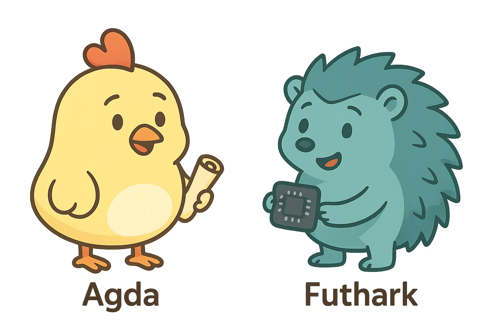

---
title: "Correctness Meets Performance"
author: "<u>Artjoms Šinkarovs</u>, Troels Henriksen"
date: "14 October 2025"
institute: "University of Southampton"

controls: false
lang: "en-GB"
theme: "white"
margin: 0.1
showNotes: "false" 
...

# Motivation

- Numerical code is frequently written in unsafe languages that rely
  on unverified libraries: C, Fortran, Python, MKL, OpenBLAS, etc.
    
- Correct‑by‑construction specifications rarely run efficiently:
  Lean, Rocq, Agda, etc.

# Vision

Rather than pursuing a single, idealised language, we adopt a pragmatic
compromise: combine a dependently‑typed proof assistant with
a high‑performance back‑end.

## 



# In the Paper

We implement a canonical CNN in Agda, including AD required for training;
we extract the specification and run it in Futhark.

## Technical Contributions

- Rank-polymorphic array theory, combinators, CNN.

- $E$ --- a deeply-embedded DSL:
  - HOAS-style wrappers for $E$ and combinators;
  - Automatic differentiation $E \to E$;
  - Semantically-preserving optimiser $E \to E$.

- Extraction from $E$ to Futhark.

- Experimental evaluation.


# Running Example

CNN for handwritten digit recognition, trained on the MNIST data set.


## Manual Implementation

In the array langauge SaC:

```c
float [10,1,1,1,1] 
forward (float [28,28] I, float [6,5,5] k1,
         float [6] b1, float [12,6,5,5] k2,
         float [12] b2, float [10,12,1,4,4] k3,
         float [10] b) {
  c1 = logisitc (mconv (I, k1, b1));
  s1 = avgpool (c1);
  c2 = logisitc (mconv (s1, k2, b2 ));
  s2 = avgpool (c2);
  return logisitc (mconv (s2, k3, b));
}
```

# Array Theory

Key idea: represent arrays as functions from indices to values and define
rank‑polymorphic combinators.


## Arrays
<!--
<pre class="Agda"><a id="1840" class="Keyword">open</a> <a id="1845" class="Keyword">import</a> <a id="1852" href="Data.Nat.html" class="Module">Data.Nat</a> <a id="1861" class="Keyword">using</a> <a id="1867" class="Symbol">(</a><a id="1868" href="Agda.Builtin.Nat.html#221" class="InductiveConstructor">zero</a><a id="1872" class="Symbol">;</a> <a id="1874" href="Agda.Builtin.Nat.html#234" class="InductiveConstructor">suc</a><a id="1877" class="Symbol">;</a> <a id="1879" href="Agda.Builtin.Nat.html#203" class="Datatype">ℕ</a><a id="1880" class="Symbol">)</a>
<a id="1882" class="Keyword">open</a> <a id="1887" class="Keyword">import</a> <a id="1894" href="Relation.Binary.PropositionalEquality.html" class="Module">Relation.Binary.PropositionalEquality</a>
<a id="1932" class="Keyword">open</a> <a id="1937" class="Keyword">import</a> <a id="1944" href="Relation.Nullary.html" class="Module">Relation.Nullary</a>
<a id="1961" class="Keyword">open</a> <a id="1966" class="Keyword">import</a> <a id="1973" href="Data.List.html" class="Module">Data.List</a> <a id="1983" class="Keyword">using</a> <a id="1989" class="Symbol">(</a><a id="1990" href="Agda.Builtin.List.html#147" class="Datatype">List</a><a id="1994" class="Symbol">;</a> <a id="1996" href="Data.List.Base.html#7301" class="InductiveConstructor">[]</a><a id="1998" class="Symbol">;</a> <a id="2000" href="Agda.Builtin.List.html#199" class="InductiveConstructor Operator">_∷_</a><a id="2003" class="Symbol">)</a>
<a id="2005" class="Keyword">open</a> <a id="2010" class="Keyword">import</a> <a id="2017" href="Data.Empty.html" class="Module">Data.Empty</a>
<a id="2028" class="Keyword">open</a> <a id="2033" class="Keyword">import</a> <a id="2040" href="Function.html" class="Module">Function</a>
<a id="2049" class="Keyword">open</a> <a id="2054" class="Keyword">import</a> <a id="2061" href="Data.Fin.html" class="Module">Data.Fin</a> <a id="2070" class="Symbol">as</a> <a id="2073" class="Module">F</a> <a id="2075" class="Keyword">using</a> <a id="2081" class="Symbol">(</a><a id="2082" href="Data.Fin.Base.html#1154" class="InductiveConstructor">zero</a><a id="2086" class="Symbol">;</a> <a id="2088" href="Data.Fin.Base.html#1175" class="InductiveConstructor">suc</a><a id="2091" class="Symbol">;</a> <a id="2093" href="Data.Fin.Base.html#1132" class="Datatype">Fin</a><a id="2096" class="Symbol">;</a> <a id="2098" href="Data.Fin.Base.html#4776" class="Function">combine</a><a id="2105" class="Symbol">;</a> <a id="2107" href="Data.Fin.Base.html#4518" class="Function">remQuot</a><a id="2114" class="Symbol">;</a> <a id="2116" href="Data.Fin.Base.html#1931" class="Function">fromℕ&lt;</a><a id="2122" class="Symbol">;</a> <a id="2124" href="Data.Fin.Base.html#9195" class="Function">inject+</a><a id="2131" class="Symbol">;</a> <a id="2133" href="Data.Fin.Base.html#3938" class="Function">splitAt</a><a id="2140" class="Symbol">)</a>
<a id="2142" class="Keyword">open</a> <a id="2147" class="Keyword">import</a> <a id="2154" href="Data.Product.html" class="Module">Data.Product</a> <a id="2167" class="Symbol">as</a> <a id="2170" class="Module">Prod</a> <a id="2175" class="Keyword">hiding</a> <a id="2182" class="Symbol">(</a><a id="2183" href="Data.Product.Base.html#2173" class="Function">map</a><a id="2186" class="Symbol">;</a> <a id="2188" href="Data.Product.html#1353" class="Function">zipWith</a><a id="2195" class="Symbol">)</a> <a id="2197" class="Comment">-- using (∃; ∃[_]_; _,_; _×_; uncurry)</a>

<a id="2237" class="Keyword">postulate</a>
 <a id="⋯"></a><a id="2248" href="present.html#2248" class="Postulate">⋯</a> <a id="2250" class="Symbol">:</a> <a id="2252" class="Symbol">∀</a> <a id="2254" class="Symbol">{</a><a id="2255" href="present.html#2255" class="Bound">A</a> <a id="2257" class="Symbol">:</a> <a id="2259" href="Agda.Primitive.html#388" class="Primitive">Set</a><a id="2262" class="Symbol">}</a> <a id="2264" class="Symbol">→</a> <a id="2266" href="present.html#2255" class="Bound">A</a>

<a id="2269" class="Keyword">module</a> <a id="2276" href="present.html#2276" class="Module">_</a> <a id="2278" class="Keyword">where</a>
<a id="2284" class="Keyword">module</a> <a id="A"></a><a id="2291" href="present.html#2291" class="Module">A</a> <a id="2293" class="Keyword">where</a>
 <a id="2300" class="Keyword">open</a> <a id="2305" class="Keyword">import</a> <a id="2312" href="Data.Nat.html" class="Module">Data.Nat</a> <a id="2321" class="Keyword">using</a> <a id="2327" class="Symbol">(</a><a id="2328" href="Agda.Builtin.Nat.html#221" class="InductiveConstructor">zero</a><a id="2332" class="Symbol">;</a> <a id="2334" href="Agda.Builtin.Nat.html#234" class="InductiveConstructor">suc</a><a id="2337" class="Symbol">;</a> <a id="2339" href="Agda.Builtin.Nat.html#203" class="Datatype">ℕ</a><a id="2340" class="Symbol">;</a> <a id="2342" href="Agda.Builtin.Nat.html#336" class="Primitive Operator">_+_</a><a id="2345" class="Symbol">;</a> <a id="2347" href="Agda.Builtin.Nat.html#539" class="Primitive Operator">_*_</a><a id="2350" class="Symbol">;</a> <a id="2352" href="Data.Nat.Base.html#1697" class="Datatype Operator">_≤_</a><a id="2355" class="Symbol">;</a> <a id="2357" href="Data.Nat.Base.html#1762" class="InductiveConstructor">s≤s</a><a id="2360" class="Symbol">;</a> <a id="2362" href="Data.Nat.Base.html#1720" class="InductiveConstructor">z≤n</a><a id="2365" class="Symbol">;</a> <a id="2367" href="Data.Nat.Base.html#1807" class="Function Operator">_&lt;_</a><a id="2370" class="Symbol">)</a>
 <a id="2373" class="Keyword">open</a> <a id="2378" class="Keyword">import</a> <a id="2385" href="Data.Nat.Properties.html" class="Module">Data.Nat.Properties</a> <a id="2405" class="Keyword">using</a> <a id="2411" class="Symbol">(</a><a id="2412" href="Data.Nat.Properties.html#19910" class="Function">+-mono-≤</a><a id="2420" class="Symbol">;</a> <a id="2422" href="Data.Nat.Properties.html#74598" class="Function">≤-step</a><a id="2428" class="Symbol">;</a> <a id="2430" href="Data.Nat.Properties.html#8895" class="Function">≤-pred</a><a id="2436" class="Symbol">;</a> <a id="2438" href="Data.Nat.Properties.html#4093" class="Function Operator">_≟_</a><a id="2441" class="Symbol">;</a> <a id="2443" href="Data.Nat.Properties.html#15956" class="Function">+-comm</a><a id="2449" class="Symbol">;</a> <a id="2451" href="Data.Nat.Properties.html#15415" class="Function">+-suc</a><a id="2456" class="Symbol">)</a>
</pre>-->

<pre class="Agda"> <a id="2472" class="Keyword">data</a> <a id="A.S"></a><a id="2477" href="present.html#2477" class="Datatype">S</a> <a id="2479" class="Symbol">:</a> <a id="2481" href="Agda.Primitive.html#388" class="Primitive">Set</a> <a id="2485" class="Keyword">where</a>
   <a id="A.S.[]"></a><a id="2494" href="present.html#2494" class="InductiveConstructor">[]</a>   <a id="2499" class="Symbol">:</a> <a id="2501" href="present.html#2477" class="Datatype">S</a>
   <a id="A.S._∷_"></a><a id="2506" href="present.html#2506" class="InductiveConstructor Operator">_∷_</a>  <a id="2511" class="Symbol">:</a> <a id="2513" href="Agda.Builtin.Nat.html#203" class="Datatype">ℕ</a> <a id="2515" class="Symbol">→</a> <a id="2517" href="present.html#2477" class="Datatype">S</a> <a id="2519" class="Symbol">→</a> <a id="2521" href="present.html#2477" class="Datatype">S</a>
</pre><!--
<pre class="Agda"> <a id="2537" class="Keyword">variable</a>
   <a id="2549" href="present.html#2549" class="Generalizable">m</a> <a id="2551" href="present.html#2551" class="Generalizable">n</a> <a id="2553" href="present.html#2553" class="Generalizable">k</a> <a id="2555" class="Symbol">:</a> <a id="2557" href="Agda.Builtin.Nat.html#203" class="Datatype">ℕ</a>
   <a id="2562" href="present.html#2562" class="Generalizable">s</a> <a id="2564" href="present.html#2564" class="Generalizable">p</a> <a id="2566" href="present.html#2566" class="Generalizable">q</a> <a id="2568" href="present.html#2568" class="Generalizable">r</a> <a id="2570" href="present.html#2570" class="Generalizable">u</a> <a id="2572" href="present.html#2572" class="Generalizable">w</a> <a id="2574" class="Symbol">:</a> <a id="2576" href="present.html#2477" class="Datatype">S</a>
   <a id="2581" href="present.html#2581" class="Generalizable">X</a> <a id="2583" href="present.html#2583" class="Generalizable">Y</a> <a id="2585" href="present.html#2585" class="Generalizable">Z</a> <a id="2587" class="Symbol">:</a> <a id="2589" href="Agda.Primitive.html#388" class="Primitive">Set</a>
</pre>-->
<pre class="Agda"> <a id="2606" class="Keyword">data</a> <a id="A.P"></a><a id="2611" href="present.html#2611" class="Datatype">P</a> <a id="2613" class="Symbol">:</a> <a id="2615" href="present.html#2477" class="Datatype">S</a> <a id="2617" class="Symbol">→</a> <a id="2619" href="Agda.Primitive.html#388" class="Primitive">Set</a> <a id="2623" class="Keyword">where</a>
   <a id="A.P.[]"></a><a id="2632" href="present.html#2632" class="InductiveConstructor">[]</a>   <a id="2637" class="Symbol">:</a> <a id="2639" href="present.html#2611" class="Datatype">P</a> <a id="2641" href="present.html#2494" class="InductiveConstructor">[]</a>
   <a id="A.P._∷_"></a><a id="2647" href="present.html#2647" class="InductiveConstructor Operator">_∷_</a>  <a id="2652" class="Symbol">:</a> <a id="2654" href="Data.Fin.Base.html#1132" class="Datatype">Fin</a> <a id="2658" href="present.html#2551" class="Generalizable">n</a> <a id="2660" class="Symbol">→</a> <a id="2662" href="present.html#2611" class="Datatype">P</a> <a id="2664" href="present.html#2562" class="Generalizable">s</a> <a id="2666" class="Symbol">→</a> <a id="2668" href="present.html#2611" class="Datatype">P</a> <a id="2670" class="Symbol">(</a><a id="2671" href="present.html#2551" class="Generalizable">n</a> <a id="2673" href="present.html#2506" class="InductiveConstructor Operator">∷</a> <a id="2675" href="present.html#2562" class="Generalizable">s</a><a id="2676" class="Symbol">)</a>
</pre><pre class="Agda"> <a id="A.Ar"></a><a id="2687" href="present.html#2687" class="Function">Ar</a> <a id="2690" class="Symbol">:</a> <a id="2692" href="present.html#2477" class="Datatype">S</a> <a id="2694" class="Symbol">→</a> <a id="2696" href="Agda.Primitive.html#388" class="Primitive">Set</a> <a id="2700" class="Symbol">→</a> <a id="2702" href="Agda.Primitive.html#388" class="Primitive">Set</a>
 <a id="2707" href="present.html#2687" class="Function">Ar</a> <a id="2710" href="present.html#2710" class="Bound">s</a> <a id="2712" href="present.html#2712" class="Bound">X</a> <a id="2714" class="Symbol">=</a> <a id="2716" href="present.html#2611" class="Datatype">P</a> <a id="2718" href="present.html#2710" class="Bound">s</a> <a id="2720" class="Symbol">→</a> <a id="2722" href="present.html#2712" class="Bound">X</a>
</pre>
. . .

As a container: `Ar = List ℕ ◃ All Fin`

## Combinators (1)

<pre class="Agda"> <a id="A.K"></a><a id="2802" href="present.html#2802" class="Function">K</a> <a id="2804" class="Symbol">:</a> <a id="2806" href="present.html#2581" class="Generalizable">X</a> <a id="2808" class="Symbol">→</a> <a id="2810" href="present.html#2687" class="Function">Ar</a> <a id="2813" href="present.html#2562" class="Generalizable">s</a> <a id="2815" href="present.html#2581" class="Generalizable">X</a>
 <a id="2818" href="present.html#2802" class="Function">K</a> <a id="2820" href="present.html#2820" class="Bound">x</a> <a id="2822" href="present.html#2822" class="Bound">i</a> <a id="2824" class="Symbol">=</a> <a id="2826" href="present.html#2820" class="Bound">x</a>
 
 <a id="A.map"></a><a id="2831" href="present.html#2831" class="Function">map</a> <a id="2835" class="Symbol">:</a> <a id="2837" class="Symbol">(</a><a id="2838" href="present.html#2581" class="Generalizable">X</a> <a id="2840" class="Symbol">→</a> <a id="2842" href="present.html#2583" class="Generalizable">Y</a><a id="2843" class="Symbol">)</a> <a id="2845" class="Symbol">→</a> <a id="2847" href="present.html#2687" class="Function">Ar</a> <a id="2850" href="present.html#2562" class="Generalizable">s</a> <a id="2852" href="present.html#2581" class="Generalizable">X</a> <a id="2854" class="Symbol">→</a> <a id="2856" href="present.html#2687" class="Function">Ar</a> <a id="2859" href="present.html#2562" class="Generalizable">s</a> <a id="2861" href="present.html#2583" class="Generalizable">Y</a>
 <a id="2864" href="present.html#2831" class="Function">map</a> <a id="2868" href="present.html#2868" class="Bound">f</a> <a id="2870" href="present.html#2870" class="Bound">a</a> <a id="2872" href="present.html#2872" class="Bound">i</a> <a id="2874" class="Symbol">=</a> <a id="2876" href="present.html#2868" class="Bound">f</a> <a id="2878" class="Symbol">(</a><a id="2879" href="present.html#2870" class="Bound">a</a> <a id="2881" href="present.html#2872" class="Bound">i</a><a id="2882" class="Symbol">)</a>
 
 <a id="A.zipWith"></a><a id="2887" href="present.html#2887" class="Function">zipWith</a> <a id="2895" class="Symbol">:</a> <a id="2897" class="Symbol">(</a><a id="2898" href="present.html#2581" class="Generalizable">X</a> <a id="2900" class="Symbol">→</a> <a id="2902" href="present.html#2583" class="Generalizable">Y</a> <a id="2904" class="Symbol">→</a> <a id="2906" href="present.html#2585" class="Generalizable">Z</a><a id="2907" class="Symbol">)</a> <a id="2909" class="Symbol">→</a> <a id="2911" href="present.html#2687" class="Function">Ar</a> <a id="2914" href="present.html#2562" class="Generalizable">s</a> <a id="2916" href="present.html#2581" class="Generalizable">X</a> <a id="2918" class="Symbol">→</a> <a id="2920" href="present.html#2687" class="Function">Ar</a> <a id="2923" href="present.html#2562" class="Generalizable">s</a> <a id="2925" href="present.html#2583" class="Generalizable">Y</a> <a id="2927" class="Symbol">→</a> <a id="2929" href="present.html#2687" class="Function">Ar</a> <a id="2932" href="present.html#2562" class="Generalizable">s</a> <a id="2934" href="present.html#2585" class="Generalizable">Z</a>
 <a id="2937" href="present.html#2887" class="Function">zipWith</a> <a id="2945" href="present.html#2945" class="Bound">f</a> <a id="2947" href="present.html#2947" class="Bound">a</a> <a id="2949" href="present.html#2949" class="Bound">b</a> <a id="2951" href="present.html#2951" class="Bound">i</a> <a id="2953" class="Symbol">=</a> <a id="2955" href="present.html#2945" class="Bound">f</a> <a id="2957" class="Symbol">(</a><a id="2958" href="present.html#2947" class="Bound">a</a> <a id="2960" href="present.html#2951" class="Bound">i</a><a id="2961" class="Symbol">)</a> <a id="2963" class="Symbol">(</a><a id="2964" href="present.html#2949" class="Bound">b</a> <a id="2966" href="present.html#2951" class="Bound">i</a><a id="2967" class="Symbol">)</a>
</pre>
## Combinators (2)

<pre class="Agda"> <a id="A._⊗_"></a><a id="2999" href="present.html#2999" class="Function Operator">_⊗_</a> <a id="3003" class="Symbol">:</a> <a id="3005" href="present.html#2477" class="Datatype">S</a> <a id="3007" class="Symbol">→</a> <a id="3009" href="present.html#2477" class="Datatype">S</a> <a id="3011" class="Symbol">→</a> <a id="3013" href="present.html#2477" class="Datatype">S</a>
 <a id="A._⊗ₚ_"></a><a id="3016" href="present.html#3016" class="Function Operator">_⊗ₚ_</a> <a id="3021" class="Symbol">:</a> <a id="3023" href="present.html#2611" class="Datatype">P</a> <a id="3025" href="present.html#2562" class="Generalizable">s</a> <a id="3027" class="Symbol">→</a> <a id="3029" href="present.html#2611" class="Datatype">P</a> <a id="3031" href="present.html#2564" class="Generalizable">p</a> <a id="3033" class="Symbol">→</a> <a id="3035" href="present.html#2611" class="Datatype">P</a> <a id="3037" class="Symbol">(</a><a id="3038" href="present.html#2562" class="Generalizable">s</a> <a id="3040" href="present.html#2999" class="Function Operator">⊗</a> <a id="3042" href="present.html#2564" class="Generalizable">p</a><a id="3043" class="Symbol">)</a>
 <a id="A.split"></a><a id="3046" href="present.html#3046" class="Function">split</a> <a id="3052" class="Symbol">:</a> <a id="3054" href="present.html#2611" class="Datatype">P</a> <a id="3056" class="Symbol">(</a><a id="3057" href="present.html#2562" class="Generalizable">s</a> <a id="3059" href="present.html#2999" class="Function Operator">⊗</a> <a id="3061" href="present.html#2564" class="Generalizable">p</a><a id="3062" class="Symbol">)</a> <a id="3064" class="Symbol">→</a> <a id="3066" href="present.html#2611" class="Datatype">P</a> <a id="3068" href="present.html#2562" class="Generalizable">s</a> <a id="3070" href="Data.Product.Base.html#1618" class="Function Operator">×</a> <a id="3072" href="present.html#2611" class="Datatype">P</a> <a id="3074" href="present.html#2564" class="Generalizable">p</a>
</pre><!--
<pre class="Agda"> <a id="3090" href="present.html#2494" class="InductiveConstructor">[]</a> <a id="3093" href="present.html#2999" class="Function Operator">⊗</a> <a id="3095" href="present.html#3095" class="Bound">p</a> <a id="3097" class="Symbol">=</a> <a id="3099" href="present.html#3095" class="Bound">p</a>
 <a id="3102" class="Symbol">(</a><a id="3103" href="present.html#3103" class="Bound">n</a> <a id="3105" href="present.html#2506" class="InductiveConstructor Operator">∷</a> <a id="3107" href="present.html#3107" class="Bound">s</a><a id="3108" class="Symbol">)</a> <a id="3110" href="present.html#2999" class="Function Operator">⊗</a> <a id="3112" href="present.html#3112" class="Bound">p</a> <a id="3114" class="Symbol">=</a> <a id="3116" href="present.html#3103" class="Bound">n</a> <a id="3118" href="present.html#2506" class="InductiveConstructor Operator">∷</a> <a id="3120" class="Symbol">(</a><a id="3121" href="present.html#3107" class="Bound">s</a> <a id="3123" href="present.html#2999" class="Function Operator">⊗</a> <a id="3125" href="present.html#3112" class="Bound">p</a><a id="3126" class="Symbol">)</a>
 
 <a id="3131" href="present.html#2632" class="InductiveConstructor">[]</a> <a id="3134" href="present.html#3016" class="Function Operator">⊗ₚ</a> <a id="3137" href="present.html#3137" class="Bound">jv</a> <a id="3140" class="Symbol">=</a> <a id="3142" href="present.html#3137" class="Bound">jv</a>
 <a id="3146" class="Symbol">(</a><a id="3147" href="present.html#3147" class="Bound">i</a> <a id="3149" href="present.html#2647" class="InductiveConstructor Operator">∷</a> <a id="3151" href="present.html#3151" class="Bound">iv</a><a id="3153" class="Symbol">)</a> <a id="3155" href="present.html#3016" class="Function Operator">⊗ₚ</a> <a id="3158" href="present.html#3158" class="Bound">jv</a> <a id="3161" class="Symbol">=</a> <a id="3163" href="present.html#3147" class="Bound">i</a> <a id="3165" href="present.html#2647" class="InductiveConstructor Operator">∷</a> <a id="3167" class="Symbol">(</a><a id="3168" href="present.html#3151" class="Bound">iv</a> <a id="3171" href="present.html#3016" class="Function Operator">⊗ₚ</a> <a id="3174" href="present.html#3158" class="Bound">jv</a><a id="3176" class="Symbol">)</a>
 
 <a id="3181" href="present.html#3046" class="Function">split</a> <a id="3187" class="Symbol">{</a><a id="3188" class="Argument">s</a> <a id="3190" class="Symbol">=</a> <a id="3192" href="present.html#2494" class="InductiveConstructor">[]</a><a id="3194" class="Symbol">}</a>    <a id="3199" href="present.html#3199" class="Bound">is</a> <a id="3202" class="Symbol">=</a> <a id="3204" href="present.html#2632" class="InductiveConstructor">[]</a> <a id="3207" href="Agda.Builtin.Sigma.html#235" class="InductiveConstructor Operator">,</a> <a id="3209" href="present.html#3199" class="Bound">is</a>
 <a id="3213" href="present.html#3046" class="Function">split</a> <a id="3219" class="Symbol">{</a><a id="3220" class="Argument">s</a> <a id="3222" class="Symbol">=</a> <a id="3224" href="present.html#3224" class="Bound">x</a> <a id="3226" href="present.html#2506" class="InductiveConstructor Operator">∷</a> <a id="3228" href="present.html#3228" class="Bound">s</a><a id="3229" class="Symbol">}</a> <a id="3231" class="Symbol">(</a><a id="3232" href="present.html#3232" class="Bound">i</a> <a id="3234" href="present.html#2647" class="InductiveConstructor Operator">∷</a> <a id="3236" href="present.html#3236" class="Bound">is</a><a id="3238" class="Symbol">)</a> <a id="3240" class="Symbol">=</a> <a id="3242" href="Data.Product.Base.html#2312" class="Function">Prod.map₁</a> <a id="3252" class="Symbol">(</a><a id="3253" href="present.html#3232" class="Bound">i</a> <a id="3255" href="present.html#2647" class="InductiveConstructor Operator">∷_</a><a id="3257" class="Symbol">)</a> <a id="3259" class="Symbol">(</a><a id="3260" href="present.html#3046" class="Function">split</a> <a id="3266" href="present.html#3236" class="Bound">is</a><a id="3268" class="Symbol">)</a>
 
 <a id="A._≟ₚ_"></a><a id="3273" href="present.html#3273" class="Function Operator">_≟ₚ_</a> <a id="3278" class="Symbol">:</a> <a id="3280" class="Symbol">(</a><a id="3281" href="present.html#3281" class="Bound">i</a> <a id="3283" href="present.html#3283" class="Bound">j</a> <a id="3285" class="Symbol">:</a> <a id="3287" href="present.html#2611" class="Datatype">P</a> <a id="3289" href="present.html#2562" class="Generalizable">s</a><a id="3290" class="Symbol">)</a> <a id="3292" class="Symbol">→</a> <a id="3294" href="Relation.Nullary.Decidable.Core.html#1966" class="Record">Dec</a> <a id="3298" class="Symbol">(</a><a id="3299" href="present.html#3281" class="Bound">i</a> <a id="3301" href="Agda.Builtin.Equality.html#150" class="Datatype Operator">≡</a> <a id="3303" href="present.html#3283" class="Bound">j</a><a id="3304" class="Symbol">)</a>
 <a id="3307" href="present.html#3273" class="Function Operator">_≟ₚ_</a> <a id="3312" class="Symbol">{</a><a id="3313" href="present.html#2494" class="InductiveConstructor">[]</a><a id="3315" class="Symbol">}</a> <a id="3317" href="present.html#2632" class="InductiveConstructor">[]</a> <a id="3320" href="present.html#2632" class="InductiveConstructor">[]</a> <a id="3323" class="Symbol">=</a> <a id="3325" href="Relation.Nullary.Decidable.Core.html#2099" class="InductiveConstructor">yes</a> <a id="3329" href="Agda.Builtin.Equality.html#207" class="InductiveConstructor">refl</a>
 <a id="3335" href="present.html#3273" class="Function Operator">_≟ₚ_</a> <a id="3340" class="Symbol">{</a><a id="3341" href="present.html#3341" class="Bound">x</a> <a id="3343" href="present.html#2506" class="InductiveConstructor Operator">∷</a> <a id="3345" href="present.html#3345" class="Bound">s</a><a id="3346" class="Symbol">}</a> <a id="3348" class="Symbol">(</a><a id="3349" href="present.html#3349" class="Bound">i</a> <a id="3351" href="present.html#2647" class="InductiveConstructor Operator">∷</a> <a id="3353" href="present.html#3353" class="Bound">is</a><a id="3355" class="Symbol">)</a> <a id="3357" class="Symbol">(</a><a id="3358" href="present.html#3358" class="Bound">j</a> <a id="3360" href="present.html#2647" class="InductiveConstructor Operator">∷</a> <a id="3362" href="present.html#3362" class="Bound">js</a><a id="3364" class="Symbol">)</a> <a id="3366" class="Keyword">with</a> <a id="3371" href="present.html#3349" class="Bound">i</a> <a id="3373" href="Data.Fin.Properties.html#3739" class="Function Operator">F.≟</a> <a id="3377" href="present.html#3358" class="Bound">j</a>
 <a id="3380" class="Symbol">...</a> <a id="3384" class="Symbol">|</a> <a id="3386" href="Relation.Nullary.Decidable.Core.html#2136" class="InductiveConstructor">no</a> <a id="3389" href="present.html#3389" class="Bound">¬p</a> <a id="3392" class="Symbol">=</a> <a id="3394" href="Relation.Nullary.Decidable.Core.html#2136" class="InductiveConstructor">no</a> <a id="3397" class="Symbol">λ</a> <a id="3399" class="Symbol">{</a> <a id="3401" href="Agda.Builtin.Equality.html#207" class="InductiveConstructor">refl</a> <a id="3406" class="Symbol">→</a> <a id="3408" href="present.html#3389" class="Bound">¬p</a> <a id="3411" href="Agda.Builtin.Equality.html#207" class="InductiveConstructor">refl</a> <a id="3416" class="Symbol">}</a>
 <a id="3419" class="Symbol">...</a> <a id="3423" class="Symbol">|</a> <a id="3425" href="Relation.Nullary.Decidable.Core.html#2099" class="InductiveConstructor">yes</a> <a id="3429" href="Agda.Builtin.Equality.html#207" class="InductiveConstructor">refl</a> <a id="3434" class="Keyword">with</a> <a id="3439" class="Bound">is</a> <a id="3442" href="present.html#3273" class="Function Operator">≟ₚ</a> <a id="3445" class="Bound">js</a>
 <a id="3449" class="Symbol">...</a> <a id="3453" class="Symbol">|</a> <a id="3455" href="Relation.Nullary.Decidable.Core.html#2136" class="InductiveConstructor">no</a> <a id="3458" href="present.html#3458" class="Bound">¬q</a> <a id="3461" class="Symbol">=</a> <a id="3463" href="Relation.Nullary.Decidable.Core.html#2136" class="InductiveConstructor">no</a> <a id="3466" class="Symbol">λ</a> <a id="3468" class="Symbol">{</a> <a id="3470" href="Agda.Builtin.Equality.html#207" class="InductiveConstructor">refl</a> <a id="3475" class="Symbol">→</a> <a id="3477" href="present.html#3458" class="Bound">¬q</a> <a id="3480" href="Agda.Builtin.Equality.html#207" class="InductiveConstructor">refl</a> <a id="3485" class="Symbol">}</a>
 <a id="3488" class="Symbol">...</a> <a id="3492" class="Symbol">|</a> <a id="3494" href="Relation.Nullary.Decidable.Core.html#2099" class="InductiveConstructor">yes</a> <a id="3498" href="Agda.Builtin.Equality.html#207" class="InductiveConstructor">refl</a> <a id="3503" class="Symbol">=</a> <a id="3505" href="Relation.Nullary.Decidable.Core.html#2099" class="InductiveConstructor">yes</a> <a id="3509" href="Agda.Builtin.Equality.html#207" class="InductiveConstructor">refl</a>
</pre>-->
<pre class="Agda"> <a id="A.nest"></a><a id="3527" href="present.html#3527" class="Function">nest</a> <a id="3532" class="Symbol">:</a> <a id="3534" href="present.html#2687" class="Function">Ar</a> <a id="3537" class="Symbol">(</a><a id="3538" href="present.html#2562" class="Generalizable">s</a> <a id="3540" href="present.html#2999" class="Function Operator">⊗</a> <a id="3542" href="present.html#2564" class="Generalizable">p</a><a id="3543" class="Symbol">)</a> <a id="3545" href="present.html#2581" class="Generalizable">X</a> <a id="3547" class="Symbol">→</a> <a id="3549" href="present.html#2687" class="Function">Ar</a> <a id="3552" href="present.html#2562" class="Generalizable">s</a> <a id="3554" class="Symbol">(</a><a id="3555" href="present.html#2687" class="Function">Ar</a> <a id="3558" href="present.html#2564" class="Generalizable">p</a> <a id="3560" href="present.html#2581" class="Generalizable">X</a><a id="3561" class="Symbol">)</a>
 <a id="3564" href="present.html#3527" class="Function">nest</a> <a id="3569" href="present.html#3569" class="Bound">a</a> <a id="3571" href="present.html#3571" class="Bound">i</a> <a id="3573" href="present.html#3573" class="Bound">j</a> <a id="3575" class="Symbol">=</a> <a id="3577" href="present.html#3569" class="Bound">a</a> <a id="3579" class="Symbol">(</a><a id="3580" href="present.html#3571" class="Bound">i</a> <a id="3582" href="present.html#3016" class="Function Operator">⊗ₚ</a> <a id="3585" href="present.html#3573" class="Bound">j</a><a id="3586" class="Symbol">)</a>
 
 <a id="A.unnest"></a><a id="3591" href="present.html#3591" class="Function">unnest</a> <a id="3598" class="Symbol">:</a> <a id="3600" href="present.html#2687" class="Function">Ar</a> <a id="3603" href="present.html#2562" class="Generalizable">s</a> <a id="3605" class="Symbol">(</a><a id="3606" href="present.html#2687" class="Function">Ar</a> <a id="3609" href="present.html#2564" class="Generalizable">p</a> <a id="3611" href="present.html#2581" class="Generalizable">X</a><a id="3612" class="Symbol">)</a> <a id="3614" class="Symbol">→</a> <a id="3616" href="present.html#2687" class="Function">Ar</a> <a id="3619" class="Symbol">(</a><a id="3620" href="present.html#2562" class="Generalizable">s</a> <a id="3622" href="present.html#2999" class="Function Operator">⊗</a> <a id="3624" href="present.html#2564" class="Generalizable">p</a><a id="3625" class="Symbol">)</a> <a id="3627" href="present.html#2581" class="Generalizable">X</a>
 <a id="3630" href="present.html#3591" class="Function">unnest</a> <a id="3637" href="present.html#3637" class="Bound">a</a> <a id="3639" href="present.html#3639" class="Bound">i</a> <a id="3641" class="Symbol">=</a> <a id="3643" href="Data.Product.Base.html#3109" class="Function">uncurry</a> <a id="3651" href="present.html#3637" class="Bound">a</a> <a id="3653" class="Symbol">(</a><a id="3654" href="present.html#3046" class="Function">split</a> <a id="3660" href="present.html#3639" class="Bound">i</a><a id="3661" class="Symbol">)</a>
</pre>
<!--
<pre class="Agda"> <a id="3678" class="Keyword">pattern</a> <a id="A.ι"></a><a id="3686" href="present.html#3686" class="InductiveConstructor">ι</a> <a id="3688" href="present.html#3692" class="Bound">n</a> <a id="3690" class="Symbol">=</a> <a id="3692" href="present.html#3692" class="Bound">n</a> <a id="3694" class="InductiveConstructor Operator">∷</a> <a id="3696" class="InductiveConstructor">[]</a>
 
 <a id="A.ιsuc"></a><a id="3702" href="present.html#3702" class="Function">ιsuc</a> <a id="3707" class="Symbol">:</a> <a id="3709" href="present.html#2611" class="Datatype">P</a> <a id="3711" class="Symbol">(</a><a id="3712" href="present.html#3686" class="InductiveConstructor">ι</a> <a id="3714" href="present.html#2551" class="Generalizable">n</a><a id="3715" class="Symbol">)</a> <a id="3717" class="Symbol">→</a> <a id="3719" href="present.html#2611" class="Datatype">P</a> <a id="3721" class="Symbol">(</a><a id="3722" href="present.html#3686" class="InductiveConstructor">ι</a> <a id="3724" class="Symbol">(</a><a id="3725" href="Agda.Builtin.Nat.html#234" class="InductiveConstructor">suc</a> <a id="3729" href="present.html#2551" class="Generalizable">n</a><a id="3730" class="Symbol">))</a>
 <a id="3734" href="present.html#3702" class="Function">ιsuc</a> <a id="3739" class="Symbol">(</a><a id="3740" href="present.html#3686" class="InductiveConstructor">ι</a> <a id="3742" href="present.html#3742" class="Bound">i</a><a id="3743" class="Symbol">)</a> <a id="3745" class="Symbol">=</a> <a id="3747" href="present.html#3686" class="InductiveConstructor">ι</a> <a id="3749" class="Symbol">(</a><a id="3750" href="Data.Fin.Base.html#1175" class="InductiveConstructor">suc</a> <a id="3754" href="present.html#3742" class="Bound">i</a><a id="3755" class="Symbol">)</a>
 
 <a id="A.sum₁"></a><a id="3760" href="present.html#3760" class="Function">sum₁</a> <a id="3765" class="Symbol">:</a> <a id="3767" class="Symbol">(</a><a id="3768" href="present.html#2581" class="Generalizable">X</a> <a id="3770" class="Symbol">→</a> <a id="3772" href="present.html#2581" class="Generalizable">X</a> <a id="3774" class="Symbol">→</a> <a id="3776" href="present.html#2581" class="Generalizable">X</a><a id="3777" class="Symbol">)</a> <a id="3779" class="Symbol">→</a> <a id="3781" href="present.html#2581" class="Generalizable">X</a> <a id="3783" class="Symbol">→</a> <a id="3785" href="present.html#2687" class="Function">Ar</a> <a id="3788" class="Symbol">(</a><a id="3789" href="present.html#3686" class="InductiveConstructor">ι</a> <a id="3791" href="present.html#2551" class="Generalizable">n</a><a id="3792" class="Symbol">)</a> <a id="3794" href="present.html#2581" class="Generalizable">X</a> <a id="3796" class="Symbol">→</a> <a id="3798" href="present.html#2581" class="Generalizable">X</a>
 <a id="3801" href="present.html#3760" class="Function">sum₁</a> <a id="3806" class="Symbol">{</a><a id="3807" class="Argument">n</a> <a id="3809" class="Symbol">=</a> <a id="3811" href="Agda.Builtin.Nat.html#221" class="InductiveConstructor">zero</a><a id="3815" class="Symbol">}</a>   <a id="3819" href="present.html#3819" class="Bound">f</a> <a id="3821" href="present.html#3821" class="Bound">ε</a> <a id="3823" href="present.html#3823" class="Bound">a</a> <a id="3825" class="Symbol">=</a> <a id="3827" href="present.html#3821" class="Bound">ε</a>
 <a id="3830" href="present.html#3760" class="Function">sum₁</a> <a id="3835" class="Symbol">{</a><a id="3836" class="Argument">n</a> <a id="3838" class="Symbol">=</a> <a id="3840" href="Agda.Builtin.Nat.html#234" class="InductiveConstructor">suc</a> <a id="3844" href="present.html#3844" class="Bound">n</a><a id="3845" class="Symbol">}</a>  <a id="3848" href="present.html#3848" class="Bound">f</a> <a id="3850" href="present.html#3850" class="Bound">ε</a> <a id="3852" href="present.html#3852" class="Bound">a</a> <a id="3854" class="Symbol">=</a> <a id="3856" href="present.html#3848" class="Bound">f</a> <a id="3858" class="Symbol">(</a><a id="3859" href="present.html#3852" class="Bound">a</a> <a id="3861" class="Symbol">(</a><a id="3862" href="present.html#3686" class="InductiveConstructor">ι</a> <a id="3864" href="Data.Fin.Base.html#1154" class="InductiveConstructor">zero</a><a id="3868" class="Symbol">))</a> <a id="3871" class="Symbol">(</a><a id="3872" href="present.html#3760" class="Function">sum₁</a> <a id="3877" href="present.html#3848" class="Bound">f</a> <a id="3879" href="present.html#3850" class="Bound">ε</a> <a id="3881" class="Symbol">(</a><a id="3882" href="present.html#3852" class="Bound">a</a> <a id="3884" href="Function.Base.html#1134" class="Function Operator">∘</a> <a id="3886" href="present.html#3702" class="Function">ιsuc</a><a id="3890" class="Symbol">))</a>
 
 <a id="A.sum"></a><a id="3896" href="present.html#3896" class="Function">sum</a> <a id="3900" class="Symbol">:</a> <a id="3902" class="Symbol">(</a><a id="3903" href="present.html#2581" class="Generalizable">X</a> <a id="3905" class="Symbol">→</a> <a id="3907" href="present.html#2581" class="Generalizable">X</a> <a id="3909" class="Symbol">→</a> <a id="3911" href="present.html#2581" class="Generalizable">X</a><a id="3912" class="Symbol">)</a> <a id="3914" class="Symbol">→</a> <a id="3916" href="present.html#2581" class="Generalizable">X</a> <a id="3918" class="Symbol">→</a> <a id="3920" href="present.html#2687" class="Function">Ar</a> <a id="3923" href="present.html#2562" class="Generalizable">s</a> <a id="3925" href="present.html#2581" class="Generalizable">X</a> <a id="3927" class="Symbol">→</a> <a id="3929" href="present.html#2581" class="Generalizable">X</a>
 <a id="3932" href="present.html#3896" class="Function">sum</a> <a id="3936" class="Symbol">{</a><a id="3937" class="Argument">s</a> <a id="3939" class="Symbol">=</a> <a id="3941" href="present.html#2494" class="InductiveConstructor">[]</a><a id="3943" class="Symbol">}</a>     <a id="3949" href="present.html#3949" class="Bound">f</a> <a id="3951" href="present.html#3951" class="Bound">ε</a> <a id="3953" href="present.html#3953" class="Bound">a</a> <a id="3955" class="Symbol">=</a> <a id="3957" href="present.html#3953" class="Bound">a</a> <a id="3959" href="present.html#2632" class="InductiveConstructor">[]</a>
 <a id="3963" href="present.html#3896" class="Function">sum</a> <a id="3967" class="Symbol">{</a><a id="3968" class="Argument">s</a> <a id="3970" class="Symbol">=</a> <a id="3972" href="present.html#3972" class="Bound">x</a> <a id="3974" href="present.html#2506" class="InductiveConstructor Operator">∷</a> <a id="3976" href="present.html#3976" class="Bound">s</a><a id="3977" class="Symbol">}</a>  <a id="3980" href="present.html#3980" class="Bound">f</a> <a id="3982" href="present.html#3982" class="Bound">ε</a> <a id="3984" href="present.html#3984" class="Bound">a</a> <a id="3986" class="Symbol">=</a> <a id="3988" href="present.html#3760" class="Function">sum₁</a> <a id="3993" href="present.html#3980" class="Bound">f</a> <a id="3995" href="present.html#3982" class="Bound">ε</a> <a id="3997" href="Function.Base.html#1993" class="Function Operator">$</a> <a id="3999" href="present.html#2831" class="Function">map</a> <a id="4003" class="Symbol">(</a><a id="4004" href="present.html#3896" class="Function">sum</a> <a id="4008" href="present.html#3980" class="Bound">f</a> <a id="4010" href="present.html#3982" class="Bound">ε</a><a id="4011" class="Symbol">)</a> <a id="4013" class="Symbol">(</a><a id="4014" href="present.html#3527" class="Function">nest</a> <a id="4019" href="present.html#3984" class="Bound">a</a><a id="4020" class="Symbol">)</a>
</pre>-->


## Convolution (1-d)

<!--
<pre class="Agda"> <a id="A.Vec"></a><a id="4064" href="present.html#4064" class="Function">Vec</a> <a id="4068" class="Symbol">:</a> <a id="4070" href="Agda.Builtin.Nat.html#203" class="Datatype">ℕ</a> <a id="4072" class="Symbol">→</a> <a id="4074" href="Agda.Primitive.html#388" class="Primitive">Set</a> <a id="4078" class="Symbol">→</a> <a id="4080" href="Agda.Primitive.html#388" class="Primitive">Set</a><a id="4083" class="Symbol">;</a>      <a id="A.Ix"></a><a id="4090" href="present.html#4090" class="Function">Ix</a> <a id="4093" class="Symbol">:</a> <a id="4095" href="Agda.Builtin.Nat.html#203" class="Datatype">ℕ</a> <a id="4097" class="Symbol">→</a> <a id="4099" href="Agda.Primitive.html#388" class="Primitive">Set</a>   
 <a id="4107" class="Keyword">postulate</a>
</pre><pre class="Agda">  <a id="A._⊕_"></a><a id="4127" href="present.html#4127" class="Postulate Operator">_⊕_</a> <a id="4131" class="Symbol">:</a> <a id="4133" href="Data.Fin.Base.html#1132" class="Datatype">Fin</a> <a id="4137" href="present.html#2549" class="Generalizable">m</a> <a id="4139" class="Symbol">→</a> <a id="4141" href="Data.Fin.Base.html#1132" class="Datatype">Fin</a> <a id="4145" class="Symbol">(</a><a id="4146" class="Number">1</a> <a id="4148" href="Agda.Builtin.Nat.html#336" class="Primitive Operator">+</a> <a id="4150" href="present.html#2551" class="Generalizable">n</a><a id="4151" class="Symbol">)</a> <a id="4153" class="Symbol">→</a> <a id="4155" href="Data.Fin.Base.html#1132" class="Datatype">Fin</a> <a id="4159" class="Symbol">(</a><a id="4160" href="present.html#2549" class="Generalizable">m</a> <a id="4162" href="Agda.Builtin.Nat.html#336" class="Primitive Operator">+</a> <a id="4164" href="present.html#2551" class="Generalizable">n</a><a id="4165" class="Symbol">)</a>
  <a id="A._⊝_"></a><a id="4169" href="present.html#4169" class="Postulate Operator">_⊝_</a> <a id="4173" class="Symbol">:</a> <a id="4175" class="Symbol">(</a><a id="4176" href="present.html#4176" class="Bound">i</a> <a id="4178" class="Symbol">:</a> <a id="4180" href="Data.Fin.Base.html#1132" class="Datatype">Fin</a> <a id="4184" class="Symbol">(</a><a id="4185" href="present.html#2549" class="Generalizable">m</a> <a id="4187" href="Agda.Builtin.Nat.html#336" class="Primitive Operator">+</a> <a id="4189" href="present.html#2551" class="Generalizable">n</a><a id="4190" class="Symbol">))</a> <a id="4193" class="Symbol">(</a><a id="4194" href="present.html#4194" class="Bound">j</a> <a id="4196" class="Symbol">:</a> <a id="4198" href="Data.Fin.Base.html#1132" class="Datatype">Fin</a> <a id="4202" href="present.html#2549" class="Generalizable">m</a><a id="4203" class="Symbol">)</a>
      <a id="4211" class="Symbol">→</a> <a id="4213" href="Relation.Nullary.Decidable.Core.html#1966" class="Record">Dec</a> <a id="4217" class="Symbol">(</a><a id="4218" href="Data.Product.Base.html#1371" class="Function">∃[</a> <a id="4221" href="present.html#4221" class="Bound">k</a> <a id="4223" href="Data.Product.Base.html#1371" class="Function">]</a> <a id="4225" href="present.html#4194" class="Bound">j</a> <a id="4227" href="present.html#4127" class="Postulate Operator">⊕</a> <a id="4229" href="present.html#4221" class="Bound">k</a> <a id="4231" href="Agda.Builtin.Equality.html#150" class="Datatype Operator">≡</a> <a id="4233" href="present.html#4176" class="Bound">i</a><a id="4234" class="Symbol">)</a>
 <a id="A.ℝ"></a><a id="4237" href="present.html#4237" class="Function">ℝ</a> <a id="4239" class="Symbol">=</a> <a id="4241" href="Agda.Builtin.Nat.html#203" class="Datatype">ℕ</a>
</pre>. . .
-->


<pre class="Agda"> <a id="4264" href="present.html#4064" class="Function">Vec</a> <a id="4268" href="present.html#4268" class="Bound">m</a> <a id="4270" href="present.html#4270" class="Bound">X</a> <a id="4272" class="Symbol">=</a> <a id="4274" href="present.html#2687" class="Function">Ar</a> <a id="4277" class="Symbol">(</a><a id="4278" href="present.html#3686" class="InductiveConstructor">ι</a> <a id="4280" href="present.html#4268" class="Bound">m</a><a id="4281" class="Symbol">)</a> <a id="4283" href="present.html#4270" class="Bound">X</a><a id="4284" class="Symbol">;</a>     <a id="4290" href="present.html#4090" class="Function">Ix</a> <a id="4293" href="present.html#4293" class="Bound">m</a> <a id="4295" class="Symbol">=</a> <a id="4297" href="present.html#2611" class="Datatype">P</a> <a id="4299" class="Symbol">(</a><a id="4300" href="present.html#3686" class="InductiveConstructor">ι</a> <a id="4302" href="present.html#4293" class="Bound">m</a><a id="4303" class="Symbol">)</a>

 <a id="A.slide₁"></a><a id="4307" href="present.html#4307" class="Function">slide₁</a> <a id="4314" class="Symbol">:</a> <a id="4316" href="present.html#4090" class="Function">Ix</a> <a id="4319" href="present.html#2549" class="Generalizable">m</a> <a id="4321" class="Symbol">→</a> <a id="4323" href="present.html#4064" class="Function">Vec</a> <a id="4327" class="Symbol">(</a><a id="4328" href="present.html#2549" class="Generalizable">m</a> <a id="4330" href="Agda.Builtin.Nat.html#336" class="Primitive Operator">+</a> <a id="4332" href="present.html#2551" class="Generalizable">n</a><a id="4333" class="Symbol">)</a> <a id="4335" href="present.html#2581" class="Generalizable">X</a> <a id="4337" class="Symbol">→</a> <a id="4339" href="present.html#4064" class="Function">Vec</a> <a id="4343" class="Symbol">(</a><a id="4344" class="Number">1</a> <a id="4346" href="Agda.Builtin.Nat.html#336" class="Primitive Operator">+</a> <a id="4348" href="present.html#2551" class="Generalizable">n</a><a id="4349" class="Symbol">)</a> <a id="4351" href="present.html#2581" class="Generalizable">X</a>
 <a id="4354" href="present.html#4307" class="Function">slide₁</a> <a id="4361" class="Symbol">(</a><a id="4362" href="present.html#3686" class="InductiveConstructor">ι</a> <a id="4364" href="present.html#4364" class="Bound">i</a><a id="4365" class="Symbol">)</a> <a id="4367" href="present.html#4367" class="Bound">v</a> <a id="4369" class="Symbol">(</a><a id="4370" href="present.html#3686" class="InductiveConstructor">ι</a> <a id="4372" href="present.html#4372" class="Bound">j</a><a id="4373" class="Symbol">)</a> <a id="4375" class="Symbol">=</a> <a id="4377" href="present.html#4367" class="Bound">v</a> <a id="4379" class="Symbol">(</a><a id="4380" href="present.html#3686" class="InductiveConstructor">ι</a> <a id="4382" class="Symbol">(</a><a id="4383" href="present.html#4364" class="Bound">i</a> <a id="4385" href="present.html#4127" class="Postulate Operator">⊕</a> <a id="4387" href="present.html#4372" class="Bound">j</a><a id="4388" class="Symbol">))</a>
</pre>
. . .

<pre class="Agda"> <a id="A.conv₁"></a><a id="4408" href="present.html#4408" class="Function">conv₁</a> <a id="4414" class="Symbol">:</a> <a id="4416" href="present.html#4064" class="Function">Vec</a> <a id="4420" class="Symbol">(</a><a id="4421" href="present.html#2549" class="Generalizable">m</a> <a id="4423" href="Agda.Builtin.Nat.html#336" class="Primitive Operator">+</a> <a id="4425" href="present.html#2551" class="Generalizable">n</a><a id="4426" class="Symbol">)</a> <a id="4428" href="present.html#4237" class="Function">ℝ</a> <a id="4430" class="Symbol">→</a> <a id="4432" href="present.html#4064" class="Function">Vec</a> <a id="4436" href="present.html#2549" class="Generalizable">m</a> <a id="4438" href="present.html#4237" class="Function">ℝ</a> <a id="4440" class="Symbol">→</a> <a id="4442" href="present.html#4064" class="Function">Vec</a> <a id="4446" class="Symbol">(</a><a id="4447" class="Number">1</a> <a id="4449" href="Agda.Builtin.Nat.html#336" class="Primitive Operator">+</a> <a id="4451" href="present.html#2551" class="Generalizable">n</a><a id="4452" class="Symbol">)</a> <a id="4454" href="present.html#4237" class="Function">ℝ</a>
 <a id="4457" href="present.html#4408" class="Function">conv₁</a> <a id="4463" href="present.html#4463" class="Bound">a</a> <a id="4465" href="present.html#4465" class="Bound">w</a> <a id="4467" class="Symbol">=</a> <a id="4469" href="present.html#3760" class="Function">sum₁</a> <a id="4474" class="Symbol">(</a><a id="4475" href="present.html#2887" class="Function">zipWith</a> <a id="4483" href="Agda.Builtin.Nat.html#336" class="Primitive Operator">_+_</a><a id="4486" class="Symbol">)</a> <a id="4488" class="Symbol">(</a><a id="4489" href="present.html#2802" class="Function">K</a> <a id="4491" class="Number">0</a><a id="4492" class="Symbol">)</a>
                  <a id="4512" class="Symbol">(λ</a> <a id="4515" href="present.html#4515" class="Bound">i</a> <a id="4517" class="Symbol">→</a> <a id="4519" href="present.html#2831" class="Function">map</a> <a id="4523" class="Symbol">(</a><a id="4524" href="present.html#4465" class="Bound">w</a> <a id="4526" href="present.html#4515" class="Bound">i</a> <a id="4528" href="Agda.Builtin.Nat.html#539" class="Primitive Operator">*_</a><a id="4530" class="Symbol">)</a>
                             <a id="4561" class="Symbol">(</a><a id="4562" href="present.html#4307" class="Function">slide₁</a> <a id="4569" href="present.html#4515" class="Bound">i</a> <a id="4571" href="present.html#4463" class="Bound">a</a><a id="4572" class="Symbol">))</a>
</pre>
## Convolution (n-d)

<!--
<pre class="Agda"> <a id="4612" class="Keyword">data</a> <a id="A.Pw₂"></a><a id="4617" href="present.html#4617" class="Datatype">Pw₂</a> <a id="4621" class="Symbol">(</a><a id="4622" href="present.html#4622" class="Bound">R</a> <a id="4624" class="Symbol">:</a> <a id="4626" class="Symbol">(</a><a id="4627" href="present.html#4627" class="Bound">a</a> <a id="4629" href="present.html#4629" class="Bound">b</a> <a id="4631" class="Symbol">:</a> <a id="4633" href="Agda.Builtin.Nat.html#203" class="Datatype">ℕ</a><a id="4634" class="Symbol">)</a> <a id="4636" class="Symbol">→</a> <a id="4638" href="Agda.Primitive.html#388" class="Primitive">Set</a><a id="4641" class="Symbol">)</a> 
      <a id="4650" class="Symbol">:</a> <a id="4652" class="Symbol">(</a><a id="4653" href="present.html#4653" class="Bound">a</a> <a id="4655" href="present.html#4655" class="Bound">b</a> <a id="4657" class="Symbol">:</a> <a id="4659" href="present.html#2477" class="Datatype">S</a><a id="4660" class="Symbol">)</a> <a id="4662" class="Symbol">→</a> <a id="4664" href="Agda.Primitive.html#388" class="Primitive">Set</a> <a id="4668" class="Keyword">where</a> <a id="4674" class="Keyword">instance</a>
     <a id="A.Pw₂.[]"></a><a id="4688" href="present.html#4688" class="InductiveConstructor">[]</a>    <a id="4694" class="Symbol">:</a> <a id="4696" href="present.html#4617" class="Datatype">Pw₂</a> <a id="4700" href="present.html#4622" class="Bound">R</a> <a id="4702" href="present.html#2494" class="InductiveConstructor">[]</a> <a id="4705" href="present.html#2494" class="InductiveConstructor">[]</a>
     <a id="A.Pw₂.cons"></a><a id="4713" href="present.html#4713" class="InductiveConstructor">cons</a>  <a id="4719" class="Symbol">:</a> <a id="4721" class="Symbol">⦃</a> <a id="4723" href="present.html#4622" class="Bound">R</a> <a id="4725" href="present.html#2549" class="Generalizable">m</a> <a id="4727" href="present.html#2551" class="Generalizable">n</a> <a id="4729" class="Symbol">⦄</a> <a id="4731" class="Symbol">→</a> <a id="4733" class="Symbol">⦃</a> <a id="4735" href="present.html#4617" class="Datatype">Pw₂</a> <a id="4739" href="present.html#4622" class="Bound">R</a> <a id="4741" href="present.html#2562" class="Generalizable">s</a> <a id="4743" href="present.html#2564" class="Generalizable">p</a> <a id="4745" class="Symbol">⦄</a>
           <a id="4758" class="Symbol">→</a> <a id="4760" href="present.html#4617" class="Datatype">Pw₂</a> <a id="4764" href="present.html#4622" class="Bound">R</a> <a id="4766" class="Symbol">(</a><a id="4767" href="present.html#2549" class="Generalizable">m</a> <a id="4769" href="present.html#2506" class="InductiveConstructor Operator">∷</a> <a id="4771" href="present.html#2562" class="Generalizable">s</a><a id="4772" class="Symbol">)</a> <a id="4774" class="Symbol">(</a><a id="4775" href="present.html#2551" class="Generalizable">n</a> <a id="4777" href="present.html#2506" class="InductiveConstructor Operator">∷</a> <a id="4779" href="present.html#2564" class="Generalizable">p</a><a id="4780" class="Symbol">)</a> 
 <a id="4784" class="Keyword">data</a> <a id="A.Pw₃"></a><a id="4789" href="present.html#4789" class="Datatype">Pw₃</a> <a id="4793" class="Symbol">(</a><a id="4794" href="present.html#4794" class="Bound">R</a> <a id="4796" class="Symbol">:</a> <a id="4798" class="Symbol">(</a><a id="4799" href="present.html#4799" class="Bound">a</a> <a id="4801" href="present.html#4801" class="Bound">b</a> <a id="4803" href="present.html#4803" class="Bound">c</a> <a id="4805" class="Symbol">:</a> <a id="4807" href="Agda.Builtin.Nat.html#203" class="Datatype">ℕ</a><a id="4808" class="Symbol">)</a> <a id="4810" class="Symbol">→</a> <a id="4812" href="Agda.Primitive.html#388" class="Primitive">Set</a><a id="4815" class="Symbol">)</a> 
      <a id="4824" class="Symbol">:</a> <a id="4826" class="Symbol">(</a><a id="4827" href="present.html#4827" class="Bound">a</a> <a id="4829" href="present.html#4829" class="Bound">b</a> <a id="4831" href="present.html#4831" class="Bound">c</a> <a id="4833" class="Symbol">:</a> <a id="4835" href="present.html#2477" class="Datatype">S</a><a id="4836" class="Symbol">)</a> <a id="4838" class="Symbol">→</a> <a id="4840" href="Agda.Primitive.html#388" class="Primitive">Set</a> <a id="4844" class="Keyword">where</a> <a id="4850" class="Keyword">instance</a>
     <a id="A.Pw₃.[]"></a><a id="4864" href="present.html#4864" class="InductiveConstructor">[]</a>    <a id="4870" class="Symbol">:</a> <a id="4872" href="present.html#4789" class="Datatype">Pw₃</a> <a id="4876" href="present.html#4794" class="Bound">R</a> <a id="4878" href="present.html#2494" class="InductiveConstructor">[]</a> <a id="4881" href="present.html#2494" class="InductiveConstructor">[]</a> <a id="4884" href="present.html#2494" class="InductiveConstructor">[]</a>
     <a id="A.Pw₃.cons"></a><a id="4892" href="present.html#4892" class="InductiveConstructor">cons</a>  <a id="4898" class="Symbol">:</a> <a id="4900" class="Symbol">⦃</a> <a id="4902" href="present.html#4794" class="Bound">R</a> <a id="4904" href="present.html#2549" class="Generalizable">m</a> <a id="4906" href="present.html#2551" class="Generalizable">n</a> <a id="4908" href="present.html#2553" class="Generalizable">k</a> <a id="4910" class="Symbol">⦄</a> <a id="4912" class="Symbol">→</a> <a id="4914" class="Symbol">⦃</a> <a id="4916" href="present.html#4789" class="Datatype">Pw₃</a> <a id="4920" href="present.html#4794" class="Bound">R</a> <a id="4922" href="present.html#2562" class="Generalizable">s</a> <a id="4924" href="present.html#2564" class="Generalizable">p</a> <a id="4926" href="present.html#2566" class="Generalizable">q</a> <a id="4928" class="Symbol">⦄</a>
           <a id="4941" class="Symbol">→</a> <a id="4943" href="present.html#4789" class="Datatype">Pw₃</a> <a id="4947" href="present.html#4794" class="Bound">R</a> <a id="4949" class="Symbol">(</a><a id="4950" href="present.html#2549" class="Generalizable">m</a> <a id="4952" href="present.html#2506" class="InductiveConstructor Operator">∷</a> <a id="4954" href="present.html#2562" class="Generalizable">s</a><a id="4955" class="Symbol">)</a> <a id="4957" class="Symbol">(</a><a id="4958" href="present.html#2551" class="Generalizable">n</a> <a id="4960" href="present.html#2506" class="InductiveConstructor Operator">∷</a> <a id="4962" href="present.html#2564" class="Generalizable">p</a><a id="4963" class="Symbol">)</a> <a id="4965" class="Symbol">(</a><a id="4966" href="present.html#2553" class="Generalizable">k</a> <a id="4968" href="present.html#2506" class="InductiveConstructor Operator">∷</a> <a id="4970" href="present.html#2566" class="Generalizable">q</a><a id="4971" class="Symbol">)</a>

 <a id="4975" class="Keyword">infix</a> <a id="4981" class="Number">5</a> <a id="4983" href="present.html#5021" class="Function Operator">_+_≈_</a>
 <a id="4990" class="Keyword">infix</a> <a id="4996" class="Number">5</a> <a id="4998" href="present.html#5127" class="Function Operator">suc_≈_</a>
 <a id="5006" class="Keyword">infix</a> <a id="5012" class="Number">5</a> <a id="5014" href="present.html#5074" class="Function Operator">_*_≈_</a>
 <a id="A._+_≈_"></a><a id="5021" href="present.html#5021" class="Function Operator">_+_≈_</a> <a id="5027" class="Symbol">:</a> <a id="5029" class="Symbol">(</a><a id="5030" href="present.html#5030" class="Bound">s</a> <a id="5032" href="present.html#5032" class="Bound">p</a> <a id="5034" href="present.html#5034" class="Bound">q</a> <a id="5036" class="Symbol">:</a> <a id="5038" href="present.html#2477" class="Datatype">S</a><a id="5039" class="Symbol">)</a> <a id="5041" class="Symbol">→</a> <a id="5043" href="Agda.Primitive.html#388" class="Primitive">Set</a>
 <a id="5048" href="present.html#5021" class="Function Operator">_+_≈_</a> <a id="5054" class="Symbol">=</a> <a id="5056" href="present.html#4789" class="Datatype">Pw₃</a> <a id="5060" class="Symbol">(</a><a id="5061" href="Agda.Builtin.Equality.html#150" class="Datatype Operator">_≡_</a> <a id="5065" href="Function.Base.html#1322" class="Function Operator">∘₂</a> <a id="5068" href="Agda.Builtin.Nat.html#336" class="Primitive Operator">_+_</a><a id="5071" class="Symbol">)</a>
 <a id="A._*_≈_"></a><a id="5074" href="present.html#5074" class="Function Operator">_*_≈_</a> <a id="5080" class="Symbol">:</a> <a id="5082" class="Symbol">(</a><a id="5083" href="present.html#5083" class="Bound">s</a> <a id="5085" href="present.html#5085" class="Bound">p</a> <a id="5087" href="present.html#5087" class="Bound">q</a> <a id="5089" class="Symbol">:</a> <a id="5091" href="present.html#2477" class="Datatype">S</a><a id="5092" class="Symbol">)</a> <a id="5094" class="Symbol">→</a> <a id="5096" href="Agda.Primitive.html#388" class="Primitive">Set</a>
 <a id="5101" href="present.html#5074" class="Function Operator">_*_≈_</a> <a id="5107" class="Symbol">=</a> <a id="5109" href="present.html#4789" class="Datatype">Pw₃</a> <a id="5113" class="Symbol">(</a><a id="5114" href="Agda.Builtin.Equality.html#150" class="Datatype Operator">_≡_</a> <a id="5118" href="Function.Base.html#1322" class="Function Operator">∘₂</a> <a id="5121" href="Agda.Builtin.Nat.html#539" class="Primitive Operator">_*_</a><a id="5124" class="Symbol">)</a>
 <a id="A.suc_≈_"></a><a id="5127" href="present.html#5127" class="Function Operator">suc_≈_</a> <a id="5134" class="Symbol">:</a> <a id="5136" class="Symbol">(</a><a id="5137" href="present.html#5137" class="Bound">s</a> <a id="5139" href="present.html#5139" class="Bound">p</a> <a id="5141" class="Symbol">:</a> <a id="5143" href="present.html#2477" class="Datatype">S</a><a id="5144" class="Symbol">)</a> <a id="5146" class="Symbol">→</a> <a id="5148" href="Agda.Primitive.html#388" class="Primitive">Set</a>
 <a id="5153" href="present.html#5127" class="Function Operator">suc_≈_</a> <a id="5160" class="Symbol">=</a> <a id="5162" href="present.html#4617" class="Datatype">Pw₂</a> <a id="5166" class="Symbol">(</a><a id="5167" href="Agda.Builtin.Equality.html#150" class="Datatype Operator">_≡_</a> <a id="5171" href="Function.Base.html#1134" class="Function Operator">∘</a> <a id="5173" href="Agda.Builtin.Nat.html#234" class="InductiveConstructor">suc</a><a id="5176" class="Symbol">)</a>

 <a id="5180" class="Keyword">postulate</a>
  <a id="A.backslide"></a><a id="5192" href="present.html#5192" class="Postulate">backslide</a> <a id="5202" class="Symbol">:</a> <a id="5204" href="present.html#2611" class="Datatype">P</a> <a id="5206" href="present.html#2562" class="Generalizable">s</a> <a id="5208" class="Symbol">→</a> <a id="5210" href="present.html#2687" class="Function">Ar</a> <a id="5213" href="present.html#2570" class="Generalizable">u</a> <a id="5215" href="present.html#2581" class="Generalizable">X</a> <a id="5217" class="Symbol">→</a> <a id="5219" href="present.html#5127" class="Function Operator">suc</a> <a id="5223" href="present.html#2564" class="Generalizable">p</a> <a id="5225" href="present.html#5127" class="Function Operator">≈</a> <a id="5227" href="present.html#2570" class="Generalizable">u</a> <a id="5229" class="Symbol">→</a> <a id="5231" class="Symbol">(</a><a id="5232" href="present.html#5232" class="Bound">def</a> <a id="5236" class="Symbol">:</a> <a id="5238" href="present.html#2581" class="Generalizable">X</a><a id="5239" class="Symbol">)</a>
            <a id="5253" class="Symbol">→</a> <a id="5255" href="present.html#2562" class="Generalizable">s</a> <a id="5257" href="present.html#5021" class="Function Operator">+</a> <a id="5259" href="present.html#2564" class="Generalizable">p</a> <a id="5261" href="present.html#5021" class="Function Operator">≈</a> <a id="5263" href="present.html#2568" class="Generalizable">r</a> <a id="5265" class="Symbol">→</a> <a id="5267" href="present.html#2687" class="Function">Ar</a> <a id="5270" href="present.html#2568" class="Generalizable">r</a> <a id="5272" href="present.html#2581" class="Generalizable">X</a>
</pre>
-->
<pre class="Agda">  <a id="A.slide"></a><a id="5289" href="present.html#5289" class="Postulate">slide</a> <a id="5295" class="Symbol">:</a> <a id="5297" href="present.html#2611" class="Datatype">P</a> <a id="5299" href="present.html#2562" class="Generalizable">s</a> <a id="5301" class="Symbol">→</a> <a id="5303" href="present.html#2562" class="Generalizable">s</a> <a id="5305" href="present.html#5021" class="Function Operator">+</a> <a id="5307" href="present.html#2564" class="Generalizable">p</a> <a id="5309" href="present.html#5021" class="Function Operator">≈</a> <a id="5311" href="present.html#2568" class="Generalizable">r</a> <a id="5313" class="Symbol">→</a> <a id="5315" href="present.html#2687" class="Function">Ar</a> <a id="5318" href="present.html#2568" class="Generalizable">r</a> <a id="5320" href="present.html#2581" class="Generalizable">X</a> 
        <a id="5331" class="Symbol">→</a> <a id="5333" href="present.html#5127" class="Function Operator">suc</a> <a id="5337" href="present.html#2564" class="Generalizable">p</a> <a id="5339" href="present.html#5127" class="Function Operator">≈</a> <a id="5341" href="present.html#2570" class="Generalizable">u</a> <a id="5343" class="Symbol">→</a> <a id="5345" href="present.html#2687" class="Function">Ar</a> <a id="5348" href="present.html#2570" class="Generalizable">u</a> <a id="5350" href="present.html#2581" class="Generalizable">X</a>
</pre>
<pre class="Agda"> <a id="A.conv"></a><a id="5362" href="present.html#5362" class="Function">conv</a> <a id="5367" class="Symbol">:</a> <a id="5369" href="present.html#2562" class="Generalizable">s</a> <a id="5371" href="present.html#5021" class="Function Operator">+</a> <a id="5373" href="present.html#2564" class="Generalizable">p</a> <a id="5375" href="present.html#5021" class="Function Operator">≈</a> <a id="5377" href="present.html#2568" class="Generalizable">r</a> <a id="5379" class="Symbol">→</a> <a id="5381" href="present.html#2687" class="Function">Ar</a> <a id="5384" href="present.html#2568" class="Generalizable">r</a> <a id="5386" href="present.html#4237" class="Function">ℝ</a> <a id="5388" class="Symbol">→</a> <a id="5390" href="present.html#2687" class="Function">Ar</a> <a id="5393" href="present.html#2562" class="Generalizable">s</a> <a id="5395" href="present.html#4237" class="Function">ℝ</a> 
      <a id="5404" class="Symbol">→</a> <a id="5406" href="present.html#5127" class="Function Operator">suc</a> <a id="5410" href="present.html#2564" class="Generalizable">p</a> <a id="5412" href="present.html#5127" class="Function Operator">≈</a> <a id="5414" href="present.html#2570" class="Generalizable">u</a> <a id="5416" class="Symbol">→</a> <a id="5418" href="present.html#2687" class="Function">Ar</a> <a id="5421" href="present.html#2570" class="Generalizable">u</a> <a id="5423" href="present.html#4237" class="Function">ℝ</a>
 <a id="5426" href="present.html#5362" class="Function">conv</a> <a id="5431" href="present.html#5431" class="Bound">sp</a> <a id="5434" href="present.html#5434" class="Bound">a</a> <a id="5436" href="present.html#5436" class="Bound">w</a> <a id="5438" href="present.html#5438" class="Bound">su</a> <a id="5441" class="Symbol">=</a> <a id="5443" href="present.html#3896" class="Function">sum</a> <a id="5447" class="Symbol">(</a><a id="5448" href="present.html#2887" class="Function">zipWith</a> <a id="5456" href="Agda.Builtin.Nat.html#336" class="Primitive Operator">_+_</a><a id="5459" class="Symbol">)</a> <a id="5461" class="Symbol">(</a><a id="5462" href="present.html#2802" class="Function">K</a> <a id="5464" class="Number">0</a><a id="5465" class="Symbol">)</a> 
                      <a id="5490" class="Symbol">(λ</a> <a id="5493" href="present.html#5493" class="Bound">i</a> <a id="5495" class="Symbol">→</a> <a id="5497" href="present.html#2831" class="Function">map</a> <a id="5501" class="Symbol">(</a><a id="5502" href="present.html#5436" class="Bound">w</a> <a id="5504" href="present.html#5493" class="Bound">i</a> <a id="5506" href="Agda.Builtin.Nat.html#539" class="Primitive Operator">*_</a><a id="5508" class="Symbol">)</a>
                                 <a id="5543" class="Symbol">(</a><a id="5544" href="present.html#5289" class="Postulate">slide</a> <a id="5550" href="present.html#5493" class="Bound">i</a> <a id="5552" href="present.html#5431" class="Bound">sp</a> <a id="5555" href="present.html#5434" class="Bound">a</a> <a id="5557" href="present.html#5438" class="Bound">su</a><a id="5559" class="Symbol">))</a>

</pre>
## CNN

<!--
<pre class="Agda"> <a id="5586" class="Keyword">postulate</a>
   <a id="A.avgp₂"></a><a id="5599" href="present.html#5599" class="Postulate">avgp₂</a> <a id="5605" class="Symbol">:</a> <a id="5607" class="Symbol">(</a><a id="5608" href="present.html#5608" class="Bound">m</a> <a id="5610" href="present.html#5610" class="Bound">n</a> <a id="5612" class="Symbol">:</a> <a id="5614" href="Agda.Builtin.Nat.html#203" class="Datatype">ℕ</a><a id="5615" class="Symbol">)</a> <a id="5617" class="Symbol">→</a> <a id="5619" href="present.html#2687" class="Function">Ar</a> <a id="5622" class="Symbol">(</a><a id="5623" href="present.html#5608" class="Bound">m</a> <a id="5625" href="Agda.Builtin.Nat.html#539" class="Primitive Operator">*</a> <a id="5627" class="Number">2</a> <a id="5629" href="present.html#2506" class="InductiveConstructor Operator">∷</a> <a id="5631" href="present.html#5610" class="Bound">n</a> <a id="5633" href="Agda.Builtin.Nat.html#539" class="Primitive Operator">*</a> <a id="5635" class="Number">2</a> <a id="5637" href="present.html#2506" class="InductiveConstructor Operator">∷</a> <a id="5639" href="present.html#2494" class="InductiveConstructor">[]</a><a id="5641" class="Symbol">)</a> <a id="5643" href="present.html#4237" class="Function">ℝ</a> <a id="5645" class="Symbol">→</a> <a id="5647" href="present.html#2687" class="Function">Ar</a> <a id="5650" class="Symbol">(</a><a id="5651" href="present.html#5608" class="Bound">m</a> <a id="5653" href="present.html#2506" class="InductiveConstructor Operator">∷</a> <a id="5655" href="present.html#5610" class="Bound">n</a> <a id="5657" href="present.html#2506" class="InductiveConstructor Operator">∷</a> <a id="5659" href="present.html#2494" class="InductiveConstructor">[]</a><a id="5661" class="Symbol">)</a> <a id="5663" href="present.html#4237" class="Function">ℝ</a>
   <a id="A.logistic"></a><a id="5668" href="present.html#5668" class="Postulate">logistic</a> <a id="5677" class="Symbol">:</a> <a id="5679" href="present.html#2687" class="Function">Ar</a> <a id="5682" href="present.html#2562" class="Generalizable">s</a> <a id="5684" href="present.html#4237" class="Function">ℝ</a> <a id="5686" class="Symbol">→</a> <a id="5688" href="present.html#2687" class="Function">Ar</a> <a id="5691" href="present.html#2562" class="Generalizable">s</a> <a id="5693" href="present.html#4237" class="Function">ℝ</a>
 
 <a id="A.mconv"></a><a id="5698" href="present.html#5698" class="Function">mconv</a> <a id="5704" class="Symbol">:</a> <a id="5706" class="Symbol">⦃</a> <a id="5708" href="present.html#2562" class="Generalizable">s</a> <a id="5710" href="present.html#5021" class="Function Operator">+</a> <a id="5712" href="present.html#2564" class="Generalizable">p</a> <a id="5714" href="present.html#5021" class="Function Operator">≈</a> <a id="5716" href="present.html#2568" class="Generalizable">r</a> <a id="5718" class="Symbol">⦄</a> <a id="5720" class="Symbol">→</a> <a id="5722" href="present.html#2687" class="Function">Ar</a> <a id="5725" href="present.html#2568" class="Generalizable">r</a> <a id="5727" href="present.html#4237" class="Function">ℝ</a> <a id="5729" class="Symbol">→</a> <a id="5731" href="present.html#2687" class="Function">Ar</a> <a id="5734" class="Symbol">(</a><a id="5735" href="present.html#2570" class="Generalizable">u</a> <a id="5737" href="present.html#2999" class="Function Operator">⊗</a> <a id="5739" href="present.html#2562" class="Generalizable">s</a><a id="5740" class="Symbol">)</a> <a id="5742" href="present.html#4237" class="Function">ℝ</a> <a id="5744" class="Symbol">→</a> <a id="5746" href="present.html#2687" class="Function">Ar</a> <a id="5749" href="present.html#2570" class="Generalizable">u</a> <a id="5751" href="present.html#4237" class="Function">ℝ</a> <a id="5753" class="Symbol">→</a> <a id="5755" class="Symbol">⦃</a> <a id="5757" href="present.html#5127" class="Function Operator">suc</a> <a id="5761" href="present.html#2564" class="Generalizable">p</a> <a id="5763" href="present.html#5127" class="Function Operator">≈</a> <a id="5765" href="present.html#2566" class="Generalizable">q</a> <a id="5767" class="Symbol">⦄</a> <a id="5769" class="Symbol">→</a> <a id="5771" href="present.html#2687" class="Function">Ar</a> <a id="5774" class="Symbol">(</a><a id="5775" href="present.html#2570" class="Generalizable">u</a> <a id="5777" href="present.html#2999" class="Function Operator">⊗</a> <a id="5779" href="present.html#2566" class="Generalizable">q</a><a id="5780" class="Symbol">)</a> <a id="5782" href="present.html#4237" class="Function">ℝ</a>
 <a id="5785" href="present.html#5698" class="Function">mconv</a> <a id="5791" class="Symbol">⦃</a> <a id="5793" href="present.html#5793" class="Bound">sp</a> <a id="5796" class="Symbol">⦄</a> <a id="5798" href="present.html#5798" class="Bound">inp</a> <a id="5802" href="present.html#5802" class="Bound">w</a> <a id="5804" href="present.html#5804" class="Bound">b</a> <a id="5806" class="Symbol">⦃</a> <a id="5808" href="present.html#5808" class="Bound">su</a> <a id="5811" class="Symbol">⦄</a> <a id="5813" class="Symbol">=</a> <a id="5815" href="present.html#3591" class="Function">unnest</a> <a id="5822" class="Symbol">λ</a> <a id="5824" href="present.html#5824" class="Bound">i</a> <a id="5826" class="Symbol">→</a> <a id="5828" href="present.html#2831" class="Function">map</a> <a id="5832" class="Symbol">(</a><a id="5833" href="present.html#5804" class="Bound">b</a> <a id="5835" href="present.html#5824" class="Bound">i</a> <a id="5837" href="Agda.Builtin.Nat.html#336" class="Primitive Operator">+_</a><a id="5839" class="Symbol">)</a> <a id="5841" class="Symbol">(</a><a id="5842" href="present.html#5362" class="Function">conv</a> <a id="5847" href="present.html#5793" class="Bound">sp</a> <a id="5850" href="present.html#5798" class="Bound">inp</a> <a id="5854" class="Symbol">(</a><a id="5855" href="present.html#3527" class="Function">nest</a> <a id="5860" href="present.html#5802" class="Bound">w</a> <a id="5862" href="present.html#5824" class="Bound">i</a><a id="5863" class="Symbol">)</a> <a id="5865" href="present.html#5808" class="Bound">su</a><a id="5867" class="Symbol">)</a>
 
 <a id="A.forward"></a><a id="5872" href="present.html#5872" class="Function">forward</a> <a id="5880" class="Symbol">:</a> <a id="5882" class="Symbol">(</a><a id="5883" href="present.html#5883" class="Bound">inp</a>  <a id="5888" class="Symbol">:</a>  <a id="5891" href="present.html#2687" class="Function">Ar</a> <a id="5894" class="Symbol">(</a><a id="5895" class="Number">28</a> <a id="5898" href="present.html#2506" class="InductiveConstructor Operator">∷</a> <a id="5900" class="Number">28</a> <a id="5903" href="present.html#2506" class="InductiveConstructor Operator">∷</a> <a id="5905" href="present.html#2494" class="InductiveConstructor">[]</a><a id="5907" class="Symbol">)</a> <a id="5909" href="present.html#4237" class="Function">ℝ</a><a id="5910" class="Symbol">)</a> <a id="5912" class="Symbol">→</a> <a id="5914" class="Symbol">(</a><a id="5915" href="present.html#5915" class="Bound">k₁</a> <a id="5918" class="Symbol">:</a> <a id="5920" href="present.html#2687" class="Function">Ar</a> <a id="5923" class="Symbol">(</a><a id="5924" class="Number">6</a> <a id="5926" href="present.html#2506" class="InductiveConstructor Operator">∷</a> <a id="5928" class="Number">5</a> <a id="5930" href="present.html#2506" class="InductiveConstructor Operator">∷</a> <a id="5932" class="Number">5</a> <a id="5934" href="present.html#2506" class="InductiveConstructor Operator">∷</a> <a id="5936" href="present.html#2494" class="InductiveConstructor">[]</a><a id="5938" class="Symbol">)</a> <a id="5940" href="present.html#4237" class="Function">ℝ</a><a id="5941" class="Symbol">)</a>
         <a id="5952" class="Symbol">→</a> <a id="5954" class="Symbol">(</a><a id="5955" href="present.html#5955" class="Bound">b₁</a>   <a id="5960" class="Symbol">:</a>  <a id="5963" href="present.html#2687" class="Function">Ar</a> <a id="5966" class="Symbol">(</a><a id="5967" class="Number">6</a>  <a id="5970" href="present.html#2506" class="InductiveConstructor Operator">∷</a> <a id="5972" href="present.html#2494" class="InductiveConstructor">[]</a><a id="5974" class="Symbol">)</a> <a id="5976" href="present.html#4237" class="Function">ℝ</a><a id="5977" class="Symbol">)</a>      <a id="5984" class="Symbol">→</a> <a id="5986" class="Symbol">(</a><a id="5987" href="present.html#5987" class="Bound">k₂</a> <a id="5990" class="Symbol">:</a> <a id="5992" href="present.html#2687" class="Function">Ar</a> <a id="5995" class="Symbol">(</a><a id="5996" class="Number">12</a> <a id="5999" href="present.html#2506" class="InductiveConstructor Operator">∷</a> <a id="6001" class="Number">6</a> <a id="6003" href="present.html#2506" class="InductiveConstructor Operator">∷</a> <a id="6005" class="Number">5</a> <a id="6007" href="present.html#2506" class="InductiveConstructor Operator">∷</a> <a id="6009" class="Number">5</a> <a id="6011" href="present.html#2506" class="InductiveConstructor Operator">∷</a> <a id="6013" href="present.html#2494" class="InductiveConstructor">[]</a><a id="6015" class="Symbol">)</a> <a id="6017" href="present.html#4237" class="Function">ℝ</a><a id="6018" class="Symbol">)</a>
         <a id="6029" class="Symbol">→</a> <a id="6031" class="Symbol">(</a><a id="6032" href="present.html#6032" class="Bound">b₂</a>   <a id="6037" class="Symbol">:</a>  <a id="6040" href="present.html#2687" class="Function">Ar</a> <a id="6043" class="Symbol">(</a><a id="6044" class="Number">12</a> <a id="6047" href="present.html#2506" class="InductiveConstructor Operator">∷</a> <a id="6049" href="present.html#2494" class="InductiveConstructor">[]</a><a id="6051" class="Symbol">)</a> <a id="6053" href="present.html#4237" class="Function">ℝ</a><a id="6054" class="Symbol">)</a>      <a id="6061" class="Symbol">→</a> <a id="6063" class="Symbol">(</a><a id="6064" href="present.html#6064" class="Bound">fc</a> <a id="6067" class="Symbol">:</a> <a id="6069" href="present.html#2687" class="Function">Ar</a> <a id="6072" class="Symbol">(</a><a id="6073" class="Number">10</a> <a id="6076" href="present.html#2506" class="InductiveConstructor Operator">∷</a> <a id="6078" class="Number">12</a> <a id="6081" href="present.html#2506" class="InductiveConstructor Operator">∷</a> <a id="6083" class="Number">1</a> <a id="6085" href="present.html#2506" class="InductiveConstructor Operator">∷</a> <a id="6087" class="Number">4</a> <a id="6089" href="present.html#2506" class="InductiveConstructor Operator">∷</a> <a id="6091" class="Number">4</a> <a id="6093" href="present.html#2506" class="InductiveConstructor Operator">∷</a> <a id="6095" href="present.html#2494" class="InductiveConstructor">[]</a><a id="6097" class="Symbol">)</a> <a id="6099" href="present.html#4237" class="Function">ℝ</a><a id="6100" class="Symbol">)</a>
         <a id="6111" class="Symbol">→</a> <a id="6113" class="Symbol">(</a><a id="6114" href="present.html#6114" class="Bound">b</a>    <a id="6119" class="Symbol">:</a>  <a id="6122" href="present.html#2687" class="Function">Ar</a> <a id="6125" class="Symbol">(</a><a id="6126" class="Number">10</a> <a id="6129" href="present.html#2506" class="InductiveConstructor Operator">∷</a> <a id="6131" href="present.html#2494" class="InductiveConstructor">[]</a><a id="6133" class="Symbol">)</a> <a id="6135" href="present.html#4237" class="Function">ℝ</a><a id="6136" class="Symbol">)</a>      <a id="6143" class="Symbol">→</a> <a id="6145" href="present.html#2687" class="Function">Ar</a> <a id="6148" class="Symbol">(</a><a id="6149" class="Number">10</a> <a id="6152" href="present.html#2506" class="InductiveConstructor Operator">∷</a> <a id="6154" class="Number">1</a> <a id="6156" href="present.html#2506" class="InductiveConstructor Operator">∷</a> <a id="6158" class="Number">1</a> <a id="6160" href="present.html#2506" class="InductiveConstructor Operator">∷</a> <a id="6162" class="Number">1</a> <a id="6164" href="present.html#2506" class="InductiveConstructor Operator">∷</a> <a id="6166" class="Number">1</a> <a id="6168" href="present.html#2506" class="InductiveConstructor Operator">∷</a> <a id="6170" href="present.html#2494" class="InductiveConstructor">[]</a><a id="6172" class="Symbol">)</a> <a id="6174" href="present.html#4237" class="Function">ℝ</a>
</pre>-->
<pre class="Agda"> <a id="6189" href="present.html#5872" class="Function">forward</a> <a id="6197" href="present.html#6197" class="Bound">inp</a> <a id="6201" href="present.html#6201" class="Bound">k₁</a> <a id="6204" href="present.html#6204" class="Bound">b₁</a> <a id="6207" href="present.html#6207" class="Bound">k₂</a> <a id="6210" href="present.html#6210" class="Bound">b₂</a> <a id="6213" href="present.html#6213" class="Bound">fc</a> <a id="6216" href="present.html#6216" class="Bound">b</a> <a id="6218" class="Symbol">=</a> <a id="6220" class="Keyword">let</a>
     <a id="6229" href="present.html#6229" class="Bound">c₁</a> <a id="6232" class="Symbol">=</a> <a id="6234" href="present.html#5668" class="Postulate">logistic</a> <a id="6243" href="Function.Base.html#1993" class="Function Operator">$</a> <a id="6245" href="present.html#5698" class="Function">mconv</a> <a id="6251" href="present.html#6197" class="Bound">inp</a> <a id="6255" href="present.html#6201" class="Bound">k₁</a> <a id="6258" href="present.html#6204" class="Bound">b₁</a> 
     
     <a id="6273" href="present.html#6273" class="Bound">s₁</a> <a id="6276" class="Symbol">=</a> <a id="6278" href="present.html#3591" class="Function">unnest</a> <a id="6285" class="Symbol">{</a><a id="6286" class="Argument">s</a> <a id="6288" class="Symbol">=</a> <a id="6290" class="Number">6</a> <a id="6292" href="present.html#2506" class="InductiveConstructor Operator">∷</a> <a id="6294" href="present.html#2494" class="InductiveConstructor">[]</a><a id="6296" class="Symbol">}</a> 
          <a id="6309" href="Function.Base.html#1993" class="Function Operator">$</a> <a id="6311" href="present.html#2831" class="Function">map</a> <a id="6315" class="Symbol">(</a><a id="6316" href="present.html#5599" class="Postulate">avgp₂</a> <a id="6322" class="Number">12</a> <a id="6325" class="Number">12</a><a id="6327" class="Symbol">)</a> <a id="6329" class="Symbol">(</a><a id="6330" href="present.html#3527" class="Function">nest</a> <a id="6335" href="present.html#6229" class="Bound">c₁</a><a id="6337" class="Symbol">)</a>
     
     <a id="6350" href="present.html#6350" class="Bound">c₂</a> <a id="6353" class="Symbol">=</a> <a id="6355" href="present.html#5668" class="Postulate">logistic</a> <a id="6364" href="Function.Base.html#1993" class="Function Operator">$</a> <a id="6366" href="present.html#5698" class="Function">mconv</a> <a id="6372" href="present.html#6273" class="Bound">s₁</a> <a id="6375" href="present.html#6207" class="Bound">k₂</a> <a id="6378" href="present.html#6210" class="Bound">b₂</a> 
     
     <a id="6393" href="present.html#6393" class="Bound">s₂</a> <a id="6396" class="Symbol">=</a> <a id="6398" href="present.html#3591" class="Function">unnest</a> <a id="6405" class="Symbol">{</a><a id="6406" class="Argument">s</a> <a id="6408" class="Symbol">=</a> <a id="6410" class="Number">12</a> <a id="6413" href="present.html#2506" class="InductiveConstructor Operator">∷</a> <a id="6415" class="Number">1</a> <a id="6417" href="present.html#2506" class="InductiveConstructor Operator">∷</a> <a id="6419" href="present.html#2494" class="InductiveConstructor">[]</a><a id="6421" class="Symbol">}</a>
          <a id="6433" href="Function.Base.html#1993" class="Function Operator">$</a> <a id="6435" href="present.html#2831" class="Function">map</a> <a id="6439" class="Symbol">(</a><a id="6440" href="present.html#5599" class="Postulate">avgp₂</a> <a id="6446" class="Number">4</a> <a id="6448" class="Number">4</a><a id="6449" class="Symbol">)</a> <a id="6451" class="Symbol">(</a><a id="6452" href="present.html#3527" class="Function">nest</a> <a id="6457" href="present.html#6350" class="Bound">c₂</a><a id="6459" class="Symbol">)</a>
     
     <a id="6472" href="present.html#6472" class="Bound">r</a> <a id="6474" class="Symbol">=</a> <a id="6476" href="present.html#5668" class="Postulate">logistic</a> <a id="6485" href="Function.Base.html#1993" class="Function Operator">$</a> <a id="6487" href="present.html#5698" class="Function">mconv</a> <a id="6493" href="present.html#6393" class="Bound">s₂</a> <a id="6496" href="present.html#6213" class="Bound">fc</a> <a id="6499" href="present.html#6216" class="Bound">b</a> 
   <a id="6505" class="Keyword">in</a> <a id="6508" href="present.html#6472" class="Bound">r</a>
</pre>
# DSL

We now define an intrinsically typed (shaped) embedded DSL, $E$,
that captures the fundamental array combinators.


## Types and Contexts
<!--
<pre class="Agda"><a id="6669" class="Keyword">module</a> <a id="Lang"></a><a id="6676" href="present.html#6676" class="Module">Lang</a> <a id="6681" class="Keyword">where</a>
 <a id="6688" class="Keyword">open</a> <a id="6693" href="present.html#2291" class="Module">A</a> <a id="6695" class="Keyword">hiding</a> <a id="6702" class="Symbol">(</a><a id="6703" href="present.html#3896" class="Function">sum</a><a id="6706" class="Symbol">;</a> <a id="6708" href="present.html#5289" class="Postulate">slide</a><a id="6713" class="Symbol">;</a> <a id="6715" href="present.html#5192" class="Postulate">backslide</a><a id="6724" class="Symbol">;</a> <a id="6726" href="present.html#5668" class="Postulate">logistic</a><a id="6734" class="Symbol">)</a>
 <a id="6737" class="Keyword">infixl</a> <a id="6744" class="Number">15</a> <a id="6747" href="present.html#6871" class="InductiveConstructor Operator">_▹_</a>
</pre>-->
<pre class="Agda"> <a id="6764" class="Keyword">data</a> <a id="Lang.IS"></a><a id="6769" href="present.html#6769" class="Datatype">IS</a> <a id="6772" class="Symbol">:</a> <a id="6774" href="Agda.Primitive.html#388" class="Primitive">Set</a> <a id="6778" class="Keyword">where</a>
   <a id="Lang.IS.ix"></a><a id="6787" href="present.html#6787" class="InductiveConstructor">ix</a>  <a id="6791" class="Symbol">:</a> <a id="6793" href="present.html#2477" class="Datatype">S</a> <a id="6795" class="Symbol">→</a> <a id="6797" href="present.html#6769" class="Datatype">IS</a>
   <a id="Lang.IS.ar"></a><a id="6803" href="present.html#6803" class="InductiveConstructor">ar</a>  <a id="6807" class="Symbol">:</a> <a id="6809" href="present.html#2477" class="Datatype">S</a> <a id="6811" class="Symbol">→</a> <a id="6813" href="present.html#6769" class="Datatype">IS</a>
</pre>
. . .

<pre class="Agda"> <a id="6833" class="Keyword">data</a> <a id="Lang.Ctx"></a><a id="6838" href="present.html#6838" class="Datatype">Ctx</a> <a id="6842" class="Symbol">:</a> <a id="6844" href="Agda.Primitive.html#388" class="Primitive">Set</a> <a id="6848" class="Keyword">where</a>
   <a id="Lang.Ctx.ε"></a><a id="6857" href="present.html#6857" class="InductiveConstructor">ε</a>    <a id="6862" class="Symbol">:</a> <a id="6864" href="present.html#6838" class="Datatype">Ctx</a>
   <a id="Lang.Ctx._▹_"></a><a id="6871" href="present.html#6871" class="InductiveConstructor Operator">_▹_</a>  <a id="6876" class="Symbol">:</a> <a id="6878" href="present.html#6838" class="Datatype">Ctx</a> <a id="6882" class="Symbol">→</a> <a id="6884" href="present.html#6769" class="Datatype">IS</a> <a id="6887" class="Symbol">→</a> <a id="6889" href="present.html#6838" class="Datatype">Ctx</a>
</pre><!--
<pre class="Agda"> <a id="6907" class="Keyword">variable</a>
   <a id="6919" href="present.html#6919" class="Generalizable">Γ</a> <a id="6921" href="present.html#6921" class="Generalizable">Δ</a> <a id="6923" href="present.html#6923" class="Generalizable">Ξ</a> <a id="6925" href="present.html#6925" class="Generalizable">Ψ</a> <a id="6927" class="Symbol">:</a> <a id="6929" href="present.html#6838" class="Datatype">Ctx</a>
   <a id="6936" href="present.html#6936" class="Generalizable">is</a> <a id="6939" href="present.html#6939" class="Generalizable">ip</a> <a id="6942" href="present.html#6942" class="Generalizable">iq</a> <a id="6945" href="present.html#6945" class="Generalizable">ir</a> <a id="6948" class="Symbol">:</a> <a id="6950" href="present.html#6769" class="Datatype">IS</a>
</pre>-->
<pre class="Agda"> <a id="6966" class="Keyword">data</a> <a id="Lang._∈_"></a><a id="6971" href="present.html#6971" class="Datatype Operator">_∈_</a> <a id="6975" class="Symbol">:</a> <a id="6977" href="present.html#6769" class="Datatype">IS</a> <a id="6980" class="Symbol">→</a> <a id="6982" href="present.html#6838" class="Datatype">Ctx</a> <a id="6986" class="Symbol">→</a> <a id="6988" href="Agda.Primitive.html#388" class="Primitive">Set</a> <a id="6992" class="Keyword">where</a>
   <a id="Lang._∈_.v₀"></a><a id="7001" href="present.html#7001" class="InductiveConstructor">v₀</a>  <a id="7005" class="Symbol">:</a> <a id="7007" href="present.html#6936" class="Generalizable">is</a> <a id="7010" href="present.html#6971" class="Datatype Operator">∈</a> <a id="7012" class="Symbol">(</a><a id="7013" href="present.html#6919" class="Generalizable">Γ</a> <a id="7015" href="present.html#6871" class="InductiveConstructor Operator">▹</a> <a id="7017" href="present.html#6936" class="Generalizable">is</a><a id="7019" class="Symbol">)</a>
   <a id="Lang._∈_.vₛ"></a><a id="7024" href="present.html#7024" class="InductiveConstructor">vₛ</a>  <a id="7028" class="Symbol">:</a> <a id="7030" href="present.html#6936" class="Generalizable">is</a> <a id="7033" href="present.html#6971" class="Datatype Operator">∈</a> <a id="7035" href="present.html#6919" class="Generalizable">Γ</a> <a id="7037" class="Symbol">→</a> <a id="7039" href="present.html#6936" class="Generalizable">is</a> <a id="7042" href="present.html#6971" class="Datatype Operator">∈</a> <a id="7044" class="Symbol">(</a><a id="7045" href="present.html#6919" class="Generalizable">Γ</a> <a id="7047" href="present.html#6871" class="InductiveConstructor Operator">▹</a> <a id="7049" href="present.html#6939" class="Generalizable">ip</a><a id="7051" class="Symbol">)</a>
</pre>
## Definition of E

<div style="font-size:60%;">
<pre class="Agda"> <a id="7112" class="Keyword">data</a> <a id="Lang.E"></a><a id="7117" href="present.html#7117" class="Datatype">E</a> <a id="7119" class="Symbol">:</a> <a id="7121" href="present.html#6838" class="Datatype">Ctx</a> <a id="7125" class="Symbol">→</a> <a id="7127" href="present.html#6769" class="Datatype">IS</a> <a id="7130" class="Symbol">→</a> <a id="7132" href="Agda.Primitive.html#388" class="Primitive">Set</a> <a id="7136" class="Keyword">where</a>
   <a id="Lang.E.var"></a><a id="7145" href="present.html#7145" class="InductiveConstructor">var</a>        <a id="7156" class="Symbol">:</a> <a id="7158" href="present.html#6936" class="Generalizable">is</a> <a id="7161" href="present.html#6971" class="Datatype Operator">∈</a> <a id="7163" href="present.html#6919" class="Generalizable">Γ</a> <a id="7165" class="Symbol">→</a> <a id="7167" href="present.html#7117" class="Datatype">E</a> <a id="7169" href="present.html#6919" class="Generalizable">Γ</a> <a id="7171" href="present.html#6936" class="Generalizable">is</a>
   <a id="Lang.E.zero"></a><a id="7177" href="present.html#7177" class="InductiveConstructor">zero</a>       <a id="7188" class="Symbol">:</a> <a id="7190" href="present.html#7117" class="Datatype">E</a> <a id="7192" href="present.html#6919" class="Generalizable">Γ</a> <a id="7194" class="Symbol">(</a><a id="7195" href="present.html#6803" class="InductiveConstructor">ar</a> <a id="7198" href="present.html#2562" class="Generalizable">s</a><a id="7199" class="Symbol">)</a>
   <a id="Lang.E.one"></a><a id="7204" href="present.html#7204" class="InductiveConstructor">one</a>        <a id="7215" class="Symbol">:</a> <a id="7217" href="present.html#7117" class="Datatype">E</a> <a id="7219" href="present.html#6919" class="Generalizable">Γ</a> <a id="7221" class="Symbol">(</a><a id="7222" href="present.html#6803" class="InductiveConstructor">ar</a> <a id="7225" href="present.html#2562" class="Generalizable">s</a><a id="7226" class="Symbol">)</a>
 
   <a id="Lang.E.imaps"></a><a id="7233" href="present.html#7233" class="InductiveConstructor">imaps</a>      <a id="7244" class="Symbol">:</a> <a id="7246" href="present.html#7117" class="Datatype">E</a> <a id="7248" class="Symbol">(</a><a id="7249" href="present.html#6919" class="Generalizable">Γ</a> <a id="7251" href="present.html#6871" class="InductiveConstructor Operator">▹</a> <a id="7253" href="present.html#6787" class="InductiveConstructor">ix</a> <a id="7256" href="present.html#2562" class="Generalizable">s</a><a id="7257" class="Symbol">)</a> <a id="7259" class="Symbol">(</a><a id="7260" href="present.html#6803" class="InductiveConstructor">ar</a> <a id="7263" href="present.html#2494" class="InductiveConstructor">[]</a><a id="7265" class="Symbol">)</a> <a id="7267" class="Symbol">→</a> <a id="7269" href="present.html#7117" class="Datatype">E</a> <a id="7271" href="present.html#6919" class="Generalizable">Γ</a> <a id="7273" class="Symbol">(</a><a id="7274" href="present.html#6803" class="InductiveConstructor">ar</a> <a id="7277" href="present.html#2562" class="Generalizable">s</a><a id="7278" class="Symbol">)</a>
   <a id="Lang.E.sels"></a><a id="7283" href="present.html#7283" class="InductiveConstructor">sels</a>       <a id="7294" class="Symbol">:</a> <a id="7296" href="present.html#7117" class="Datatype">E</a> <a id="7298" href="present.html#6919" class="Generalizable">Γ</a> <a id="7300" class="Symbol">(</a><a id="7301" href="present.html#6803" class="InductiveConstructor">ar</a> <a id="7304" href="present.html#2562" class="Generalizable">s</a><a id="7305" class="Symbol">)</a> <a id="7307" class="Symbol">→</a> <a id="7309" href="present.html#7117" class="Datatype">E</a> <a id="7311" href="present.html#6919" class="Generalizable">Γ</a> <a id="7313" class="Symbol">(</a><a id="7314" href="present.html#6787" class="InductiveConstructor">ix</a> <a id="7317" href="present.html#2562" class="Generalizable">s</a><a id="7318" class="Symbol">)</a> <a id="7320" class="Symbol">→</a> <a id="7322" href="present.html#7117" class="Datatype">E</a> <a id="7324" href="present.html#6919" class="Generalizable">Γ</a> <a id="7326" class="Symbol">(</a><a id="7327" href="present.html#6803" class="InductiveConstructor">ar</a> <a id="7330" href="present.html#2494" class="InductiveConstructor">[]</a><a id="7332" class="Symbol">)</a>
 
   <a id="Lang.E.imap"></a><a id="7339" href="present.html#7339" class="InductiveConstructor">imap</a>       <a id="7350" class="Symbol">:</a> <a id="7352" href="present.html#7117" class="Datatype">E</a> <a id="7354" class="Symbol">(</a><a id="7355" href="present.html#6919" class="Generalizable">Γ</a> <a id="7357" href="present.html#6871" class="InductiveConstructor Operator">▹</a> <a id="7359" href="present.html#6787" class="InductiveConstructor">ix</a> <a id="7362" href="present.html#2562" class="Generalizable">s</a><a id="7363" class="Symbol">)</a> <a id="7365" class="Symbol">(</a><a id="7366" href="present.html#6803" class="InductiveConstructor">ar</a> <a id="7369" href="present.html#2564" class="Generalizable">p</a><a id="7370" class="Symbol">)</a> <a id="7372" class="Symbol">→</a> <a id="7374" href="present.html#7117" class="Datatype">E</a> <a id="7376" href="present.html#6919" class="Generalizable">Γ</a> <a id="7378" class="Symbol">(</a><a id="7379" href="present.html#6803" class="InductiveConstructor">ar</a> <a id="7382" class="Symbol">(</a><a id="7383" href="present.html#2562" class="Generalizable">s</a> <a id="7385" href="present.html#2999" class="Function Operator">⊗</a> <a id="7387" href="present.html#2564" class="Generalizable">p</a><a id="7388" class="Symbol">))</a>
   <a id="Lang.E.sel"></a><a id="7394" href="present.html#7394" class="InductiveConstructor">sel</a>        <a id="7405" class="Symbol">:</a> <a id="7407" href="present.html#7117" class="Datatype">E</a> <a id="7409" href="present.html#6919" class="Generalizable">Γ</a> <a id="7411" class="Symbol">(</a><a id="7412" href="present.html#6803" class="InductiveConstructor">ar</a> <a id="7415" class="Symbol">(</a><a id="7416" href="present.html#2562" class="Generalizable">s</a> <a id="7418" href="present.html#2999" class="Function Operator">⊗</a> <a id="7420" href="present.html#2564" class="Generalizable">p</a><a id="7421" class="Symbol">))</a> <a id="7424" class="Symbol">→</a> <a id="7426" href="present.html#7117" class="Datatype">E</a> <a id="7428" href="present.html#6919" class="Generalizable">Γ</a> <a id="7430" class="Symbol">(</a><a id="7431" href="present.html#6787" class="InductiveConstructor">ix</a> <a id="7434" href="present.html#2562" class="Generalizable">s</a><a id="7435" class="Symbol">)</a> <a id="7437" class="Symbol">→</a> <a id="7439" href="present.html#7117" class="Datatype">E</a> <a id="7441" href="present.html#6919" class="Generalizable">Γ</a> <a id="7443" class="Symbol">(</a><a id="7444" href="present.html#6803" class="InductiveConstructor">ar</a> <a id="7447" href="present.html#2564" class="Generalizable">p</a><a id="7448" class="Symbol">)</a>
 
   <a id="Lang.E.imapb"></a><a id="7455" href="present.html#7455" class="InductiveConstructor">imapb</a>      <a id="7466" class="Symbol">:</a> <a id="7468" href="present.html#2562" class="Generalizable">s</a> <a id="7470" href="present.html#5074" class="Function Operator">*</a> <a id="7472" href="present.html#2564" class="Generalizable">p</a> <a id="7474" href="present.html#5074" class="Function Operator">≈</a> <a id="7476" href="present.html#2566" class="Generalizable">q</a> <a id="7478" class="Symbol">→</a> <a id="7480" href="present.html#7117" class="Datatype">E</a> <a id="7482" class="Symbol">(</a><a id="7483" href="present.html#6919" class="Generalizable">Γ</a> <a id="7485" href="present.html#6871" class="InductiveConstructor Operator">▹</a> <a id="7487" href="present.html#6787" class="InductiveConstructor">ix</a> <a id="7490" href="present.html#2562" class="Generalizable">s</a><a id="7491" class="Symbol">)</a> <a id="7493" class="Symbol">(</a><a id="7494" href="present.html#6803" class="InductiveConstructor">ar</a> <a id="7497" href="present.html#2564" class="Generalizable">p</a><a id="7498" class="Symbol">)</a> <a id="7500" class="Symbol">→</a> <a id="7502" href="present.html#7117" class="Datatype">E</a> <a id="7504" href="present.html#6919" class="Generalizable">Γ</a> <a id="7506" class="Symbol">(</a><a id="7507" href="present.html#6803" class="InductiveConstructor">ar</a> <a id="7510" href="present.html#2566" class="Generalizable">q</a><a id="7511" class="Symbol">)</a>
   <a id="Lang.E.selb"></a><a id="7516" href="present.html#7516" class="InductiveConstructor">selb</a>       <a id="7527" class="Symbol">:</a> <a id="7529" href="present.html#2562" class="Generalizable">s</a> <a id="7531" href="present.html#5074" class="Function Operator">*</a> <a id="7533" href="present.html#2564" class="Generalizable">p</a> <a id="7535" href="present.html#5074" class="Function Operator">≈</a> <a id="7537" href="present.html#2566" class="Generalizable">q</a> <a id="7539" class="Symbol">→</a> <a id="7541" href="present.html#7117" class="Datatype">E</a> <a id="7543" href="present.html#6919" class="Generalizable">Γ</a> <a id="7545" class="Symbol">(</a><a id="7546" href="present.html#6803" class="InductiveConstructor">ar</a> <a id="7549" href="present.html#2566" class="Generalizable">q</a><a id="7550" class="Symbol">)</a> <a id="7552" class="Symbol">→</a> <a id="7554" href="present.html#7117" class="Datatype">E</a> <a id="7556" href="present.html#6919" class="Generalizable">Γ</a> <a id="7558" class="Symbol">(</a><a id="7559" href="present.html#6787" class="InductiveConstructor">ix</a> <a id="7562" href="present.html#2562" class="Generalizable">s</a><a id="7563" class="Symbol">)</a> <a id="7565" class="Symbol">→</a> <a id="7567" href="present.html#7117" class="Datatype">E</a> <a id="7569" href="present.html#6919" class="Generalizable">Γ</a> <a id="7571" class="Symbol">(</a><a id="7572" href="present.html#6803" class="InductiveConstructor">ar</a> <a id="7575" href="present.html#2564" class="Generalizable">p</a><a id="7576" class="Symbol">)</a>
 
   <a id="Lang.E.sum"></a><a id="7583" href="present.html#7583" class="InductiveConstructor">sum</a>        <a id="7594" class="Symbol">:</a> <a id="7596" href="present.html#7117" class="Datatype">E</a> <a id="7598" class="Symbol">(</a><a id="7599" href="present.html#6919" class="Generalizable">Γ</a> <a id="7601" href="present.html#6871" class="InductiveConstructor Operator">▹</a> <a id="7603" href="present.html#6787" class="InductiveConstructor">ix</a> <a id="7606" href="present.html#2562" class="Generalizable">s</a><a id="7607" class="Symbol">)</a> <a id="7609" class="Symbol">(</a><a id="7610" href="present.html#6803" class="InductiveConstructor">ar</a> <a id="7613" href="present.html#2564" class="Generalizable">p</a><a id="7614" class="Symbol">)</a> <a id="7616" class="Symbol">→</a> <a id="7618" href="present.html#7117" class="Datatype">E</a> <a id="7620" href="present.html#6919" class="Generalizable">Γ</a> <a id="7622" class="Symbol">(</a><a id="7623" href="present.html#6803" class="InductiveConstructor">ar</a> <a id="7626" href="present.html#2564" class="Generalizable">p</a><a id="7627" class="Symbol">)</a>
   <a id="Lang.E.zero-but"></a><a id="7632" href="present.html#7632" class="InductiveConstructor">zero-but</a>   <a id="7643" class="Symbol">:</a> <a id="7645" href="present.html#7117" class="Datatype">E</a> <a id="7647" href="present.html#6919" class="Generalizable">Γ</a> <a id="7649" class="Symbol">(</a><a id="7650" href="present.html#6787" class="InductiveConstructor">ix</a> <a id="7653" href="present.html#2562" class="Generalizable">s</a><a id="7654" class="Symbol">)</a> <a id="7656" class="Symbol">→</a> <a id="7658" href="present.html#7117" class="Datatype">E</a> <a id="7660" href="present.html#6919" class="Generalizable">Γ</a> <a id="7662" class="Symbol">(</a><a id="7663" href="present.html#6787" class="InductiveConstructor">ix</a> <a id="7666" href="present.html#2562" class="Generalizable">s</a><a id="7667" class="Symbol">)</a> <a id="7669" class="Symbol">→</a> <a id="7671" href="present.html#7117" class="Datatype">E</a> <a id="7673" href="present.html#6919" class="Generalizable">Γ</a> <a id="7675" class="Symbol">(</a><a id="7676" href="present.html#6803" class="InductiveConstructor">ar</a> <a id="7679" href="present.html#2564" class="Generalizable">p</a><a id="7680" class="Symbol">)</a> <a id="7682" class="Symbol">→</a> <a id="7684" href="present.html#7117" class="Datatype">E</a> <a id="7686" href="present.html#6919" class="Generalizable">Γ</a> <a id="7688" class="Symbol">(</a><a id="7689" href="present.html#6803" class="InductiveConstructor">ar</a> <a id="7692" href="present.html#2564" class="Generalizable">p</a><a id="7693" class="Symbol">)</a>
 
   <a id="Lang.E.slide"></a><a id="7700" href="present.html#7700" class="InductiveConstructor">slide</a>      <a id="7711" class="Symbol">:</a> <a id="7713" href="present.html#7117" class="Datatype">E</a> <a id="7715" href="present.html#6919" class="Generalizable">Γ</a> <a id="7717" class="Symbol">(</a><a id="7718" href="present.html#6787" class="InductiveConstructor">ix</a> <a id="7721" href="present.html#2562" class="Generalizable">s</a><a id="7722" class="Symbol">)</a> <a id="7724" class="Symbol">→</a> <a id="7726" href="present.html#2562" class="Generalizable">s</a> <a id="7728" href="present.html#5021" class="Function Operator">+</a> <a id="7730" href="present.html#2564" class="Generalizable">p</a> <a id="7732" href="present.html#5021" class="Function Operator">≈</a> <a id="7734" href="present.html#2568" class="Generalizable">r</a> <a id="7736" class="Symbol">→</a> <a id="7738" href="present.html#7117" class="Datatype">E</a> <a id="7740" href="present.html#6919" class="Generalizable">Γ</a> <a id="7742" class="Symbol">(</a><a id="7743" href="present.html#6803" class="InductiveConstructor">ar</a> <a id="7746" href="present.html#2568" class="Generalizable">r</a><a id="7747" class="Symbol">)</a> <a id="7749" class="Symbol">→</a> <a id="7751" href="present.html#5127" class="Function Operator">suc</a> <a id="7755" href="present.html#2564" class="Generalizable">p</a> <a id="7757" href="present.html#5127" class="Function Operator">≈</a> <a id="7759" href="present.html#2570" class="Generalizable">u</a> <a id="7761" class="Symbol">→</a> <a id="7763" href="present.html#7117" class="Datatype">E</a> <a id="7765" href="present.html#6919" class="Generalizable">Γ</a> <a id="7767" class="Symbol">(</a><a id="7768" href="present.html#6803" class="InductiveConstructor">ar</a> <a id="7771" href="present.html#2570" class="Generalizable">u</a><a id="7772" class="Symbol">)</a>
   <a id="Lang.E.backslide"></a><a id="7777" href="present.html#7777" class="InductiveConstructor">backslide</a>  <a id="7788" class="Symbol">:</a> <a id="7790" href="present.html#7117" class="Datatype">E</a> <a id="7792" href="present.html#6919" class="Generalizable">Γ</a> <a id="7794" class="Symbol">(</a><a id="7795" href="present.html#6787" class="InductiveConstructor">ix</a> <a id="7798" href="present.html#2562" class="Generalizable">s</a><a id="7799" class="Symbol">)</a> <a id="7801" class="Symbol">→</a> <a id="7803" href="present.html#7117" class="Datatype">E</a> <a id="7805" href="present.html#6919" class="Generalizable">Γ</a> <a id="7807" class="Symbol">(</a><a id="7808" href="present.html#6803" class="InductiveConstructor">ar</a> <a id="7811" href="present.html#2570" class="Generalizable">u</a><a id="7812" class="Symbol">)</a> <a id="7814" class="Symbol">→</a> <a id="7816" href="present.html#5127" class="Function Operator">suc</a> <a id="7820" href="present.html#2564" class="Generalizable">p</a> <a id="7822" href="present.html#5127" class="Function Operator">≈</a> <a id="7824" href="present.html#2570" class="Generalizable">u</a> <a id="7826" class="Symbol">→</a> <a id="7828" href="present.html#2562" class="Generalizable">s</a> <a id="7830" href="present.html#5021" class="Function Operator">+</a> <a id="7832" href="present.html#2564" class="Generalizable">p</a> <a id="7834" href="present.html#5021" class="Function Operator">≈</a> <a id="7836" href="present.html#2568" class="Generalizable">r</a> <a id="7838" class="Symbol">→</a> <a id="7840" href="present.html#7117" class="Datatype">E</a> <a id="7842" href="present.html#6919" class="Generalizable">Γ</a> <a id="7844" class="Symbol">(</a><a id="7845" href="present.html#6803" class="InductiveConstructor">ar</a> <a id="7848" href="present.html#2568" class="Generalizable">r</a><a id="7849" class="Symbol">)</a>
 
   <a id="Lang.E.logistic"></a><a id="7856" href="present.html#7856" class="InductiveConstructor">logistic</a>   <a id="7867" class="Symbol">:</a> <a id="7869" href="present.html#7117" class="Datatype">E</a> <a id="7871" href="present.html#6919" class="Generalizable">Γ</a> <a id="7873" class="Symbol">(</a><a id="7874" href="present.html#6803" class="InductiveConstructor">ar</a> <a id="7877" href="present.html#2562" class="Generalizable">s</a><a id="7878" class="Symbol">)</a> <a id="7880" class="Symbol">→</a> <a id="7882" href="present.html#7117" class="Datatype">E</a> <a id="7884" href="present.html#6919" class="Generalizable">Γ</a> <a id="7886" class="Symbol">(</a><a id="7887" href="present.html#6803" class="InductiveConstructor">ar</a> <a id="7890" href="present.html#2562" class="Generalizable">s</a><a id="7891" class="Symbol">)</a>
   <a id="Lang.E._⊞_"></a><a id="7896" href="present.html#7896" class="InductiveConstructor Operator">_⊞_</a> <a id="Lang.E._⊠_"></a><a id="7900" href="present.html#7900" class="InductiveConstructor Operator">_⊠_</a>    <a id="7907" class="Symbol">:</a> <a id="7909" href="present.html#7117" class="Datatype">E</a> <a id="7911" href="present.html#6919" class="Generalizable">Γ</a> <a id="7913" class="Symbol">(</a><a id="7914" href="present.html#6803" class="InductiveConstructor">ar</a> <a id="7917" href="present.html#2562" class="Generalizable">s</a><a id="7918" class="Symbol">)</a> <a id="7920" class="Symbol">→</a> <a id="7922" href="present.html#7117" class="Datatype">E</a> <a id="7924" href="present.html#6919" class="Generalizable">Γ</a> <a id="7926" class="Symbol">(</a><a id="7927" href="present.html#6803" class="InductiveConstructor">ar</a> <a id="7930" href="present.html#2562" class="Generalizable">s</a><a id="7931" class="Symbol">)</a> <a id="7933" class="Symbol">→</a> <a id="7935" href="present.html#7117" class="Datatype">E</a> <a id="7937" href="present.html#6919" class="Generalizable">Γ</a> <a id="7939" class="Symbol">(</a><a id="7940" href="present.html#6803" class="InductiveConstructor">ar</a> <a id="7943" href="present.html#2562" class="Generalizable">s</a><a id="7944" class="Symbol">)</a>
   <a id="Lang.E.scaledown"></a><a id="7949" href="present.html#7949" class="InductiveConstructor">scaledown</a>  <a id="7960" class="Symbol">:</a> <a id="7962" href="Agda.Builtin.Nat.html#203" class="Datatype">ℕ</a> <a id="7964" class="Symbol">→</a> <a id="7966" href="present.html#7117" class="Datatype">E</a> <a id="7968" href="present.html#6919" class="Generalizable">Γ</a> <a id="7970" class="Symbol">(</a><a id="7971" href="present.html#6803" class="InductiveConstructor">ar</a> <a id="7974" href="present.html#2562" class="Generalizable">s</a><a id="7975" class="Symbol">)</a> <a id="7977" class="Symbol">→</a> <a id="7979" href="present.html#7117" class="Datatype">E</a> <a id="7981" href="present.html#6919" class="Generalizable">Γ</a> <a id="7983" class="Symbol">(</a><a id="7984" href="present.html#6803" class="InductiveConstructor">ar</a> <a id="7987" href="present.html#2562" class="Generalizable">s</a><a id="7988" class="Symbol">)</a>
   <a id="Lang.E.minus"></a><a id="7993" href="present.html#7993" class="InductiveConstructor">minus</a>      <a id="8004" class="Symbol">:</a> <a id="8006" href="present.html#7117" class="Datatype">E</a> <a id="8008" href="present.html#6919" class="Generalizable">Γ</a> <a id="8010" class="Symbol">(</a><a id="8011" href="present.html#6803" class="InductiveConstructor">ar</a> <a id="8014" href="present.html#2562" class="Generalizable">s</a><a id="8015" class="Symbol">)</a> <a id="8017" class="Symbol">→</a> <a id="8019" href="present.html#7117" class="Datatype">E</a> <a id="8021" href="present.html#6919" class="Generalizable">Γ</a> <a id="8023" class="Symbol">(</a><a id="8024" href="present.html#6803" class="InductiveConstructor">ar</a> <a id="8027" href="present.html#2562" class="Generalizable">s</a><a id="8028" class="Symbol">)</a>
   <a id="Lang.E.let′"></a><a id="8033" href="present.html#8033" class="InductiveConstructor">let′</a>       <a id="8044" class="Symbol">:</a> <a id="8046" href="present.html#7117" class="Datatype">E</a> <a id="8048" href="present.html#6919" class="Generalizable">Γ</a> <a id="8050" class="Symbol">(</a><a id="8051" href="present.html#6803" class="InductiveConstructor">ar</a> <a id="8054" href="present.html#2562" class="Generalizable">s</a><a id="8055" class="Symbol">)</a> <a id="8057" class="Symbol">→</a> <a id="8059" href="present.html#7117" class="Datatype">E</a> <a id="8061" class="Symbol">(</a><a id="8062" href="present.html#6919" class="Generalizable">Γ</a> <a id="8064" href="present.html#6871" class="InductiveConstructor Operator">▹</a> <a id="8066" href="present.html#6803" class="InductiveConstructor">ar</a> <a id="8069" href="present.html#2562" class="Generalizable">s</a><a id="8070" class="Symbol">)</a> <a id="8072" class="Symbol">(</a><a id="8073" href="present.html#6803" class="InductiveConstructor">ar</a> <a id="8076" href="present.html#2564" class="Generalizable">p</a><a id="8077" class="Symbol">)</a> <a id="8079" class="Symbol">→</a> <a id="8081" href="present.html#7117" class="Datatype">E</a> <a id="8083" href="present.html#6919" class="Generalizable">Γ</a> <a id="8085" class="Symbol">(</a><a id="8086" href="present.html#6803" class="InductiveConstructor">ar</a> <a id="8089" href="present.html#2564" class="Generalizable">p</a><a id="8090" class="Symbol">)</a>
 
 <a id="8095" class="Keyword">pattern</a> <a id="Lang._⊟_"></a><a id="8103" href="present.html#8103" class="InductiveConstructor Operator">_⊟_</a> <a id="8107" href="present.html#8113" class="Bound">a</a> <a id="8109" href="present.html#8124" class="Bound">b</a> <a id="8111" class="Symbol">=</a> <a id="8113" href="present.html#8113" class="Bound">a</a> <a id="8115" href="present.html#7896" class="InductiveConstructor Operator">⊞</a> <a id="8117" class="Symbol">(</a><a id="8118" href="present.html#7993" class="InductiveConstructor">minus</a> <a id="8124" href="present.html#8124" class="Bound">b</a><a id="8125" class="Symbol">)</a>
</pre></div>

<!--
<pre class="Agda"> <a id="8149" class="Keyword">infixl</a> <a id="8156" class="Number">10</a> <a id="8159" href="present.html#7896" class="InductiveConstructor Operator">_⊞_</a>
 <a id="8164" class="Keyword">infixl</a> <a id="8171" class="Number">15</a> <a id="8174" href="present.html#7900" class="InductiveConstructor Operator">_⊠_</a>

</pre>-->

## Evaluation (1)


<pre class="Agda"><a id="8212" class="Keyword">record</a> <a id="Real"></a><a id="8219" href="present.html#8219" class="Record">Real</a> <a id="8224" class="Symbol">:</a> <a id="8226" href="Agda.Primitive.html#388" class="Primitive">Set₁</a> <a id="8231" class="Keyword">where</a>
 <a id="8238" class="Keyword">field</a>
   <a id="Real.R"></a><a id="8247" href="present.html#8247" class="Field">R</a> <a id="8249" class="Symbol">:</a> <a id="8251" href="Agda.Primitive.html#388" class="Primitive">Set</a>
   <a id="Real.fromℕ"></a><a id="8258" href="present.html#8258" class="Field">fromℕ</a> <a id="8264" class="Symbol">:</a> <a id="8266" href="Agda.Builtin.Nat.html#203" class="Datatype">ℕ</a> <a id="8268" class="Symbol">→</a> <a id="8270" href="present.html#8247" class="Field">R</a>
   <a id="Real._+_"></a><a id="8275" href="present.html#8275" class="Field Operator">_+_</a> <a id="Real._*_"></a><a id="8279" href="present.html#8279" class="Field Operator">_*_</a> <a id="Real._÷_"></a><a id="8283" href="present.html#8283" class="Field Operator">_÷_</a> <a id="8287" class="Symbol">:</a> <a id="8289" href="present.html#8247" class="Field">R</a> <a id="8291" class="Symbol">→</a> <a id="8293" href="present.html#8247" class="Field">R</a> <a id="8295" class="Symbol">→</a> <a id="8297" href="present.html#8247" class="Field">R</a>
   <a id="Real.-_"></a><a id="8302" href="present.html#8302" class="Field Operator">-_</a> <a id="Real.e^_"></a><a id="8305" href="present.html#8305" class="Field Operator">e^_</a> <a id="8309" class="Symbol">:</a> <a id="8311" href="present.html#8247" class="Field">R</a> <a id="8313" class="Symbol">→</a> <a id="8315" href="present.html#8247" class="Field">R</a>
</pre><!--
<pre class="Agda"> <a id="8331" class="Keyword">infixl</a> <a id="8338" class="Number">10</a> <a id="8341" href="present.html#8275" class="Function Operator">_+_</a> 
 <a id="8347" class="Keyword">infixl</a> <a id="8354" class="Number">15</a> <a id="8357" href="present.html#8279" class="Function Operator">_*_</a> 
 <a id="8363" class="Keyword">infixl</a> <a id="8370" class="Number">15</a> <a id="8373" href="present.html#8283" class="Field Operator">_÷_</a> 
</pre>-->
<pre class="Agda"> <a id="Real.logisticʳ"></a><a id="8391" href="present.html#8391" class="Function">logisticʳ</a> <a id="8401" class="Symbol">:</a> <a id="8403" href="present.html#8247" class="Field">R</a> <a id="8405" class="Symbol">→</a> <a id="8407" href="present.html#8247" class="Field">R</a>
 <a id="8410" href="present.html#8391" class="Function">logisticʳ</a> <a id="8420" href="present.html#8420" class="Bound">x</a> <a id="8422" class="Symbol">=</a> <a id="8424" href="present.html#8258" class="Field">fromℕ</a> <a id="8430" class="Number">1</a> <a id="8432" href="present.html#8283" class="Field Operator">÷</a> <a id="8434" class="Symbol">(</a><a id="8435" href="present.html#8258" class="Field">fromℕ</a> <a id="8441" class="Number">1</a> <a id="8443" href="present.html#8275" class="Field Operator">+</a> <a id="8445" href="present.html#8305" class="Field Operator">e^</a> <a id="8448" class="Symbol">(</a><a id="8449" href="present.html#8302" class="Field Operator">-</a> <a id="8451" href="present.html#8420" class="Bound">x</a><a id="8452" class="Symbol">))</a>

 <a id="Real.0ᵣ"></a><a id="8457" href="present.html#8457" class="Function">0ᵣ</a> <a id="8460" class="Symbol">=</a> <a id="8462" href="present.html#8258" class="Field">fromℕ</a> <a id="8468" class="Number">0</a>
 <a id="Real.1ᵣ"></a><a id="8471" href="present.html#8471" class="Function">1ᵣ</a> <a id="8474" class="Symbol">=</a> <a id="8476" href="present.html#8258" class="Field">fromℕ</a> <a id="8482" class="Number">1</a>
</pre>
## Evaluation (2)

<!--
<pre class="Agda"><a id="8517" class="Keyword">module</a> <a id="Eval"></a><a id="8524" href="present.html#8524" class="Module">Eval</a> <a id="8529" class="Symbol">(</a><a id="8530" href="present.html#8530" class="Bound">r</a> <a id="8532" class="Symbol">:</a> <a id="8534" href="present.html#8219" class="Record">Real</a><a id="8538" class="Symbol">)</a> <a id="8540" class="Keyword">where</a>
 <a id="8547" class="Keyword">open</a> <a id="8552" class="Keyword">import</a> <a id="8559" href="Data.Unit.html" class="Module">Data.Unit</a>
 <a id="8570" class="Keyword">open</a> <a id="8575" href="present.html#6676" class="Module">Lang</a>
 <a id="8581" class="Keyword">open</a> <a id="8586" href="present.html#8219" class="Module">Real</a> <a id="8591" href="present.html#8530" class="Bound">r</a>
 <a id="8594" class="Keyword">open</a> <a id="8599" href="present.html#2291" class="Module">A</a>

</pre>-->
<pre class="Agda"> <a id="Eval.Val"></a><a id="8615" href="present.html#8615" class="Function">Val</a> <a id="8619" class="Symbol">:</a> <a id="8621" href="present.html#6769" class="Datatype">IS</a> <a id="8624" class="Symbol">→</a> <a id="8626" href="Agda.Primitive.html#388" class="Primitive">Set</a>
 <a id="8631" href="present.html#8615" class="Function">Val</a> <a id="8635" class="Symbol">(</a><a id="8636" href="present.html#6803" class="InductiveConstructor">ar</a> <a id="8639" href="present.html#8639" class="Bound">s</a><a id="8640" class="Symbol">)</a>  <a id="8643" class="Symbol">=</a> <a id="8645" href="present.html#2687" class="Function">Ar</a> <a id="8648" href="present.html#8639" class="Bound">s</a> <a id="8650" href="present.html#8247" class="Field">R</a>
 <a id="8653" href="present.html#8615" class="Function">Val</a> <a id="8657" class="Symbol">(</a><a id="8658" href="present.html#6787" class="InductiveConstructor">ix</a> <a id="8661" href="present.html#8661" class="Bound">s</a><a id="8662" class="Symbol">)</a>  <a id="8665" class="Symbol">=</a> <a id="8667" href="present.html#2611" class="Datatype">P</a> <a id="8669" href="present.html#8661" class="Bound">s</a>

 <a id="Eval.Env"></a><a id="8673" href="present.html#8673" class="Function">Env</a> <a id="8677" class="Symbol">:</a> <a id="8679" href="present.html#6838" class="Datatype">Ctx</a> <a id="8683" class="Symbol">→</a> <a id="8685" href="Agda.Primitive.html#388" class="Primitive">Set</a>
 <a id="8690" href="present.html#8673" class="Function">Env</a> <a id="8694" href="present.html#6857" class="InductiveConstructor">ε</a>         <a id="8704" class="Symbol">=</a> <a id="8706" href="Agda.Builtin.Unit.html#175" class="Record">⊤</a>
 <a id="8709" href="present.html#8673" class="Function">Env</a> <a id="8713" class="Symbol">(</a><a id="8714" href="present.html#8714" class="Bound">Γ</a> <a id="8716" href="present.html#6871" class="InductiveConstructor Operator">▹</a> <a id="8718" href="present.html#8718" class="Bound">is</a><a id="8720" class="Symbol">)</a>  <a id="8723" class="Symbol">=</a> <a id="8725" href="present.html#8673" class="Function">Env</a> <a id="8729" href="present.html#8714" class="Bound">Γ</a> <a id="8731" href="Data.Product.Base.html#1618" class="Function Operator">×</a> <a id="8733" href="present.html#8615" class="Function">Val</a> <a id="8737" href="present.html#8718" class="Bound">is</a>

 <a id="Eval._"></a><a id="8742" href="present.html#8742" class="Function Operator">_</a> <a id="8746" class="Symbol">:</a> <a id="8748" href="present.html#7117" class="Datatype">E</a> <a id="8750" href="present.html#6919" class="Generalizable">Γ</a> <a id="8752" href="present.html#6936" class="Generalizable">is</a> <a id="8755" class="Symbol">→</a> <a id="8757" class="Symbol">⦃</a> <a id="8759" href="present.html#8673" class="Function">Env</a> <a id="8763" href="present.html#6919" class="Generalizable">Γ</a> <a id="8765" class="Symbol">⦄</a> <a id="8767" class="Symbol">→</a> <a id="8769" href="present.html#8615" class="Function">Val</a> <a id="8773" href="present.html#6936" class="Generalizable">is</a>
</pre><!--
<pre class="Agda"> <a id="8790" href="present.html#8742" class="Function Operator">_</a> <a id="8794" class="Symbol">=</a> <a id="8796" href="present.html#2248" class="Postulate">⋯</a>

<a id="8799" class="Keyword">module</a> <a id="WkSub"></a><a id="8806" href="present.html#8806" class="Module">WkSub</a> <a id="8812" class="Keyword">where</a>
  <a id="8820" class="Keyword">open</a> <a id="8825" href="present.html#6676" class="Module">Lang</a>

  <a id="8833" class="Keyword">data</a> <a id="WkSub._⊆_"></a><a id="8838" href="present.html#8838" class="Datatype Operator">_⊆_</a> <a id="8842" class="Symbol">:</a> <a id="8844" href="present.html#6838" class="Datatype">Ctx</a> <a id="8848" class="Symbol">→</a> <a id="8850" href="present.html#6838" class="Datatype">Ctx</a> <a id="8854" class="Symbol">→</a> <a id="8856" href="Agda.Primitive.html#388" class="Primitive">Set</a> <a id="8860" class="Keyword">where</a>
    <a id="WkSub._⊆_.ε"></a><a id="8870" href="present.html#8870" class="InductiveConstructor">ε</a>     <a id="8876" class="Symbol">:</a> <a id="8878" href="present.html#6857" class="InductiveConstructor">ε</a> <a id="8880" href="present.html#8838" class="Datatype Operator">⊆</a> <a id="8882" href="present.html#6857" class="InductiveConstructor">ε</a>
    <a id="WkSub._⊆_.skip"></a><a id="8888" href="present.html#8888" class="InductiveConstructor">skip</a>  <a id="8894" class="Symbol">:</a> <a id="8896" href="present.html#6919" class="Generalizable">Γ</a> <a id="8898" href="present.html#8838" class="Datatype Operator">⊆</a> <a id="8900" href="present.html#6921" class="Generalizable">Δ</a> <a id="8902" class="Symbol">→</a> <a id="8904" href="present.html#6919" class="Generalizable">Γ</a> <a id="8906" href="present.html#8838" class="Datatype Operator">⊆</a> <a id="8908" class="Symbol">(</a><a id="8909" href="present.html#6921" class="Generalizable">Δ</a> <a id="8911" href="present.html#6871" class="InductiveConstructor Operator">▹</a> <a id="8913" href="present.html#6936" class="Generalizable">is</a><a id="8915" class="Symbol">)</a>
    <a id="WkSub._⊆_.keep"></a><a id="8921" href="present.html#8921" class="InductiveConstructor">keep</a>  <a id="8927" class="Symbol">:</a> <a id="8929" href="present.html#6919" class="Generalizable">Γ</a> <a id="8931" href="present.html#8838" class="Datatype Operator">⊆</a> <a id="8933" href="present.html#6921" class="Generalizable">Δ</a> <a id="8935" class="Symbol">→</a> <a id="8937" class="Symbol">(</a><a id="8938" href="present.html#6919" class="Generalizable">Γ</a> <a id="8940" href="present.html#6871" class="InductiveConstructor Operator">▹</a> <a id="8942" href="present.html#6936" class="Generalizable">is</a><a id="8944" class="Symbol">)</a> <a id="8946" href="present.html#8838" class="Datatype Operator">⊆</a> <a id="8948" class="Symbol">(</a><a id="8949" href="present.html#6921" class="Generalizable">Δ</a> <a id="8951" href="present.html#6871" class="InductiveConstructor Operator">▹</a> <a id="8953" href="present.html#6936" class="Generalizable">is</a><a id="8955" class="Symbol">)</a>
  
  <a id="WkSub.wkv"></a><a id="8962" href="present.html#8962" class="Function">wkv</a> <a id="8966" class="Symbol">:</a> <a id="8968" href="present.html#6919" class="Generalizable">Γ</a> <a id="8970" href="present.html#8838" class="Datatype Operator">⊆</a> <a id="8972" href="present.html#6921" class="Generalizable">Δ</a> <a id="8974" class="Symbol">→</a> <a id="8976" href="present.html#6936" class="Generalizable">is</a> <a id="8979" href="present.html#6971" class="Datatype Operator">∈</a> <a id="8981" href="present.html#6919" class="Generalizable">Γ</a> <a id="8983" class="Symbol">→</a> <a id="8985" href="present.html#6936" class="Generalizable">is</a> <a id="8988" href="present.html#6971" class="Datatype Operator">∈</a> <a id="8990" href="present.html#6921" class="Generalizable">Δ</a>
  <a id="8994" href="present.html#8962" class="Function">wkv</a> <a id="8998" class="Symbol">(</a><a id="8999" href="present.html#8888" class="InductiveConstructor">skip</a> <a id="9004" href="present.html#9004" class="Bound">s</a><a id="9005" class="Symbol">)</a> <a id="9007" href="present.html#9007" class="Bound">v</a>       <a id="9015" class="Symbol">=</a> <a id="9017" href="present.html#7024" class="InductiveConstructor">vₛ</a> <a id="9020" class="Symbol">(</a><a id="9021" href="present.html#8962" class="Function">wkv</a> <a id="9025" href="present.html#9004" class="Bound">s</a> <a id="9027" href="present.html#9007" class="Bound">v</a><a id="9028" class="Symbol">)</a>
  <a id="9032" href="present.html#8962" class="Function">wkv</a> <a id="9036" class="Symbol">(</a><a id="9037" href="present.html#8921" class="InductiveConstructor">keep</a> <a id="9042" href="present.html#9042" class="Bound">s</a><a id="9043" class="Symbol">)</a> <a id="9045" href="present.html#7001" class="InductiveConstructor">v₀</a>      <a id="9053" class="Symbol">=</a> <a id="9055" href="present.html#7001" class="InductiveConstructor">v₀</a>
  <a id="9060" href="present.html#8962" class="Function">wkv</a> <a id="9064" class="Symbol">(</a><a id="9065" href="present.html#8921" class="InductiveConstructor">keep</a> <a id="9070" href="present.html#9070" class="Bound">s</a><a id="9071" class="Symbol">)</a> <a id="9073" class="Symbol">(</a><a id="9074" href="present.html#7024" class="InductiveConstructor">vₛ</a> <a id="9077" href="present.html#9077" class="Bound">v</a><a id="9078" class="Symbol">)</a>  <a id="9081" class="Symbol">=</a> <a id="9083" href="present.html#7024" class="InductiveConstructor">vₛ</a> <a id="9086" class="Symbol">(</a><a id="9087" href="present.html#8962" class="Function">wkv</a> <a id="9091" href="present.html#9070" class="Bound">s</a> <a id="9093" href="present.html#9077" class="Bound">v</a><a id="9094" class="Symbol">)</a>
  
  <a id="WkSub.wk"></a><a id="9101" href="present.html#9101" class="Function">wk</a> <a id="9104" class="Symbol">:</a> <a id="9106" href="present.html#6919" class="Generalizable">Γ</a> <a id="9108" href="present.html#8838" class="Datatype Operator">⊆</a> <a id="9110" href="present.html#6921" class="Generalizable">Δ</a> <a id="9112" class="Symbol">→</a> <a id="9114" href="present.html#7117" class="Datatype">E</a> <a id="9116" href="present.html#6919" class="Generalizable">Γ</a> <a id="9118" href="present.html#6936" class="Generalizable">is</a> <a id="9121" class="Symbol">→</a> <a id="9123" href="present.html#7117" class="Datatype">E</a> <a id="9125" href="present.html#6921" class="Generalizable">Δ</a> <a id="9127" href="present.html#6936" class="Generalizable">is</a>
  
  <a id="WkSub.⊆-eq"></a><a id="9135" href="present.html#9135" class="Function">⊆-eq</a> <a id="9140" class="Symbol">:</a> <a id="9142" href="present.html#6919" class="Generalizable">Γ</a> <a id="9144" href="present.html#8838" class="Datatype Operator">⊆</a> <a id="9146" href="present.html#6919" class="Generalizable">Γ</a>
  <a id="9150" href="present.html#9135" class="Function">⊆-eq</a> <a id="9155" class="Symbol">{</a><a id="9156" href="present.html#6857" class="InductiveConstructor">ε</a><a id="9157" class="Symbol">}</a>      <a id="9164" class="Symbol">=</a> <a id="9166" href="present.html#8870" class="InductiveConstructor">ε</a>
  <a id="9170" href="present.html#9135" class="Function">⊆-eq</a> <a id="9175" class="Symbol">{</a><a id="9176" href="present.html#9176" class="Bound">Γ</a> <a id="9178" href="present.html#6871" class="InductiveConstructor Operator">▹</a> <a id="9180" href="present.html#9180" class="Bound">x</a><a id="9181" class="Symbol">}</a>  <a id="9184" class="Symbol">=</a> <a id="9186" href="present.html#8921" class="InductiveConstructor">keep</a> <a id="9191" href="present.html#9135" class="Function">⊆-eq</a>
  
  <a id="WkSub._↑"></a><a id="9201" href="present.html#9201" class="Function Operator">_↑</a> <a id="9204" class="Symbol">:</a> <a id="9206" href="present.html#7117" class="Datatype">E</a> <a id="9208" href="present.html#6919" class="Generalizable">Γ</a> <a id="9210" href="present.html#6936" class="Generalizable">is</a> <a id="9213" class="Symbol">→</a> <a id="9215" href="present.html#7117" class="Datatype">E</a> <a id="9217" class="Symbol">(</a><a id="9218" href="present.html#6919" class="Generalizable">Γ</a> <a id="9220" href="present.html#6871" class="InductiveConstructor Operator">▹</a> <a id="9222" href="present.html#6939" class="Generalizable">ip</a><a id="9224" class="Symbol">)</a> <a id="9226" href="present.html#6936" class="Generalizable">is</a>
  <a id="9231" href="present.html#9201" class="Function Operator">_↑</a> <a id="9234" class="Symbol">=</a> <a id="9236" href="present.html#9101" class="Function">wk</a> <a id="9239" class="Symbol">(</a><a id="9240" href="present.html#8888" class="InductiveConstructor">skip</a> <a id="9245" href="present.html#9135" class="Function">⊆-eq</a><a id="9249" class="Symbol">)</a>
  
  <a id="9256" href="present.html#9101" class="Function">wk</a> <a id="9259" href="present.html#9259" class="Bound">s</a> <a id="9261" class="Symbol">(</a><a id="9262" href="present.html#7145" class="InductiveConstructor">var</a> <a id="9266" href="present.html#9266" class="Bound">x</a><a id="9267" class="Symbol">)</a> <a id="9269" class="Symbol">=</a> <a id="9271" href="present.html#7145" class="InductiveConstructor">var</a> <a id="9275" class="Symbol">(</a><a id="9276" href="present.html#8962" class="Function">wkv</a> <a id="9280" href="present.html#9259" class="Bound">s</a> <a id="9282" href="present.html#9266" class="Bound">x</a><a id="9283" class="Symbol">)</a>
  <a id="9287" href="present.html#9101" class="Function">wk</a> <a id="9290" href="present.html#9290" class="Bound">s</a> <a id="9292" href="present.html#7177" class="InductiveConstructor">zero</a> <a id="9297" class="Symbol">=</a> <a id="9299" href="present.html#7177" class="InductiveConstructor">zero</a>
  <a id="9306" href="present.html#9101" class="Function">wk</a> <a id="9309" href="present.html#9309" class="Bound">s</a> <a id="9311" href="present.html#7204" class="InductiveConstructor">one</a> <a id="9315" class="Symbol">=</a> <a id="9317" href="present.html#7204" class="InductiveConstructor">one</a>
  <a id="9323" href="present.html#9101" class="Function">wk</a> <a id="9326" href="present.html#9326" class="Bound">s</a> <a id="9328" class="Symbol">(</a><a id="9329" href="present.html#7233" class="InductiveConstructor">imaps</a> <a id="9335" href="present.html#9335" class="Bound">e</a><a id="9336" class="Symbol">)</a> <a id="9338" class="Symbol">=</a> <a id="9340" href="present.html#7233" class="InductiveConstructor">imaps</a> <a id="9346" class="Symbol">(</a><a id="9347" href="present.html#9101" class="Function">wk</a> <a id="9350" class="Symbol">(</a><a id="9351" href="present.html#8921" class="InductiveConstructor">keep</a> <a id="9356" href="present.html#9326" class="Bound">s</a><a id="9357" class="Symbol">)</a> <a id="9359" href="present.html#9335" class="Bound">e</a><a id="9360" class="Symbol">)</a>
  <a id="9364" href="present.html#9101" class="Function">wk</a> <a id="9367" href="present.html#9367" class="Bound">s</a> <a id="9369" class="Symbol">(</a><a id="9370" href="present.html#7283" class="InductiveConstructor">sels</a> <a id="9375" href="present.html#9375" class="Bound">e</a> <a id="9377" href="present.html#9377" class="Bound">e₁</a><a id="9379" class="Symbol">)</a> <a id="9381" class="Symbol">=</a> <a id="9383" href="present.html#7283" class="InductiveConstructor">sels</a> <a id="9388" class="Symbol">(</a><a id="9389" href="present.html#9101" class="Function">wk</a> <a id="9392" href="present.html#9367" class="Bound">s</a> <a id="9394" href="present.html#9375" class="Bound">e</a><a id="9395" class="Symbol">)</a> <a id="9397" class="Symbol">(</a><a id="9398" href="present.html#9101" class="Function">wk</a> <a id="9401" href="present.html#9367" class="Bound">s</a> <a id="9403" href="present.html#9377" class="Bound">e₁</a><a id="9405" class="Symbol">)</a>
  <a id="9409" href="present.html#9101" class="Function">wk</a> <a id="9412" href="present.html#9412" class="Bound">s</a> <a id="9414" class="Symbol">(</a><a id="9415" href="present.html#7339" class="InductiveConstructor">imap</a> <a id="9420" href="present.html#9420" class="Bound">e</a><a id="9421" class="Symbol">)</a> <a id="9423" class="Symbol">=</a> <a id="9425" href="present.html#7339" class="InductiveConstructor">imap</a> <a id="9430" class="Symbol">(</a><a id="9431" href="present.html#9101" class="Function">wk</a> <a id="9434" class="Symbol">(</a><a id="9435" href="present.html#8921" class="InductiveConstructor">keep</a> <a id="9440" href="present.html#9412" class="Bound">s</a><a id="9441" class="Symbol">)</a> <a id="9443" href="present.html#9420" class="Bound">e</a><a id="9444" class="Symbol">)</a>
  <a id="9448" href="present.html#9101" class="Function">wk</a> <a id="9451" href="present.html#9451" class="Bound">s</a> <a id="9453" class="Symbol">(</a><a id="9454" href="present.html#7394" class="InductiveConstructor">sel</a> <a id="9458" href="present.html#9458" class="Bound">e</a> <a id="9460" href="present.html#9460" class="Bound">e₁</a><a id="9462" class="Symbol">)</a> <a id="9464" class="Symbol">=</a> <a id="9466" href="present.html#7394" class="InductiveConstructor">sel</a> <a id="9470" class="Symbol">(</a><a id="9471" href="present.html#9101" class="Function">wk</a> <a id="9474" href="present.html#9451" class="Bound">s</a> <a id="9476" href="present.html#9458" class="Bound">e</a><a id="9477" class="Symbol">)</a> <a id="9479" class="Symbol">(</a><a id="9480" href="present.html#9101" class="Function">wk</a> <a id="9483" href="present.html#9451" class="Bound">s</a> <a id="9485" href="present.html#9460" class="Bound">e₁</a><a id="9487" class="Symbol">)</a>
  <a id="9491" href="present.html#9101" class="Function">wk</a> <a id="9494" href="present.html#9494" class="Bound">s</a> <a id="9496" class="Symbol">(</a><a id="9497" href="present.html#7455" class="InductiveConstructor">imapb</a> <a id="9503" href="present.html#9503" class="Bound">x</a> <a id="9505" href="present.html#9505" class="Bound">e</a><a id="9506" class="Symbol">)</a> <a id="9508" class="Symbol">=</a> <a id="9510" href="present.html#7455" class="InductiveConstructor">imapb</a> <a id="9516" href="present.html#9503" class="Bound">x</a> <a id="9518" class="Symbol">(</a><a id="9519" href="present.html#9101" class="Function">wk</a> <a id="9522" class="Symbol">(</a><a id="9523" href="present.html#8921" class="InductiveConstructor">keep</a> <a id="9528" href="present.html#9494" class="Bound">s</a><a id="9529" class="Symbol">)</a> <a id="9531" href="present.html#9505" class="Bound">e</a><a id="9532" class="Symbol">)</a>
  <a id="9536" href="present.html#9101" class="Function">wk</a> <a id="9539" href="present.html#9539" class="Bound">s</a> <a id="9541" class="Symbol">(</a><a id="9542" href="present.html#7516" class="InductiveConstructor">selb</a> <a id="9547" href="present.html#9547" class="Bound">x</a> <a id="9549" href="present.html#9549" class="Bound">e</a> <a id="9551" href="present.html#9551" class="Bound">e₁</a><a id="9553" class="Symbol">)</a> <a id="9555" class="Symbol">=</a> <a id="9557" href="present.html#7516" class="InductiveConstructor">selb</a> <a id="9562" href="present.html#9547" class="Bound">x</a> <a id="9564" class="Symbol">(</a><a id="9565" href="present.html#9101" class="Function">wk</a> <a id="9568" href="present.html#9539" class="Bound">s</a> <a id="9570" href="present.html#9549" class="Bound">e</a><a id="9571" class="Symbol">)</a> <a id="9573" class="Symbol">(</a><a id="9574" href="present.html#9101" class="Function">wk</a> <a id="9577" href="present.html#9539" class="Bound">s</a> <a id="9579" href="present.html#9551" class="Bound">e₁</a><a id="9581" class="Symbol">)</a>
  <a id="9585" href="present.html#9101" class="Function">wk</a> <a id="9588" href="present.html#9588" class="Bound">s</a> <a id="9590" class="Symbol">(</a><a id="9591" href="present.html#7583" class="InductiveConstructor">sum</a> <a id="9595" href="present.html#9595" class="Bound">e</a><a id="9596" class="Symbol">)</a> <a id="9598" class="Symbol">=</a> <a id="9600" href="present.html#7583" class="InductiveConstructor">sum</a> <a id="9604" class="Symbol">(</a><a id="9605" href="present.html#9101" class="Function">wk</a> <a id="9608" class="Symbol">(</a><a id="9609" href="present.html#8921" class="InductiveConstructor">keep</a> <a id="9614" href="present.html#9588" class="Bound">s</a><a id="9615" class="Symbol">)</a> <a id="9617" href="present.html#9595" class="Bound">e</a><a id="9618" class="Symbol">)</a>
  <a id="9622" href="present.html#9101" class="Function">wk</a> <a id="9625" href="present.html#9625" class="Bound">s</a> <a id="9627" class="Symbol">(</a><a id="9628" href="present.html#7632" class="InductiveConstructor">zero-but</a> <a id="9637" href="present.html#9637" class="Bound">e</a> <a id="9639" href="present.html#9639" class="Bound">e₁</a> <a id="9642" href="present.html#9642" class="Bound">e₂</a><a id="9644" class="Symbol">)</a> <a id="9646" class="Symbol">=</a> <a id="9648" href="present.html#7632" class="InductiveConstructor">zero-but</a> <a id="9657" class="Symbol">(</a><a id="9658" href="present.html#9101" class="Function">wk</a> <a id="9661" href="present.html#9625" class="Bound">s</a> <a id="9663" href="present.html#9637" class="Bound">e</a><a id="9664" class="Symbol">)</a> <a id="9666" class="Symbol">(</a><a id="9667" href="present.html#9101" class="Function">wk</a> <a id="9670" href="present.html#9625" class="Bound">s</a> <a id="9672" href="present.html#9639" class="Bound">e₁</a><a id="9674" class="Symbol">)</a> <a id="9676" class="Symbol">(</a><a id="9677" href="present.html#9101" class="Function">wk</a> <a id="9680" href="present.html#9625" class="Bound">s</a> <a id="9682" href="present.html#9642" class="Bound">e₂</a><a id="9684" class="Symbol">)</a>
  <a id="9688" href="present.html#9101" class="Function">wk</a> <a id="9691" href="present.html#9691" class="Bound">s</a> <a id="9693" class="Symbol">(</a><a id="9694" href="present.html#7700" class="InductiveConstructor">slide</a> <a id="9700" href="present.html#9700" class="Bound">e</a> <a id="9702" href="present.html#9702" class="Bound">x</a> <a id="9704" href="present.html#9704" class="Bound">e₁</a> <a id="9707" href="present.html#9707" class="Bound">x₁</a><a id="9709" class="Symbol">)</a> <a id="9711" class="Symbol">=</a> <a id="9713" href="present.html#7700" class="InductiveConstructor">slide</a> <a id="9719" class="Symbol">(</a><a id="9720" href="present.html#9101" class="Function">wk</a> <a id="9723" href="present.html#9691" class="Bound">s</a> <a id="9725" href="present.html#9700" class="Bound">e</a><a id="9726" class="Symbol">)</a> <a id="9728" href="present.html#9702" class="Bound">x</a> <a id="9730" class="Symbol">(</a><a id="9731" href="present.html#9101" class="Function">wk</a> <a id="9734" href="present.html#9691" class="Bound">s</a> <a id="9736" href="present.html#9704" class="Bound">e₁</a><a id="9738" class="Symbol">)</a> <a id="9740" href="present.html#9707" class="Bound">x₁</a>
  <a id="9745" href="present.html#9101" class="Function">wk</a> <a id="9748" href="present.html#9748" class="Bound">s</a> <a id="9750" class="Symbol">(</a><a id="9751" href="present.html#7777" class="InductiveConstructor">backslide</a> <a id="9761" href="present.html#9761" class="Bound">e</a> <a id="9763" href="present.html#9763" class="Bound">e₁</a> <a id="9766" href="present.html#9766" class="Bound">x</a> <a id="9768" href="present.html#9768" class="Bound">x₁</a><a id="9770" class="Symbol">)</a> <a id="9772" class="Symbol">=</a> <a id="9774" href="present.html#7777" class="InductiveConstructor">backslide</a> <a id="9784" class="Symbol">(</a><a id="9785" href="present.html#9101" class="Function">wk</a> <a id="9788" href="present.html#9748" class="Bound">s</a> <a id="9790" href="present.html#9761" class="Bound">e</a><a id="9791" class="Symbol">)</a> <a id="9793" class="Symbol">(</a><a id="9794" href="present.html#9101" class="Function">wk</a> <a id="9797" href="present.html#9748" class="Bound">s</a> <a id="9799" href="present.html#9763" class="Bound">e₁</a><a id="9801" class="Symbol">)</a> <a id="9803" href="present.html#9766" class="Bound">x</a> <a id="9805" href="present.html#9768" class="Bound">x₁</a>
  <a id="9810" href="present.html#9101" class="Function">wk</a> <a id="9813" href="present.html#9813" class="Bound">s</a> <a id="9815" class="Symbol">(</a><a id="9816" href="present.html#7856" class="InductiveConstructor">logistic</a> <a id="9825" href="present.html#9825" class="Bound">e</a><a id="9826" class="Symbol">)</a> <a id="9828" class="Symbol">=</a> <a id="9830" href="present.html#7856" class="InductiveConstructor">logistic</a> <a id="9839" class="Symbol">(</a><a id="9840" href="present.html#9101" class="Function">wk</a> <a id="9843" href="present.html#9813" class="Bound">s</a> <a id="9845" href="present.html#9825" class="Bound">e</a><a id="9846" class="Symbol">)</a>
  <a id="9850" href="present.html#9101" class="Function">wk</a> <a id="9853" href="present.html#9853" class="Bound">s</a> <a id="9855" class="Symbol">(</a><a id="9856" href="present.html#9856" class="Bound">e</a> <a id="9858" href="present.html#7896" class="InductiveConstructor Operator">⊞</a> <a id="9860" href="present.html#9860" class="Bound">e₁</a><a id="9862" class="Symbol">)</a> <a id="9864" class="Symbol">=</a> <a id="9866" class="Symbol">(</a><a id="9867" href="present.html#9101" class="Function">wk</a> <a id="9870" href="present.html#9853" class="Bound">s</a> <a id="9872" href="present.html#9856" class="Bound">e</a><a id="9873" class="Symbol">)</a> <a id="9875" href="present.html#7896" class="InductiveConstructor Operator">⊞</a> <a id="9877" class="Symbol">(</a><a id="9878" href="present.html#9101" class="Function">wk</a> <a id="9881" href="present.html#9853" class="Bound">s</a> <a id="9883" href="present.html#9860" class="Bound">e₁</a><a id="9885" class="Symbol">)</a>
  <a id="9889" href="present.html#9101" class="Function">wk</a> <a id="9892" href="present.html#9892" class="Bound">s</a> <a id="9894" class="Symbol">(</a><a id="9895" href="present.html#9895" class="Bound">e</a> <a id="9897" href="present.html#7900" class="InductiveConstructor Operator">⊠</a> <a id="9899" href="present.html#9899" class="Bound">e₁</a><a id="9901" class="Symbol">)</a> <a id="9903" class="Symbol">=</a> <a id="9905" class="Symbol">(</a><a id="9906" href="present.html#9101" class="Function">wk</a> <a id="9909" href="present.html#9892" class="Bound">s</a> <a id="9911" href="present.html#9895" class="Bound">e</a><a id="9912" class="Symbol">)</a> <a id="9914" href="present.html#7900" class="InductiveConstructor Operator">⊠</a> <a id="9916" class="Symbol">(</a><a id="9917" href="present.html#9101" class="Function">wk</a> <a id="9920" href="present.html#9892" class="Bound">s</a> <a id="9922" href="present.html#9899" class="Bound">e₁</a><a id="9924" class="Symbol">)</a>
  <a id="9928" href="present.html#9101" class="Function">wk</a> <a id="9931" href="present.html#9931" class="Bound">s</a> <a id="9933" class="Symbol">(</a><a id="9934" href="present.html#7949" class="InductiveConstructor">scaledown</a> <a id="9944" href="present.html#9944" class="Bound">x</a> <a id="9946" href="present.html#9946" class="Bound">e</a><a id="9947" class="Symbol">)</a> <a id="9949" class="Symbol">=</a> <a id="9951" href="present.html#7949" class="InductiveConstructor">scaledown</a> <a id="9961" href="present.html#9944" class="Bound">x</a> <a id="9963" class="Symbol">(</a><a id="9964" href="present.html#9101" class="Function">wk</a> <a id="9967" href="present.html#9931" class="Bound">s</a> <a id="9969" href="present.html#9946" class="Bound">e</a><a id="9970" class="Symbol">)</a>
  <a id="9974" href="present.html#9101" class="Function">wk</a> <a id="9977" href="present.html#9977" class="Bound">s</a> <a id="9979" class="Symbol">(</a><a id="9980" href="present.html#7993" class="InductiveConstructor">minus</a> <a id="9986" href="present.html#9986" class="Bound">e</a><a id="9987" class="Symbol">)</a> <a id="9989" class="Symbol">=</a> <a id="9991" href="present.html#7993" class="InductiveConstructor">minus</a> <a id="9997" class="Symbol">(</a><a id="9998" href="present.html#9101" class="Function">wk</a> <a id="10001" href="present.html#9977" class="Bound">s</a> <a id="10003" href="present.html#9986" class="Bound">e</a><a id="10004" class="Symbol">)</a>
  <a id="10008" href="present.html#9101" class="Function">wk</a> <a id="10011" href="present.html#10011" class="Bound">s</a> <a id="10013" class="Symbol">(</a><a id="10014" href="present.html#8033" class="InductiveConstructor">let′</a> <a id="10019" href="present.html#10019" class="Bound">e</a> <a id="10021" href="present.html#10021" class="Bound">e₁</a><a id="10023" class="Symbol">)</a> <a id="10025" class="Symbol">=</a> <a id="10027" href="present.html#8033" class="InductiveConstructor">let′</a> <a id="10032" class="Symbol">(</a><a id="10033" href="present.html#9101" class="Function">wk</a> <a id="10036" href="present.html#10011" class="Bound">s</a> <a id="10038" href="present.html#10019" class="Bound">e</a><a id="10039" class="Symbol">)</a> <a id="10041" class="Symbol">(</a><a id="10042" href="present.html#9101" class="Function">wk</a> <a id="10045" class="Symbol">(</a><a id="10046" href="present.html#8921" class="InductiveConstructor">keep</a> <a id="10051" href="present.html#10011" class="Bound">s</a><a id="10052" class="Symbol">)</a> <a id="10054" href="present.html#10021" class="Bound">e₁</a><a id="10056" class="Symbol">)</a>
  
  <a id="10063" class="Keyword">data</a> <a id="WkSub.Sub"></a><a id="10068" href="present.html#10068" class="Datatype">Sub</a> <a id="10072" class="Symbol">(</a><a id="10073" href="present.html#10073" class="Bound">Γ</a> <a id="10075" class="Symbol">:</a> <a id="10077" href="present.html#6838" class="Datatype">Ctx</a><a id="10080" class="Symbol">)</a> <a id="10082" class="Symbol">:</a> <a id="10084" href="present.html#6838" class="Datatype">Ctx</a> <a id="10088" class="Symbol">→</a> <a id="10090" href="Agda.Primitive.html#388" class="Primitive">Set</a> <a id="10094" class="Keyword">where</a>
    <a id="WkSub.Sub.ε"></a><a id="10104" href="present.html#10104" class="InductiveConstructor">ε</a>    <a id="10109" class="Symbol">:</a> <a id="10111" href="present.html#10068" class="Datatype">Sub</a> <a id="10115" href="present.html#10073" class="Bound">Γ</a> <a id="10117" href="present.html#6857" class="InductiveConstructor">ε</a>
    <a id="WkSub.Sub._▹_"></a><a id="10123" href="present.html#10123" class="InductiveConstructor Operator">_▹_</a>  <a id="10128" class="Symbol">:</a> <a id="10130" href="present.html#10068" class="Datatype">Sub</a> <a id="10134" href="present.html#10073" class="Bound">Γ</a> <a id="10136" href="present.html#6921" class="Generalizable">Δ</a> <a id="10138" class="Symbol">→</a> <a id="10140" href="present.html#7117" class="Datatype">E</a> <a id="10142" href="present.html#10073" class="Bound">Γ</a> <a id="10144" href="present.html#6936" class="Generalizable">is</a> <a id="10147" class="Symbol">→</a> <a id="10149" href="present.html#10068" class="Datatype">Sub</a> <a id="10153" href="present.html#10073" class="Bound">Γ</a> <a id="10155" class="Symbol">(</a><a id="10156" href="present.html#6921" class="Generalizable">Δ</a> <a id="10158" href="present.html#6871" class="InductiveConstructor Operator">▹</a> <a id="10160" href="present.html#6936" class="Generalizable">is</a><a id="10162" class="Symbol">)</a>
  
  <a id="WkSub.wks"></a><a id="10169" href="present.html#10169" class="Function">wks</a> <a id="10173" class="Symbol">:</a> <a id="10175" href="present.html#10068" class="Datatype">Sub</a> <a id="10179" href="present.html#6919" class="Generalizable">Γ</a> <a id="10181" href="present.html#6921" class="Generalizable">Δ</a> <a id="10183" class="Symbol">→</a> <a id="10185" href="present.html#6919" class="Generalizable">Γ</a> <a id="10187" href="present.html#8838" class="Datatype Operator">⊆</a> <a id="10189" href="present.html#6925" class="Generalizable">Ψ</a> <a id="10191" class="Symbol">→</a> <a id="10193" href="present.html#10068" class="Datatype">Sub</a> <a id="10197" href="present.html#6925" class="Generalizable">Ψ</a> <a id="10199" href="present.html#6921" class="Generalizable">Δ</a>
  <a id="10203" href="present.html#10169" class="Function">wks</a> <a id="10207" href="present.html#10104" class="InductiveConstructor">ε</a> <a id="10209" href="present.html#10209" class="Bound">p</a>        <a id="10218" class="Symbol">=</a> <a id="10220" href="present.html#10104" class="InductiveConstructor">ε</a>
  <a id="10224" href="present.html#10169" class="Function">wks</a> <a id="10228" class="Symbol">(</a><a id="10229" href="present.html#10229" class="Bound">s</a> <a id="10231" href="present.html#10123" class="InductiveConstructor Operator">▹</a> <a id="10233" href="present.html#10233" class="Bound">x</a><a id="10234" class="Symbol">)</a> <a id="10236" href="present.html#10236" class="Bound">p</a>  <a id="10239" class="Symbol">=</a> <a id="10241" class="Symbol">(</a><a id="10242" href="present.html#10169" class="Function">wks</a> <a id="10246" href="present.html#10229" class="Bound">s</a> <a id="10248" href="present.html#10236" class="Bound">p</a><a id="10249" class="Symbol">)</a> <a id="10251" href="present.html#10123" class="InductiveConstructor Operator">▹</a> <a id="10253" href="present.html#9101" class="Function">wk</a> <a id="10256" href="present.html#10236" class="Bound">p</a> <a id="10258" href="present.html#10233" class="Bound">x</a>
  
  <a id="WkSub.sdrop"></a><a id="10265" href="present.html#10265" class="Function">sdrop</a> <a id="10271" class="Symbol">:</a> <a id="10273" href="present.html#10068" class="Datatype">Sub</a> <a id="10277" href="present.html#6919" class="Generalizable">Γ</a> <a id="10279" href="present.html#6921" class="Generalizable">Δ</a> <a id="10281" class="Symbol">→</a> <a id="10283" href="present.html#10068" class="Datatype">Sub</a> <a id="10287" class="Symbol">(</a><a id="10288" href="present.html#6919" class="Generalizable">Γ</a> <a id="10290" href="present.html#6871" class="InductiveConstructor Operator">▹</a> <a id="10292" href="present.html#6936" class="Generalizable">is</a><a id="10294" class="Symbol">)</a> <a id="10296" href="present.html#6921" class="Generalizable">Δ</a>
  <a id="10300" href="present.html#10265" class="Function">sdrop</a> <a id="10306" href="present.html#10306" class="Bound">s</a> <a id="10308" class="Symbol">=</a> <a id="10310" href="present.html#10169" class="Function">wks</a> <a id="10314" href="present.html#10306" class="Bound">s</a> <a id="10316" class="Symbol">(</a><a id="10317" href="present.html#8888" class="InductiveConstructor">skip</a> <a id="10322" href="present.html#9135" class="Function">⊆-eq</a><a id="10326" class="Symbol">)</a>

  <a id="WkSub.skeep"></a><a id="10331" href="present.html#10331" class="Function">skeep</a> <a id="10337" class="Symbol">:</a> <a id="10339" href="present.html#10068" class="Datatype">Sub</a> <a id="10343" href="present.html#6919" class="Generalizable">Γ</a> <a id="10345" href="present.html#6921" class="Generalizable">Δ</a> <a id="10347" class="Symbol">→</a> <a id="10349" href="present.html#10068" class="Datatype">Sub</a> <a id="10353" class="Symbol">(</a><a id="10354" href="present.html#6919" class="Generalizable">Γ</a> <a id="10356" href="present.html#6871" class="InductiveConstructor Operator">▹</a> <a id="10358" href="present.html#6936" class="Generalizable">is</a><a id="10360" class="Symbol">)</a> <a id="10362" class="Symbol">(</a><a id="10363" href="present.html#6921" class="Generalizable">Δ</a> <a id="10365" href="present.html#6871" class="InductiveConstructor Operator">▹</a> <a id="10367" href="present.html#6936" class="Generalizable">is</a><a id="10369" class="Symbol">)</a>
  <a id="10373" href="present.html#10331" class="Function">skeep</a> <a id="10379" href="present.html#10379" class="Bound">s</a> <a id="10381" class="Symbol">=</a> <a id="10383" href="present.html#10265" class="Function">sdrop</a> <a id="10389" href="present.html#10379" class="Bound">s</a> <a id="10391" href="present.html#10123" class="InductiveConstructor Operator">▹</a> <a id="10393" href="present.html#7145" class="InductiveConstructor">var</a> <a id="10397" href="present.html#7001" class="InductiveConstructor">v₀</a>
  <a id="WkSub.sub-id"></a><a id="10402" href="present.html#10402" class="Function">sub-id</a> <a id="10409" class="Symbol">:</a> <a id="10411" href="present.html#10068" class="Datatype">Sub</a> <a id="10415" href="present.html#6919" class="Generalizable">Γ</a> <a id="10417" href="present.html#6919" class="Generalizable">Γ</a>
  <a id="10421" href="present.html#10402" class="Function">sub-id</a> <a id="10428" class="Symbol">{</a><a id="10429" href="present.html#6857" class="InductiveConstructor">ε</a><a id="10430" class="Symbol">}</a>      <a id="10437" class="Symbol">=</a> <a id="10439" href="present.html#10104" class="InductiveConstructor">ε</a>
  <a id="10443" href="present.html#10402" class="Function">sub-id</a> <a id="10450" class="Symbol">{</a><a id="10451" href="present.html#10451" class="Bound">Γ</a> <a id="10453" href="present.html#6871" class="InductiveConstructor Operator">▹</a> <a id="10455" href="present.html#10455" class="Bound">x</a><a id="10456" class="Symbol">}</a>  <a id="10459" class="Symbol">=</a> <a id="10461" href="present.html#10331" class="Function">skeep</a> <a id="10467" href="present.html#10402" class="Function">sub-id</a>

  <a id="WkSub.sub"></a><a id="10477" href="present.html#10477" class="Function">sub</a> <a id="10481" class="Symbol">:</a> <a id="10483" href="present.html#7117" class="Datatype">E</a> <a id="10485" href="present.html#6921" class="Generalizable">Δ</a> <a id="10487" href="present.html#6936" class="Generalizable">is</a> <a id="10490" class="Symbol">→</a> <a id="10492" href="present.html#10068" class="Datatype">Sub</a> <a id="10496" href="present.html#6919" class="Generalizable">Γ</a> <a id="10498" href="present.html#6921" class="Generalizable">Δ</a> <a id="10500" class="Symbol">→</a> <a id="10502" href="present.html#7117" class="Datatype">E</a> <a id="10504" href="present.html#6919" class="Generalizable">Γ</a> <a id="10506" href="present.html#6936" class="Generalizable">is</a>
  <a id="WkSub.subv"></a><a id="10511" href="present.html#10511" class="Function">subv</a> <a id="10516" class="Symbol">:</a> <a id="10518" href="present.html#10068" class="Datatype">Sub</a> <a id="10522" href="present.html#6919" class="Generalizable">Γ</a> <a id="10524" href="present.html#6921" class="Generalizable">Δ</a> <a id="10526" class="Symbol">→</a> <a id="10528" href="present.html#6936" class="Generalizable">is</a> <a id="10531" href="present.html#6971" class="Datatype Operator">∈</a> <a id="10533" href="present.html#6921" class="Generalizable">Δ</a> <a id="10535" class="Symbol">→</a> <a id="10537" href="present.html#7117" class="Datatype">E</a> <a id="10539" href="present.html#6919" class="Generalizable">Γ</a> <a id="10541" href="present.html#6936" class="Generalizable">is</a>
  <a id="10546" href="present.html#10511" class="Function">subv</a> <a id="10551" class="Symbol">(</a><a id="10552" href="present.html#10552" class="Bound">s</a> <a id="10554" href="present.html#10123" class="InductiveConstructor Operator">▹</a> <a id="10556" href="present.html#10556" class="Bound">x</a><a id="10557" class="Symbol">)</a> <a id="10559" href="present.html#7001" class="InductiveConstructor">v₀</a>      <a id="10567" class="Symbol">=</a> <a id="10569" href="present.html#10556" class="Bound">x</a>
  <a id="10573" href="present.html#10511" class="Function">subv</a> <a id="10578" class="Symbol">(</a><a id="10579" href="present.html#10579" class="Bound">s</a> <a id="10581" href="present.html#10123" class="InductiveConstructor Operator">▹</a> <a id="10583" href="present.html#10583" class="Bound">x</a><a id="10584" class="Symbol">)</a> <a id="10586" class="Symbol">(</a><a id="10587" href="present.html#7024" class="InductiveConstructor">vₛ</a> <a id="10590" href="present.html#10590" class="Bound">v</a><a id="10591" class="Symbol">)</a>  <a id="10594" class="Symbol">=</a> <a id="10596" href="present.html#10511" class="Function">subv</a> <a id="10601" href="present.html#10579" class="Bound">s</a> <a id="10603" href="present.html#10590" class="Bound">v</a>
  
  <a id="10610" href="present.html#10477" class="Function">sub</a> <a id="10614" class="Symbol">(</a><a id="10615" href="present.html#7145" class="InductiveConstructor">var</a> <a id="10619" href="present.html#10619" class="Bound">x</a><a id="10620" class="Symbol">)</a> <a id="10622" href="present.html#10622" class="Bound">s</a> <a id="10624" class="Symbol">=</a> <a id="10626" href="present.html#10511" class="Function">subv</a> <a id="10631" href="present.html#10622" class="Bound">s</a> <a id="10633" href="present.html#10619" class="Bound">x</a>
  <a id="10637" href="present.html#10477" class="Function">sub</a> <a id="10641" href="present.html#7177" class="InductiveConstructor">zero</a> <a id="10646" href="present.html#10646" class="Bound">s</a> <a id="10648" class="Symbol">=</a> <a id="10650" href="present.html#7177" class="InductiveConstructor">zero</a>
  <a id="10657" href="present.html#10477" class="Function">sub</a> <a id="10661" href="present.html#7204" class="InductiveConstructor">one</a> <a id="10665" href="present.html#10665" class="Bound">s</a> <a id="10667" class="Symbol">=</a> <a id="10669" href="present.html#7204" class="InductiveConstructor">one</a>
  <a id="10675" href="present.html#10477" class="Function">sub</a> <a id="10679" class="Symbol">(</a><a id="10680" href="present.html#7233" class="InductiveConstructor">imaps</a> <a id="10686" href="present.html#10686" class="Bound">e</a><a id="10687" class="Symbol">)</a> <a id="10689" href="present.html#10689" class="Bound">s</a> <a id="10691" class="Symbol">=</a> <a id="10693" href="present.html#7233" class="InductiveConstructor">imaps</a> <a id="10699" class="Symbol">(</a><a id="10700" href="present.html#10477" class="Function">sub</a> <a id="10704" href="present.html#10686" class="Bound">e</a> <a id="10706" class="Symbol">(</a><a id="10707" href="present.html#10331" class="Function">skeep</a> <a id="10713" href="present.html#10689" class="Bound">s</a><a id="10714" class="Symbol">))</a>
  <a id="10719" href="present.html#10477" class="Function">sub</a> <a id="10723" class="Symbol">(</a><a id="10724" href="present.html#7283" class="InductiveConstructor">sels</a> <a id="10729" href="present.html#10729" class="Bound">e</a> <a id="10731" href="present.html#10731" class="Bound">e₁</a><a id="10733" class="Symbol">)</a> <a id="10735" href="present.html#10735" class="Bound">s</a> <a id="10737" class="Symbol">=</a> <a id="10739" href="present.html#7283" class="InductiveConstructor">sels</a> <a id="10744" class="Symbol">(</a><a id="10745" href="present.html#10477" class="Function">sub</a> <a id="10749" href="present.html#10729" class="Bound">e</a> <a id="10751" href="present.html#10735" class="Bound">s</a><a id="10752" class="Symbol">)</a> <a id="10754" class="Symbol">(</a><a id="10755" href="present.html#10477" class="Function">sub</a> <a id="10759" href="present.html#10731" class="Bound">e₁</a> <a id="10762" href="present.html#10735" class="Bound">s</a><a id="10763" class="Symbol">)</a>
  <a id="10767" href="present.html#10477" class="Function">sub</a> <a id="10771" class="Symbol">(</a><a id="10772" href="present.html#7339" class="InductiveConstructor">imap</a> <a id="10777" href="present.html#10777" class="Bound">e</a><a id="10778" class="Symbol">)</a> <a id="10780" href="present.html#10780" class="Bound">s</a> <a id="10782" class="Symbol">=</a> <a id="10784" href="present.html#7339" class="InductiveConstructor">imap</a> <a id="10789" class="Symbol">(</a><a id="10790" href="present.html#10477" class="Function">sub</a> <a id="10794" href="present.html#10777" class="Bound">e</a> <a id="10796" class="Symbol">(</a><a id="10797" href="present.html#10331" class="Function">skeep</a> <a id="10803" href="present.html#10780" class="Bound">s</a><a id="10804" class="Symbol">))</a>
  <a id="10809" href="present.html#10477" class="Function">sub</a> <a id="10813" class="Symbol">(</a><a id="10814" href="present.html#7394" class="InductiveConstructor">sel</a> <a id="10818" href="present.html#10818" class="Bound">e</a> <a id="10820" href="present.html#10820" class="Bound">e₁</a><a id="10822" class="Symbol">)</a> <a id="10824" href="present.html#10824" class="Bound">s</a> <a id="10826" class="Symbol">=</a> <a id="10828" href="present.html#7394" class="InductiveConstructor">sel</a> <a id="10832" class="Symbol">(</a><a id="10833" href="present.html#10477" class="Function">sub</a> <a id="10837" href="present.html#10818" class="Bound">e</a> <a id="10839" href="present.html#10824" class="Bound">s</a><a id="10840" class="Symbol">)</a> <a id="10842" class="Symbol">(</a><a id="10843" href="present.html#10477" class="Function">sub</a> <a id="10847" href="present.html#10820" class="Bound">e₁</a> <a id="10850" href="present.html#10824" class="Bound">s</a><a id="10851" class="Symbol">)</a>
  <a id="10855" href="present.html#10477" class="Function">sub</a> <a id="10859" class="Symbol">(</a><a id="10860" href="present.html#7455" class="InductiveConstructor">imapb</a> <a id="10866" href="present.html#10866" class="Bound">x</a> <a id="10868" href="present.html#10868" class="Bound">e</a><a id="10869" class="Symbol">)</a> <a id="10871" href="present.html#10871" class="Bound">s</a> <a id="10873" class="Symbol">=</a> <a id="10875" href="present.html#7455" class="InductiveConstructor">imapb</a> <a id="10881" href="present.html#10866" class="Bound">x</a> <a id="10883" class="Symbol">(</a><a id="10884" href="present.html#10477" class="Function">sub</a> <a id="10888" href="present.html#10868" class="Bound">e</a> <a id="10890" class="Symbol">(</a><a id="10891" href="present.html#10331" class="Function">skeep</a> <a id="10897" href="present.html#10871" class="Bound">s</a><a id="10898" class="Symbol">))</a>
  <a id="10903" href="present.html#10477" class="Function">sub</a> <a id="10907" class="Symbol">(</a><a id="10908" href="present.html#7516" class="InductiveConstructor">selb</a> <a id="10913" href="present.html#10913" class="Bound">x</a> <a id="10915" href="present.html#10915" class="Bound">e</a> <a id="10917" href="present.html#10917" class="Bound">e₁</a><a id="10919" class="Symbol">)</a> <a id="10921" href="present.html#10921" class="Bound">s</a> <a id="10923" class="Symbol">=</a> <a id="10925" href="present.html#7516" class="InductiveConstructor">selb</a> <a id="10930" href="present.html#10913" class="Bound">x</a> <a id="10932" class="Symbol">(</a><a id="10933" href="present.html#10477" class="Function">sub</a> <a id="10937" href="present.html#10915" class="Bound">e</a> <a id="10939" href="present.html#10921" class="Bound">s</a><a id="10940" class="Symbol">)</a> <a id="10942" class="Symbol">(</a><a id="10943" href="present.html#10477" class="Function">sub</a> <a id="10947" href="present.html#10917" class="Bound">e₁</a> <a id="10950" href="present.html#10921" class="Bound">s</a><a id="10951" class="Symbol">)</a>
  <a id="10955" href="present.html#10477" class="Function">sub</a> <a id="10959" class="Symbol">(</a><a id="10960" href="present.html#7583" class="InductiveConstructor">sum</a> <a id="10964" href="present.html#10964" class="Bound">e</a><a id="10965" class="Symbol">)</a> <a id="10967" href="present.html#10967" class="Bound">s</a> <a id="10969" class="Symbol">=</a> <a id="10971" href="present.html#7583" class="InductiveConstructor">sum</a> <a id="10975" class="Symbol">(</a><a id="10976" href="present.html#10477" class="Function">sub</a> <a id="10980" href="present.html#10964" class="Bound">e</a> <a id="10982" class="Symbol">(</a><a id="10983" href="present.html#10331" class="Function">skeep</a> <a id="10989" href="present.html#10967" class="Bound">s</a><a id="10990" class="Symbol">))</a>
  <a id="10995" href="present.html#10477" class="Function">sub</a> <a id="10999" class="Symbol">(</a><a id="11000" href="present.html#7632" class="InductiveConstructor">zero-but</a> <a id="11009" href="present.html#11009" class="Bound">e</a> <a id="11011" href="present.html#11011" class="Bound">e₁</a> <a id="11014" href="present.html#11014" class="Bound">e₂</a><a id="11016" class="Symbol">)</a> <a id="11018" href="present.html#11018" class="Bound">s</a> <a id="11020" class="Symbol">=</a> <a id="11022" href="present.html#7632" class="InductiveConstructor">zero-but</a> <a id="11031" class="Symbol">(</a><a id="11032" href="present.html#10477" class="Function">sub</a> <a id="11036" href="present.html#11009" class="Bound">e</a> <a id="11038" href="present.html#11018" class="Bound">s</a><a id="11039" class="Symbol">)</a> <a id="11041" class="Symbol">(</a><a id="11042" href="present.html#10477" class="Function">sub</a> <a id="11046" href="present.html#11011" class="Bound">e₁</a> <a id="11049" href="present.html#11018" class="Bound">s</a><a id="11050" class="Symbol">)</a> <a id="11052" class="Symbol">(</a><a id="11053" href="present.html#10477" class="Function">sub</a> <a id="11057" href="present.html#11014" class="Bound">e₂</a> <a id="11060" href="present.html#11018" class="Bound">s</a><a id="11061" class="Symbol">)</a>
  <a id="11065" href="present.html#10477" class="Function">sub</a> <a id="11069" class="Symbol">(</a><a id="11070" href="present.html#7700" class="InductiveConstructor">slide</a> <a id="11076" href="present.html#11076" class="Bound">e</a> <a id="11078" href="present.html#11078" class="Bound">x</a> <a id="11080" href="present.html#11080" class="Bound">e₁</a> <a id="11083" href="present.html#11083" class="Bound">x₁</a><a id="11085" class="Symbol">)</a> <a id="11087" href="present.html#11087" class="Bound">s</a> <a id="11089" class="Symbol">=</a> <a id="11091" href="present.html#7700" class="InductiveConstructor">slide</a> <a id="11097" class="Symbol">(</a><a id="11098" href="present.html#10477" class="Function">sub</a> <a id="11102" href="present.html#11076" class="Bound">e</a> <a id="11104" href="present.html#11087" class="Bound">s</a><a id="11105" class="Symbol">)</a> <a id="11107" href="present.html#11078" class="Bound">x</a> <a id="11109" class="Symbol">(</a><a id="11110" href="present.html#10477" class="Function">sub</a> <a id="11114" href="present.html#11080" class="Bound">e₁</a> <a id="11117" href="present.html#11087" class="Bound">s</a><a id="11118" class="Symbol">)</a> <a id="11120" href="present.html#11083" class="Bound">x₁</a>
  <a id="11125" href="present.html#10477" class="Function">sub</a> <a id="11129" class="Symbol">(</a><a id="11130" href="present.html#7777" class="InductiveConstructor">backslide</a> <a id="11140" href="present.html#11140" class="Bound">e</a> <a id="11142" href="present.html#11142" class="Bound">e₁</a> <a id="11145" href="present.html#11145" class="Bound">x</a> <a id="11147" href="present.html#11147" class="Bound">x₁</a><a id="11149" class="Symbol">)</a> <a id="11151" href="present.html#11151" class="Bound">s</a> <a id="11153" class="Symbol">=</a> <a id="11155" href="present.html#7777" class="InductiveConstructor">backslide</a> <a id="11165" class="Symbol">(</a><a id="11166" href="present.html#10477" class="Function">sub</a> <a id="11170" href="present.html#11140" class="Bound">e</a> <a id="11172" href="present.html#11151" class="Bound">s</a><a id="11173" class="Symbol">)</a> <a id="11175" class="Symbol">(</a><a id="11176" href="present.html#10477" class="Function">sub</a> <a id="11180" href="present.html#11142" class="Bound">e₁</a> <a id="11183" href="present.html#11151" class="Bound">s</a><a id="11184" class="Symbol">)</a> <a id="11186" href="present.html#11145" class="Bound">x</a> <a id="11188" href="present.html#11147" class="Bound">x₁</a>
  <a id="11193" href="present.html#10477" class="Function">sub</a> <a id="11197" class="Symbol">(</a><a id="11198" href="present.html#7856" class="InductiveConstructor">logistic</a> <a id="11207" href="present.html#11207" class="Bound">e</a><a id="11208" class="Symbol">)</a> <a id="11210" href="present.html#11210" class="Bound">s</a> <a id="11212" class="Symbol">=</a> <a id="11214" href="present.html#7856" class="InductiveConstructor">logistic</a> <a id="11223" class="Symbol">(</a><a id="11224" href="present.html#10477" class="Function">sub</a> <a id="11228" href="present.html#11207" class="Bound">e</a> <a id="11230" href="present.html#11210" class="Bound">s</a><a id="11231" class="Symbol">)</a>
  <a id="11235" href="present.html#10477" class="Function">sub</a> <a id="11239" class="Symbol">(</a><a id="11240" href="present.html#11240" class="Bound">e</a> <a id="11242" href="present.html#7896" class="InductiveConstructor Operator">⊞</a> <a id="11244" href="present.html#11244" class="Bound">e₁</a><a id="11246" class="Symbol">)</a> <a id="11248" href="present.html#11248" class="Bound">s</a> <a id="11250" class="Symbol">=</a> <a id="11252" class="Symbol">(</a><a id="11253" href="present.html#10477" class="Function">sub</a> <a id="11257" href="present.html#11240" class="Bound">e</a> <a id="11259" href="present.html#11248" class="Bound">s</a><a id="11260" class="Symbol">)</a> <a id="11262" href="present.html#7896" class="InductiveConstructor Operator">⊞</a> <a id="11264" class="Symbol">(</a><a id="11265" href="present.html#10477" class="Function">sub</a> <a id="11269" href="present.html#11244" class="Bound">e₁</a> <a id="11272" href="present.html#11248" class="Bound">s</a><a id="11273" class="Symbol">)</a>
  <a id="11277" href="present.html#10477" class="Function">sub</a> <a id="11281" class="Symbol">(</a><a id="11282" href="present.html#11282" class="Bound">e</a> <a id="11284" href="present.html#7900" class="InductiveConstructor Operator">⊠</a> <a id="11286" href="present.html#11286" class="Bound">e₁</a><a id="11288" class="Symbol">)</a> <a id="11290" href="present.html#11290" class="Bound">s</a> <a id="11292" class="Symbol">=</a> <a id="11294" class="Symbol">(</a><a id="11295" href="present.html#10477" class="Function">sub</a> <a id="11299" href="present.html#11282" class="Bound">e</a> <a id="11301" href="present.html#11290" class="Bound">s</a><a id="11302" class="Symbol">)</a> <a id="11304" href="present.html#7900" class="InductiveConstructor Operator">⊠</a> <a id="11306" class="Symbol">(</a><a id="11307" href="present.html#10477" class="Function">sub</a> <a id="11311" href="present.html#11286" class="Bound">e₁</a> <a id="11314" href="present.html#11290" class="Bound">s</a><a id="11315" class="Symbol">)</a>
  <a id="11319" href="present.html#10477" class="Function">sub</a> <a id="11323" class="Symbol">(</a><a id="11324" href="present.html#7949" class="InductiveConstructor">scaledown</a> <a id="11334" href="present.html#11334" class="Bound">x</a> <a id="11336" href="present.html#11336" class="Bound">e</a><a id="11337" class="Symbol">)</a> <a id="11339" href="present.html#11339" class="Bound">s</a> <a id="11341" class="Symbol">=</a> <a id="11343" href="present.html#7949" class="InductiveConstructor">scaledown</a> <a id="11353" href="present.html#11334" class="Bound">x</a> <a id="11355" class="Symbol">(</a><a id="11356" href="present.html#10477" class="Function">sub</a> <a id="11360" href="present.html#11336" class="Bound">e</a> <a id="11362" href="present.html#11339" class="Bound">s</a><a id="11363" class="Symbol">)</a>
  <a id="11367" href="present.html#10477" class="Function">sub</a> <a id="11371" class="Symbol">(</a><a id="11372" href="present.html#7993" class="InductiveConstructor">minus</a> <a id="11378" href="present.html#11378" class="Bound">e</a><a id="11379" class="Symbol">)</a> <a id="11381" href="present.html#11381" class="Bound">s</a> <a id="11383" class="Symbol">=</a> <a id="11385" href="present.html#7993" class="InductiveConstructor">minus</a> <a id="11391" class="Symbol">(</a><a id="11392" href="present.html#10477" class="Function">sub</a> <a id="11396" href="present.html#11378" class="Bound">e</a> <a id="11398" href="present.html#11381" class="Bound">s</a><a id="11399" class="Symbol">)</a>
  <a id="11403" href="present.html#10477" class="Function">sub</a> <a id="11407" class="Symbol">(</a><a id="11408" href="present.html#8033" class="InductiveConstructor">let′</a> <a id="11413" href="present.html#11413" class="Bound">e</a> <a id="11415" href="present.html#11415" class="Bound">e₁</a><a id="11417" class="Symbol">)</a> <a id="11419" href="present.html#11419" class="Bound">s</a> <a id="11421" class="Symbol">=</a> <a id="11423" href="present.html#8033" class="InductiveConstructor">let′</a> <a id="11428" class="Symbol">(</a><a id="11429" href="present.html#10477" class="Function">sub</a> <a id="11433" href="present.html#11413" class="Bound">e</a> <a id="11435" href="present.html#11419" class="Bound">s</a><a id="11436" class="Symbol">)</a> <a id="11438" class="Symbol">(</a><a id="11439" href="present.html#10477" class="Function">sub</a> <a id="11443" href="present.html#11415" class="Bound">e₁</a> <a id="11446" class="Symbol">(</a><a id="11447" href="present.html#10331" class="Function">skeep</a> <a id="11453" href="present.html#11419" class="Bound">s</a><a id="11454" class="Symbol">))</a>

  <a id="WkSub._∙ˢ_"></a><a id="11460" href="present.html#11460" class="Function Operator">_∙ˢ_</a> <a id="11465" class="Symbol">:</a> <a id="11467" href="present.html#10068" class="Datatype">Sub</a> <a id="11471" href="present.html#6921" class="Generalizable">Δ</a> <a id="11473" href="present.html#6925" class="Generalizable">Ψ</a> <a id="11475" class="Symbol">→</a> <a id="11477" href="present.html#10068" class="Datatype">Sub</a> <a id="11481" href="present.html#6919" class="Generalizable">Γ</a> <a id="11483" href="present.html#6921" class="Generalizable">Δ</a> <a id="11485" class="Symbol">→</a> <a id="11487" href="present.html#10068" class="Datatype">Sub</a> <a id="11491" href="present.html#6919" class="Generalizable">Γ</a> <a id="11493" href="present.html#6925" class="Generalizable">Ψ</a>
  <a id="11497" href="present.html#10104" class="InductiveConstructor">ε</a> <a id="11499" href="present.html#11460" class="Function Operator">∙ˢ</a> <a id="11502" href="present.html#11502" class="Bound">t</a> <a id="11504" class="Symbol">=</a> <a id="11506" href="present.html#10104" class="InductiveConstructor">ε</a>
  <a id="11510" class="Symbol">(</a><a id="11511" href="present.html#11511" class="Bound">s</a> <a id="11513" href="present.html#10123" class="InductiveConstructor Operator">▹</a> <a id="11515" href="present.html#11515" class="Bound">x</a><a id="11516" class="Symbol">)</a> <a id="11518" href="present.html#11460" class="Function Operator">∙ˢ</a> <a id="11521" href="present.html#11521" class="Bound">t</a> <a id="11523" class="Symbol">=</a> <a id="11525" class="Symbol">(</a><a id="11526" href="present.html#11511" class="Bound">s</a> <a id="11528" href="present.html#11460" class="Function Operator">∙ˢ</a> <a id="11531" href="present.html#11521" class="Bound">t</a><a id="11532" class="Symbol">)</a> <a id="11534" href="present.html#10123" class="InductiveConstructor Operator">▹</a> <a id="11536" href="present.html#10477" class="Function">sub</a> <a id="11540" href="present.html#11515" class="Bound">x</a> <a id="11542" href="present.html#11521" class="Bound">t</a>
  <a id="WkSub.sub-swap"></a><a id="11546" href="present.html#11546" class="Function">sub-swap</a> <a id="11555" class="Symbol">:</a> <a id="11557" href="present.html#10068" class="Datatype">Sub</a> <a id="11561" class="Symbol">(</a><a id="11562" href="present.html#6919" class="Generalizable">Γ</a> <a id="11564" href="present.html#6871" class="InductiveConstructor Operator">▹</a> <a id="11566" href="present.html#6936" class="Generalizable">is</a> <a id="11569" href="present.html#6871" class="InductiveConstructor Operator">▹</a> <a id="11571" href="present.html#6939" class="Generalizable">ip</a><a id="11573" class="Symbol">)</a> <a id="11575" class="Symbol">(</a><a id="11576" href="present.html#6919" class="Generalizable">Γ</a> <a id="11578" href="present.html#6871" class="InductiveConstructor Operator">▹</a> <a id="11580" href="present.html#6939" class="Generalizable">ip</a> <a id="11583" href="present.html#6871" class="InductiveConstructor Operator">▹</a> <a id="11585" href="present.html#6936" class="Generalizable">is</a><a id="11587" class="Symbol">)</a>
  <a id="11591" href="present.html#11546" class="Function">sub-swap</a> <a id="11600" class="Symbol">=</a> <a id="11602" href="present.html#10265" class="Function">sdrop</a> <a id="11608" class="Symbol">(</a><a id="11609" href="present.html#10265" class="Function">sdrop</a> <a id="11615" href="present.html#10402" class="Function">sub-id</a><a id="11621" class="Symbol">)</a> <a id="11623" href="present.html#10123" class="InductiveConstructor Operator">▹</a> <a id="11625" href="present.html#7145" class="InductiveConstructor">var</a> <a id="11629" href="present.html#7001" class="InductiveConstructor">v₀</a> <a id="11632" href="present.html#10123" class="InductiveConstructor Operator">▹</a> <a id="11634" href="present.html#7145" class="InductiveConstructor">var</a> <a id="11638" class="Symbol">(</a><a id="11639" href="present.html#7024" class="InductiveConstructor">vₛ</a> <a id="11642" href="present.html#7001" class="InductiveConstructor">v₀</a><a id="11644" class="Symbol">)</a>

</pre>-->


<!-- Here we include the module with hoas slides -->

!include build/hoas.md


# Automatic Differentiation

Reverse mode automatic differentiation for the intrinsically typed language.


## Environment

<!--
<pre class="Agda"><a id="11869" class="Keyword">module</a> <a id="AD"></a><a id="11876" href="present.html#11876" class="Module">AD</a> <a id="11879" class="Keyword">where</a>
  <a id="11887" class="Keyword">open</a> <a id="11892" class="Keyword">import</a> <a id="11899" href="Data.Unit.html" class="Module">Data.Unit</a>
  <a id="11911" class="Keyword">open</a> <a id="11916" class="Keyword">import</a> <a id="11923" href="Data.Product.html" class="Module">Data.Product</a> <a id="11936" class="Symbol">as</a> <a id="11939" class="Module">Prod</a>
  <a id="11946" class="Keyword">open</a> <a id="11951" href="present.html#2291" class="Module">A</a> <a id="11953" class="Keyword">hiding</a> <a id="11960" class="Symbol">(</a><a id="11961" href="present.html#3896" class="Function">sum</a><a id="11964" class="Symbol">;</a> <a id="11966" href="present.html#5192" class="Postulate">backslide</a><a id="11975" class="Symbol">;</a> <a id="11977" href="present.html#5289" class="Postulate">slide</a><a id="11982" class="Symbol">;</a> <a id="11984" href="present.html#5668" class="Postulate">logistic</a><a id="11992" class="Symbol">)</a>
  <a id="11996" class="Keyword">open</a> <a id="12001" href="present.html#8806" class="Module">WkSub</a>
  <a id="12009" class="Keyword">open</a> <a id="12014" href="present.html#6676" class="Module">Lang</a>
  <a id="12021" class="Comment">--open Syntax</a>
</pre>-->
<pre class="Agda">  <a id="12049" class="Keyword">data</a> <a id="AD.Env"></a><a id="12054" href="present.html#12054" class="Datatype">Env</a> <a id="12058" class="Symbol">:</a> <a id="12060" href="present.html#6838" class="Datatype">Ctx</a> <a id="12064" class="Symbol">→</a> <a id="12066" href="present.html#6838" class="Datatype">Ctx</a> <a id="12070" class="Symbol">→</a> <a id="12072" href="Agda.Primitive.html#388" class="Primitive">Set</a> <a id="12076" class="Keyword">where</a>
    <a id="AD.Env.ε"></a><a id="12086" href="present.html#12086" class="InductiveConstructor">ε</a>     <a id="12092" class="Symbol">:</a> <a id="12094" href="present.html#12054" class="Datatype">Env</a> <a id="12098" href="present.html#6857" class="InductiveConstructor">ε</a> <a id="12100" href="present.html#6919" class="Generalizable">Γ</a>
    <a id="AD.Env.skip"></a><a id="12106" href="present.html#12106" class="InductiveConstructor">skip</a>  <a id="12112" class="Symbol">:</a> <a id="12114" href="present.html#12054" class="Datatype">Env</a> <a id="12118" href="present.html#6919" class="Generalizable">Γ</a> <a id="12120" href="present.html#6921" class="Generalizable">Δ</a> <a id="12122" class="Symbol">→</a> <a id="12124" href="present.html#12054" class="Datatype">Env</a> <a id="12128" class="Symbol">(</a><a id="12129" href="present.html#6919" class="Generalizable">Γ</a> <a id="12131" href="present.html#6871" class="InductiveConstructor Operator">▹</a> <a id="12133" href="present.html#6787" class="InductiveConstructor">ix</a> <a id="12136" href="present.html#2562" class="Generalizable">s</a><a id="12137" class="Symbol">)</a> <a id="12139" href="present.html#6921" class="Generalizable">Δ</a>
    <a id="AD.Env._▹_"></a><a id="12145" href="present.html#12145" class="InductiveConstructor Operator">_▹_</a>   <a id="12151" class="Symbol">:</a> <a id="12153" href="present.html#12054" class="Datatype">Env</a> <a id="12157" href="present.html#6919" class="Generalizable">Γ</a> <a id="12159" href="present.html#6921" class="Generalizable">Δ</a> <a id="12161" class="Symbol">→</a> <a id="12163" href="present.html#7117" class="Datatype">E</a> <a id="12165" href="present.html#6921" class="Generalizable">Δ</a> <a id="12167" class="Symbol">(</a><a id="12168" href="present.html#6803" class="InductiveConstructor">ar</a> <a id="12171" href="present.html#2562" class="Generalizable">s</a><a id="12172" class="Symbol">)</a>
          <a id="12184" class="Symbol">→</a> <a id="12186" href="present.html#12054" class="Datatype">Env</a> <a id="12190" class="Symbol">(</a><a id="12191" href="present.html#6919" class="Generalizable">Γ</a> <a id="12193" href="present.html#6871" class="InductiveConstructor Operator">▹</a> <a id="12195" href="present.html#6803" class="InductiveConstructor">ar</a> <a id="12198" href="present.html#2562" class="Generalizable">s</a><a id="12199" class="Symbol">)</a> <a id="12201" href="present.html#6921" class="Generalizable">Δ</a>

  <a id="12206" class="Keyword">data</a> <a id="AD.EE"></a><a id="12211" href="present.html#12211" class="Datatype">EE</a> <a id="12214" class="Symbol">:</a> <a id="12216" href="present.html#6838" class="Datatype">Ctx</a> <a id="12220" class="Symbol">→</a> <a id="12222" href="present.html#6838" class="Datatype">Ctx</a> <a id="12226" class="Symbol">→</a> <a id="12228" href="Agda.Primitive.html#388" class="Primitive">Set</a> <a id="12232" class="Keyword">where</a>
    <a id="AD.EE.env"></a><a id="12242" href="present.html#12242" class="InductiveConstructor">env</a>   <a id="12248" class="Symbol">:</a> <a id="12250" href="present.html#12054" class="Datatype">Env</a> <a id="12254" href="present.html#6919" class="Generalizable">Γ</a> <a id="12256" href="present.html#6921" class="Generalizable">Δ</a> <a id="12258" class="Symbol">→</a> <a id="12260" href="present.html#12211" class="Datatype">EE</a> <a id="12263" href="present.html#6919" class="Generalizable">Γ</a> <a id="12265" href="present.html#6921" class="Generalizable">Δ</a>
    <a id="AD.EE.let′"></a><a id="12271" href="present.html#12271" class="InductiveConstructor">let′</a>  <a id="12277" class="Symbol">:</a> <a id="12279" href="present.html#7117" class="Datatype">E</a> <a id="12281" href="present.html#6921" class="Generalizable">Δ</a> <a id="12283" class="Symbol">(</a><a id="12284" href="present.html#6803" class="InductiveConstructor">ar</a> <a id="12287" href="present.html#2562" class="Generalizable">s</a><a id="12288" class="Symbol">)</a> <a id="12290" class="Symbol">→</a> <a id="12292" href="present.html#12211" class="Datatype">EE</a> <a id="12295" href="present.html#6919" class="Generalizable">Γ</a> <a id="12297" class="Symbol">(</a><a id="12298" href="present.html#6921" class="Generalizable">Δ</a> <a id="12300" href="present.html#6871" class="InductiveConstructor Operator">▹</a> <a id="12302" href="present.html#6803" class="InductiveConstructor">ar</a> <a id="12305" href="present.html#2562" class="Generalizable">s</a><a id="12306" class="Symbol">)</a>
          <a id="12318" class="Symbol">→</a> <a id="12320" href="present.html#12211" class="Datatype">EE</a> <a id="12323" href="present.html#6919" class="Generalizable">Γ</a> <a id="12325" href="present.html#6921" class="Generalizable">Δ</a> 
</pre>
## AD

<!--
<pre class="Agda">  <a id="AD.ee-update+"></a><a id="12351" href="present.html#12351" class="Function">ee-update+</a>  <a id="12363" class="Symbol">:</a> <a id="12365" href="present.html#12211" class="Datatype">EE</a> <a id="12368" href="present.html#6919" class="Generalizable">Γ</a> <a id="12370" href="present.html#6921" class="Generalizable">Δ</a> <a id="12372" class="Symbol">→</a> <a id="12374" href="present.html#6803" class="InductiveConstructor">ar</a> <a id="12377" href="present.html#2562" class="Generalizable">s</a> <a id="12379" href="present.html#6971" class="Datatype Operator">∈</a> <a id="12381" href="present.html#6919" class="Generalizable">Γ</a> <a id="12383" class="Symbol">→</a> <a id="12385" href="present.html#7117" class="Datatype">E</a> <a id="12387" href="present.html#6921" class="Generalizable">Δ</a> <a id="12389" class="Symbol">(</a><a id="12390" href="present.html#6803" class="InductiveConstructor">ar</a> <a id="12393" href="present.html#2562" class="Generalizable">s</a><a id="12394" class="Symbol">)</a> <a id="12396" class="Symbol">→</a> <a id="12398" href="present.html#12211" class="Datatype">EE</a> <a id="12401" href="present.html#6919" class="Generalizable">Γ</a> <a id="12403" href="present.html#6921" class="Generalizable">Δ</a>
  <a id="AD._▹𝟘"></a><a id="12407" href="present.html#12407" class="Function Operator">_▹𝟘</a>         <a id="12419" class="Symbol">:</a> <a id="12421" href="present.html#12211" class="Datatype">EE</a> <a id="12424" href="present.html#6919" class="Generalizable">Γ</a> <a id="12426" href="present.html#6921" class="Generalizable">Δ</a> <a id="12428" class="Symbol">→</a> <a id="12430" href="present.html#12211" class="Datatype">EE</a> <a id="12433" class="Symbol">(</a><a id="12434" href="present.html#6919" class="Generalizable">Γ</a> <a id="12436" href="present.html#6871" class="InductiveConstructor Operator">▹</a> <a id="12438" href="present.html#6803" class="InductiveConstructor">ar</a> <a id="12441" href="present.html#2562" class="Generalizable">s</a><a id="12442" class="Symbol">)</a> <a id="12444" class="Symbol">(</a><a id="12445" href="present.html#6921" class="Generalizable">Δ</a> <a id="12447" href="present.html#6871" class="InductiveConstructor Operator">▹</a> <a id="12449" href="present.html#6803" class="InductiveConstructor">ar</a> <a id="12452" href="present.html#2562" class="Generalizable">s</a><a id="12453" class="Symbol">)</a>
  <a id="AD.∇ₗ"></a><a id="12457" href="present.html#12457" class="Function">∇ₗ</a> <a id="12460" class="Symbol">:</a> <a id="12462" href="present.html#7117" class="Datatype">E</a> <a id="12464" href="present.html#6919" class="Generalizable">Γ</a> <a id="12466" class="Symbol">(</a><a id="12467" href="present.html#6803" class="InductiveConstructor">ar</a> <a id="12470" href="present.html#2562" class="Generalizable">s</a><a id="12471" class="Symbol">)</a> <a id="12473" class="Symbol">→</a> <a id="12475" href="present.html#12211" class="Datatype">EE</a> <a id="12478" class="Symbol">(</a><a id="12479" href="present.html#6919" class="Generalizable">Γ</a> <a id="12481" href="present.html#6871" class="InductiveConstructor Operator">▹</a> <a id="12483" href="present.html#6803" class="InductiveConstructor">ar</a> <a id="12486" href="present.html#2562" class="Generalizable">s</a><a id="12487" class="Symbol">)</a> <a id="12489" href="present.html#6919" class="Generalizable">Γ</a> <a id="12491" class="Symbol">→</a> <a id="12493" href="present.html#12211" class="Datatype">EE</a> <a id="12496" href="present.html#6919" class="Generalizable">Γ</a> <a id="12498" href="present.html#6919" class="Generalizable">Γ</a>
  <a id="AD.∇Σ"></a><a id="12502" href="present.html#12502" class="Function">∇Σ</a> <a id="12505" class="Symbol">:</a> <a id="12507" class="Symbol">(</a><a id="12508" href="present.html#12508" class="Bound">e</a> <a id="12510" href="present.html#12510" class="Bound">s</a> <a id="12512" class="Symbol">:</a> <a id="12514" href="present.html#7117" class="Datatype">E</a> <a id="12516" class="Symbol">(</a><a id="12517" href="present.html#6919" class="Generalizable">Γ</a> <a id="12519" href="present.html#6871" class="InductiveConstructor Operator">▹</a> <a id="12521" href="present.html#6787" class="InductiveConstructor">ix</a> <a id="12524" href="present.html#2562" class="Generalizable">s</a><a id="12525" class="Symbol">)</a> <a id="12527" class="Symbol">(</a><a id="12528" href="present.html#6803" class="InductiveConstructor">ar</a> <a id="12531" href="present.html#2564" class="Generalizable">p</a><a id="12532" class="Symbol">))</a> <a id="12535" class="Symbol">→</a> <a id="12537" href="present.html#12211" class="Datatype">EE</a> <a id="12540" href="present.html#6919" class="Generalizable">Γ</a> <a id="12542" href="present.html#6919" class="Generalizable">Γ</a> <a id="12544" class="Symbol">→</a> <a id="12546" href="present.html#12211" class="Datatype">EE</a> <a id="12549" href="present.html#6919" class="Generalizable">Γ</a> <a id="12551" href="present.html#6919" class="Generalizable">Γ</a>
  <a id="12555" href="present.html#12351" class="Function">ee-update+</a> <a id="12566" class="Symbol">=</a> <a id="12568" href="present.html#2248" class="Postulate">⋯</a>
  <a id="12572" href="present.html#12407" class="Function Operator">_▹𝟘</a> <a id="12576" class="Symbol">=</a> <a id="12578" href="present.html#2248" class="Postulate">⋯</a>
  <a id="12582" href="present.html#12457" class="Function">∇ₗ</a> <a id="12585" class="Symbol">=</a> <a id="12587" href="present.html#2248" class="Postulate">⋯</a>
  <a id="12591" href="present.html#12502" class="Function">∇Σ</a> <a id="12594" class="Symbol">=</a> <a id="12596" href="present.html#2248" class="Postulate">⋯</a>
</pre>-->

<div style="font-size:60%;">
<pre class="Agda">  <a id="AD.∇"></a><a id="12642" href="present.html#12642" class="Function">∇</a> <a id="12644" class="Symbol">:</a> <a id="12646" class="Symbol">(</a><a id="12647" href="present.html#12647" class="Bound">e</a> <a id="12649" href="present.html#12649" class="Bound">s</a> <a id="12651" class="Symbol">:</a> <a id="12653" href="present.html#7117" class="Datatype">E</a> <a id="12655" href="present.html#6919" class="Generalizable">Γ</a> <a id="12657" href="present.html#6936" class="Generalizable">is</a><a id="12659" class="Symbol">)</a> <a id="12661" class="Symbol">→</a> <a id="12663" href="present.html#12211" class="Datatype">EE</a> <a id="12666" href="present.html#6919" class="Generalizable">Γ</a> <a id="12668" href="present.html#6919" class="Generalizable">Γ</a> <a id="12670" class="Symbol">→</a> <a id="12672" href="present.html#12211" class="Datatype">EE</a> <a id="12675" href="present.html#6919" class="Generalizable">Γ</a> <a id="12677" href="present.html#6919" class="Generalizable">Γ</a>
  <a id="12681" href="present.html#12642" class="Function">∇</a> <a id="12683" class="Symbol">{</a><a id="12684" class="Argument">is</a> <a id="12687" class="Symbol">=</a> <a id="12689" href="present.html#6787" class="InductiveConstructor">ix</a> <a id="12692" class="Symbol">_}</a> <a id="12695" class="Symbol">(</a><a id="12696" href="present.html#7145" class="InductiveConstructor">var</a> <a id="12700" href="present.html#12700" class="Bound">x</a><a id="12701" class="Symbol">)</a>    <a id="12706" href="present.html#12706" class="Bound">s</a>   <a id="12710" class="Symbol">=</a> <a id="12712" href="Function.Base.html#704" class="Function">id</a>
  <a id="12717" href="present.html#12642" class="Function">∇</a> <a id="12719" class="Symbol">{</a><a id="12720" class="Argument">is</a> <a id="12723" class="Symbol">=</a> <a id="12725" href="present.html#6803" class="InductiveConstructor">ar</a> <a id="12728" class="Symbol">_}</a> <a id="12731" class="Symbol">(</a><a id="12732" href="present.html#7145" class="InductiveConstructor">var</a> <a id="12736" href="present.html#12736" class="Bound">x</a><a id="12737" class="Symbol">)</a>    <a id="12742" href="present.html#12742" class="Bound">s</a>   <a id="12746" class="Symbol">=</a> <a id="12748" class="Symbol">λ</a> <a id="12750" href="present.html#12750" class="Bound">δ</a> <a id="12752" class="Symbol">→</a> <a id="12754" href="present.html#12351" class="Function">ee-update+</a> <a id="12765" href="present.html#12750" class="Bound">δ</a> <a id="12767" href="present.html#12736" class="Bound">x</a> <a id="12769" href="present.html#12742" class="Bound">s</a>
  <a id="12773" href="present.html#12642" class="Function">∇</a> <a id="12775" href="present.html#7177" class="InductiveConstructor">zero</a>                   <a id="12798" href="present.html#12798" class="Bound">s</a>   <a id="12802" class="Symbol">=</a> <a id="12804" href="Function.Base.html#704" class="Function">id</a>
  <a id="12809" href="present.html#12642" class="Function">∇</a> <a id="12811" href="present.html#7204" class="InductiveConstructor">one</a>                    <a id="12834" href="present.html#12834" class="Bound">s</a>   <a id="12838" class="Symbol">=</a> <a id="12840" href="Function.Base.html#704" class="Function">id</a>

  <a id="12846" href="present.html#12642" class="Function">∇</a> <a id="12848" class="Symbol">(</a><a id="12849" href="present.html#7233" class="InductiveConstructor">imaps</a> <a id="12855" href="present.html#12855" class="Bound">e</a><a id="12856" class="Symbol">)</a>              <a id="12871" href="present.html#12871" class="Bound">s</a>   <a id="12875" class="Symbol">=</a> <a id="12877" href="present.html#12502" class="Function">∇Σ</a> <a id="12880" href="present.html#12855" class="Bound">e</a> <a id="12882" class="Symbol">(</a><a id="12883" href="present.html#7283" class="InductiveConstructor">sels</a>     <a id="12892" class="Symbol">(</a><a id="12893" href="present.html#12871" class="Bound">s</a> <a id="12895" href="present.html#9201" class="Function Operator">↑</a><a id="12896" class="Symbol">)</a> <a id="12898" class="Symbol">(</a><a id="12899" href="present.html#7145" class="InductiveConstructor">var</a> <a id="12903" href="present.html#7001" class="InductiveConstructor">v₀</a><a id="12905" class="Symbol">))</a>
  <a id="12910" href="present.html#12642" class="Function">∇</a> <a id="12912" class="Symbol">(</a><a id="12913" href="present.html#7339" class="InductiveConstructor">imap</a> <a id="12918" href="present.html#12918" class="Bound">e</a><a id="12919" class="Symbol">)</a>               <a id="12935" href="present.html#12935" class="Bound">s</a>   <a id="12939" class="Symbol">=</a> <a id="12941" href="present.html#12502" class="Function">∇Σ</a> <a id="12944" href="present.html#12918" class="Bound">e</a> <a id="12946" class="Symbol">(</a><a id="12947" href="present.html#7394" class="InductiveConstructor">sel</a>      <a id="12956" class="Symbol">(</a><a id="12957" href="present.html#12935" class="Bound">s</a> <a id="12959" href="present.html#9201" class="Function Operator">↑</a><a id="12960" class="Symbol">)</a> <a id="12962" class="Symbol">(</a><a id="12963" href="present.html#7145" class="InductiveConstructor">var</a> <a id="12967" href="present.html#7001" class="InductiveConstructor">v₀</a><a id="12969" class="Symbol">))</a>
  <a id="12974" href="present.html#12642" class="Function">∇</a> <a id="12976" class="Symbol">(</a><a id="12977" href="present.html#7455" class="InductiveConstructor">E.imapb</a> <a id="12985" href="present.html#12985" class="Bound">m</a> <a id="12987" href="present.html#12987" class="Bound">e</a><a id="12988" class="Symbol">)</a>          <a id="12999" href="present.html#12999" class="Bound">s</a>   <a id="13003" class="Symbol">=</a> <a id="13005" href="present.html#12502" class="Function">∇Σ</a> <a id="13008" href="present.html#12987" class="Bound">e</a> <a id="13010" class="Symbol">(</a><a id="13011" href="present.html#7516" class="InductiveConstructor">E.selb</a> <a id="13018" href="present.html#12985" class="Bound">m</a> <a id="13020" class="Symbol">(</a><a id="13021" href="present.html#12999" class="Bound">s</a> <a id="13023" href="present.html#9201" class="Function Operator">↑</a><a id="13024" class="Symbol">)</a> <a id="13026" class="Symbol">(</a><a id="13027" href="present.html#7145" class="InductiveConstructor">var</a> <a id="13031" href="present.html#7001" class="InductiveConstructor">v₀</a><a id="13033" class="Symbol">))</a>

  <a id="13039" href="present.html#12642" class="Function">∇</a> <a id="13041" class="Symbol">(</a><a id="13042" href="present.html#7283" class="InductiveConstructor">sels</a> <a id="13047" href="present.html#13047" class="Bound">e</a> <a id="13049" href="present.html#13049" class="Bound">i</a><a id="13050" class="Symbol">)</a>             <a id="13064" href="present.html#13064" class="Bound">s</a>   <a id="13068" class="Symbol">=</a> <a id="13070" href="present.html#12642" class="Function">∇</a> <a id="13072" href="present.html#13047" class="Bound">e</a> <a id="13074" class="Symbol">(</a><a id="13075" href="present.html#7233" class="InductiveConstructor">imaps</a>     <a id="13085" class="Symbol">(</a><a id="13086" href="present.html#7632" class="InductiveConstructor">zero-but</a> <a id="13095" class="Symbol">(</a><a id="13096" href="present.html#7145" class="InductiveConstructor">var</a> <a id="13100" href="present.html#7001" class="InductiveConstructor">v₀</a><a id="13102" class="Symbol">)</a> <a id="13104" class="Symbol">(</a><a id="13105" href="present.html#13049" class="Bound">i</a> <a id="13107" href="present.html#9201" class="Function Operator">↑</a><a id="13108" class="Symbol">)</a> <a id="13110" class="Symbol">(</a><a id="13111" href="present.html#13064" class="Bound">s</a> <a id="13113" href="present.html#9201" class="Function Operator">↑</a><a id="13114" class="Symbol">)))</a>
  <a id="13120" href="present.html#12642" class="Function">∇</a> <a id="13122" class="Symbol">(</a><a id="13123" href="present.html#7394" class="InductiveConstructor">sel</a> <a id="13127" href="present.html#13127" class="Bound">e</a> <a id="13129" href="present.html#13129" class="Bound">i</a><a id="13130" class="Symbol">)</a>              <a id="13145" href="present.html#13145" class="Bound">s</a>   <a id="13149" class="Symbol">=</a> <a id="13151" href="present.html#12642" class="Function">∇</a> <a id="13153" href="present.html#13127" class="Bound">e</a> <a id="13155" class="Symbol">(</a><a id="13156" href="present.html#7339" class="InductiveConstructor">imap</a>      <a id="13166" class="Symbol">(</a><a id="13167" href="present.html#7632" class="InductiveConstructor">zero-but</a> <a id="13176" class="Symbol">(</a><a id="13177" href="present.html#7145" class="InductiveConstructor">var</a> <a id="13181" href="present.html#7001" class="InductiveConstructor">v₀</a><a id="13183" class="Symbol">)</a> <a id="13185" class="Symbol">(</a><a id="13186" href="present.html#13129" class="Bound">i</a> <a id="13188" href="present.html#9201" class="Function Operator">↑</a><a id="13189" class="Symbol">)</a> <a id="13191" class="Symbol">(</a><a id="13192" href="present.html#13145" class="Bound">s</a> <a id="13194" href="present.html#9201" class="Function Operator">↑</a><a id="13195" class="Symbol">)))</a>
  <a id="13201" href="present.html#12642" class="Function">∇</a> <a id="13203" class="Symbol">(</a><a id="13204" href="present.html#7516" class="InductiveConstructor">E.selb</a> <a id="13211" href="present.html#13211" class="Bound">m</a> <a id="13213" href="present.html#13213" class="Bound">e</a> <a id="13215" href="present.html#13215" class="Bound">i</a><a id="13216" class="Symbol">)</a>         <a id="13226" href="present.html#13226" class="Bound">s</a>   <a id="13230" class="Symbol">=</a> <a id="13232" href="present.html#12642" class="Function">∇</a> <a id="13234" href="present.html#13213" class="Bound">e</a> <a id="13236" class="Symbol">(</a><a id="13237" href="present.html#7455" class="InductiveConstructor">E.imapb</a> <a id="13245" href="present.html#13211" class="Bound">m</a> <a id="13247" class="Symbol">(</a><a id="13248" href="present.html#7632" class="InductiveConstructor">zero-but</a> <a id="13257" class="Symbol">(</a><a id="13258" href="present.html#7145" class="InductiveConstructor">var</a> <a id="13262" href="present.html#7001" class="InductiveConstructor">v₀</a><a id="13264" class="Symbol">)</a> <a id="13266" class="Symbol">(</a><a id="13267" href="present.html#13215" class="Bound">i</a> <a id="13269" href="present.html#9201" class="Function Operator">↑</a><a id="13270" class="Symbol">)</a> <a id="13272" class="Symbol">(</a><a id="13273" href="present.html#13226" class="Bound">s</a> <a id="13275" href="present.html#9201" class="Function Operator">↑</a><a id="13276" class="Symbol">)))</a>

  <a id="13283" href="present.html#12642" class="Function">∇</a> <a id="13285" class="Symbol">(</a><a id="13286" href="present.html#7583" class="InductiveConstructor">E.sum</a> <a id="13292" href="present.html#13292" class="Bound">e</a><a id="13293" class="Symbol">)</a>              <a id="13308" href="present.html#13308" class="Bound">s</a>   <a id="13312" class="Symbol">=</a> <a id="13314" href="present.html#12502" class="Function">∇Σ</a> <a id="13317" href="present.html#13292" class="Bound">e</a> <a id="13319" class="Symbol">(</a><a id="13320" href="present.html#13308" class="Bound">s</a> <a id="13322" href="present.html#9201" class="Function Operator">↑</a><a id="13323" class="Symbol">)</a> 
  <a id="13328" href="present.html#12642" class="Function">∇</a> <a id="13330" class="Symbol">(</a><a id="13331" href="present.html#7632" class="InductiveConstructor">zero-but</a> <a id="13340" href="present.html#13340" class="Bound">i</a> <a id="13342" href="present.html#13342" class="Bound">j</a> <a id="13344" href="present.html#13344" class="Bound">e</a><a id="13345" class="Symbol">)</a>       <a id="13353" href="present.html#13353" class="Bound">s</a>   <a id="13357" class="Symbol">=</a> <a id="13359" href="present.html#12642" class="Function">∇</a> <a id="13361" href="present.html#13344" class="Bound">e</a> <a id="13363" class="Symbol">(</a><a id="13364" href="present.html#7632" class="InductiveConstructor">zero-but</a> <a id="13373" href="present.html#13340" class="Bound">i</a> <a id="13375" href="present.html#13342" class="Bound">j</a> <a id="13377" href="present.html#13353" class="Bound">s</a><a id="13378" class="Symbol">)</a> 

  <a id="13384" href="present.html#12642" class="Function">∇</a> <a id="13386" class="Symbol">(</a><a id="13387" href="present.html#7700" class="InductiveConstructor">E.slide</a> <a id="13395" href="present.html#13395" class="Bound">i</a> <a id="13397" href="present.html#13397" class="Bound">p</a> <a id="13399" href="present.html#13399" class="Bound">e</a> <a id="13401" href="present.html#13401" class="Bound">su</a><a id="13403" class="Symbol">)</a>     <a id="13409" href="present.html#13409" class="Bound">s</a>   <a id="13413" class="Symbol">=</a> <a id="13415" href="present.html#12642" class="Function">∇</a> <a id="13417" href="present.html#13399" class="Bound">e</a> <a id="13419" class="Symbol">(</a><a id="13420" href="present.html#7777" class="InductiveConstructor">E.backslide</a> <a id="13432" href="present.html#13395" class="Bound">i</a> <a id="13434" href="present.html#13409" class="Bound">s</a> <a id="13436" href="present.html#13401" class="Bound">su</a> <a id="13439" href="present.html#13397" class="Bound">p</a><a id="13440" class="Symbol">)</a> 
  <a id="13445" href="present.html#12642" class="Function">∇</a> <a id="13447" class="Symbol">(</a><a id="13448" href="present.html#7777" class="InductiveConstructor">E.backslide</a> <a id="13460" href="present.html#13460" class="Bound">i</a> <a id="13462" href="present.html#13462" class="Bound">e</a> <a id="13464" href="present.html#13464" class="Bound">su</a> <a id="13467" href="present.html#13467" class="Bound">p</a><a id="13468" class="Symbol">)</a> <a id="13470" href="present.html#13470" class="Bound">s</a>   <a id="13474" class="Symbol">=</a> <a id="13476" href="present.html#12642" class="Function">∇</a> <a id="13478" href="present.html#13462" class="Bound">e</a> <a id="13480" class="Symbol">(</a><a id="13481" href="present.html#7700" class="InductiveConstructor">E.slide</a> <a id="13489" href="present.html#13460" class="Bound">i</a> <a id="13491" href="present.html#13467" class="Bound">p</a> <a id="13493" href="present.html#13470" class="Bound">s</a> <a id="13495" href="present.html#13464" class="Bound">su</a><a id="13497" class="Symbol">)</a> 

  <a id="13503" href="present.html#12642" class="Function">∇</a> <a id="13505" class="Symbol">(</a><a id="13506" href="present.html#13506" class="Bound">e</a> <a id="13508" href="present.html#7896" class="InductiveConstructor Operator">⊞</a> <a id="13510" href="present.html#13510" class="Bound">e₁</a><a id="13512" class="Symbol">)</a>               <a id="13528" href="present.html#13528" class="Bound">s</a>   <a id="13532" class="Symbol">=</a> <a id="13534" href="present.html#12642" class="Function">∇</a> <a id="13536" href="present.html#13506" class="Bound">e</a> <a id="13538" href="present.html#13528" class="Bound">s</a> <a id="13540" href="Function.Base.html#1134" class="Function Operator">∘</a> <a id="13542" href="present.html#12642" class="Function">∇</a> <a id="13544" href="present.html#13510" class="Bound">e₁</a> <a id="13547" href="present.html#13528" class="Bound">s</a>
  <a id="13551" href="present.html#12642" class="Function">∇</a> <a id="13553" class="Symbol">(</a><a id="13554" href="present.html#13554" class="Bound">e</a> <a id="13556" href="present.html#7900" class="InductiveConstructor Operator">⊠</a> <a id="13558" href="present.html#13558" class="Bound">e₁</a><a id="13560" class="Symbol">)</a>               <a id="13576" href="present.html#13576" class="Bound">s</a>   <a id="13580" class="Symbol">=</a> <a id="13582" href="present.html#12642" class="Function">∇</a> <a id="13584" href="present.html#13554" class="Bound">e</a> <a id="13586" class="Symbol">(</a><a id="13587" href="present.html#13576" class="Bound">s</a> <a id="13589" href="present.html#7900" class="InductiveConstructor Operator">⊠</a> <a id="13591" href="present.html#13558" class="Bound">e₁</a><a id="13593" class="Symbol">)</a> <a id="13595" href="Function.Base.html#1134" class="Function Operator">∘</a> <a id="13597" href="present.html#12642" class="Function">∇</a> <a id="13599" href="present.html#13558" class="Bound">e₁</a> <a id="13602" class="Symbol">(</a><a id="13603" href="present.html#13576" class="Bound">s</a> <a id="13605" href="present.html#7900" class="InductiveConstructor Operator">⊠</a> <a id="13607" href="present.html#13554" class="Bound">e</a><a id="13608" class="Symbol">)</a>
  <a id="13612" href="present.html#12642" class="Function">∇</a> <a id="13614" class="Symbol">(</a><a id="13615" href="present.html#7949" class="InductiveConstructor">scaledown</a> <a id="13625" href="present.html#13625" class="Bound">x</a> <a id="13627" href="present.html#13627" class="Bound">e</a><a id="13628" class="Symbol">)</a>        <a id="13637" href="present.html#13637" class="Bound">s</a>   <a id="13641" class="Symbol">=</a> <a id="13643" href="present.html#12642" class="Function">∇</a> <a id="13645" href="present.html#13627" class="Bound">e</a> <a id="13647" class="Symbol">(</a><a id="13648" href="present.html#7949" class="InductiveConstructor">scaledown</a> <a id="13658" href="present.html#13625" class="Bound">x</a> <a id="13660" href="present.html#13637" class="Bound">s</a><a id="13661" class="Symbol">)</a>
  <a id="13665" href="present.html#12642" class="Function">∇</a> <a id="13667" class="Symbol">(</a><a id="13668" href="present.html#7993" class="InductiveConstructor">minus</a> <a id="13674" href="present.html#13674" class="Bound">e</a><a id="13675" class="Symbol">)</a>              <a id="13690" href="present.html#13690" class="Bound">s</a>   <a id="13694" class="Symbol">=</a> <a id="13696" href="present.html#12642" class="Function">∇</a> <a id="13698" href="present.html#13674" class="Bound">e</a> <a id="13700" class="Symbol">(</a><a id="13701" href="present.html#7993" class="InductiveConstructor">minus</a> <a id="13707" href="present.html#13690" class="Bound">s</a><a id="13708" class="Symbol">)</a>
  <a id="13712" href="present.html#12642" class="Function">∇</a> <a id="13714" class="Symbol">(</a><a id="13715" href="present.html#7856" class="InductiveConstructor">logistic</a> <a id="13724" href="present.html#13724" class="Bound">e</a><a id="13725" class="Symbol">)</a>           <a id="13737" href="present.html#13737" class="Bound">s</a>   <a id="13741" class="Symbol">=</a> <a id="13743" href="present.html#12642" class="Function">∇</a> <a id="13745" href="present.html#13724" class="Bound">e</a> <a id="13747" class="Symbol">(</a><a id="13748" href="present.html#8033" class="InductiveConstructor">let′</a> <a id="13753" class="Symbol">(</a><a id="13754" href="present.html#7856" class="InductiveConstructor">logistic</a> <a id="13763" href="present.html#13724" class="Bound">e</a><a id="13764" class="Symbol">)</a> 
                                     <a id="13804" class="Symbol">((</a><a id="13806" href="present.html#13737" class="Bound">s</a> <a id="13808" href="present.html#9201" class="Function Operator">↑</a><a id="13809" class="Symbol">)</a> <a id="13811" href="present.html#7900" class="InductiveConstructor Operator">⊠</a> <a id="13813" href="present.html#7145" class="InductiveConstructor">var</a> <a id="13817" href="present.html#7001" class="InductiveConstructor">v₀</a> <a id="13820" href="present.html#7900" class="InductiveConstructor Operator">⊠</a> <a id="13822" class="Symbol">(</a><a id="13823" href="present.html#7204" class="InductiveConstructor">one</a> <a id="13827" href="present.html#8103" class="InductiveConstructor Operator">⊟</a> <a id="13829" href="present.html#7145" class="InductiveConstructor">var</a> <a id="13833" href="present.html#7001" class="InductiveConstructor">v₀</a><a id="13835" class="Symbol">)))</a>
  
  <a id="13844" href="present.html#12642" class="Function">∇</a> <a id="13846" class="Symbol">(</a><a id="13847" href="present.html#8033" class="InductiveConstructor">let′</a> <a id="13852" href="present.html#13852" class="Bound">e</a> <a id="13854" href="present.html#13854" class="Bound">e₁</a><a id="13856" class="Symbol">)</a>            <a id="13869" href="present.html#13869" class="Bound">s</a>   <a id="13873" class="Symbol">=</a> <a id="13875" class="Symbol">λ</a> <a id="13877" href="present.html#13877" class="Bound">δ</a> <a id="13879" class="Symbol">→</a> <a id="13881" href="present.html#12457" class="Function">∇ₗ</a> <a id="13884" href="present.html#13852" class="Bound">e</a> <a id="13886" class="Symbol">(</a><a id="13887" href="present.html#12271" class="InductiveConstructor">let′</a> <a id="13892" href="present.html#13852" class="Bound">e</a> <a id="13894" class="Symbol">(</a><a id="13895" href="present.html#12642" class="Function">∇</a> <a id="13897" href="present.html#13854" class="Bound">e₁</a> <a id="13900" class="Symbol">(</a><a id="13901" href="present.html#13869" class="Bound">s</a> <a id="13903" href="present.html#9201" class="Function Operator">↑</a><a id="13904" class="Symbol">)</a> <a id="13906" class="Symbol">(</a><a id="13907" href="present.html#13877" class="Bound">δ</a> <a id="13909" href="present.html#12407" class="Function Operator">▹𝟘</a><a id="13911" class="Symbol">)))</a>
</pre></div>

# Optimiser and Codegen

Before code generation we apply a suite of semantically preserving
rewrite rules.


## Optimiser

<!--
<pre class="Agda"><a id="14059" class="Keyword">module</a> <a id="Opt"></a><a id="14066" href="present.html#14066" class="Module">Opt</a> <a id="14070" class="Keyword">where</a>
  <a id="14078" class="Keyword">open</a> <a id="14083" class="Keyword">import</a> <a id="14090" href="Data.Nat.html" class="Module">Data.Nat</a> <a id="14099" class="Symbol">as</a> <a id="14102" class="Module">ℕ</a> <a id="14104" class="Keyword">using</a> <a id="14110" class="Symbol">(</a><a id="14111" href="Agda.Builtin.Nat.html#203" class="Datatype">ℕ</a><a id="14112" class="Symbol">;</a> <a id="14114" href="Agda.Builtin.Nat.html#221" class="InductiveConstructor">zero</a><a id="14118" class="Symbol">;</a> <a id="14120" href="Agda.Builtin.Nat.html#234" class="InductiveConstructor">suc</a><a id="14123" class="Symbol">)</a>
  <a id="14127" class="Keyword">open</a> <a id="14132" class="Keyword">import</a> <a id="14139" href="Data.Product.html" class="Module">Data.Product</a>
  <a id="14154" class="Keyword">open</a> <a id="14159" href="present.html#6676" class="Module">Lang</a>
  <a id="14166" class="Keyword">open</a> <a id="14171" href="present.html#8806" class="Module">WkSub</a>
</pre>-->
<pre class="Agda">  <a id="14191" class="Keyword">record</a> <a id="Opt.RealProp"></a><a id="14198" href="present.html#14198" class="Record">RealProp</a> <a id="14207" class="Symbol">(</a><a id="14208" href="present.html#14208" class="Bound">r</a> <a id="14210" class="Symbol">:</a> <a id="14212" href="present.html#8219" class="Record">Real</a><a id="14216" class="Symbol">)</a> <a id="14218" class="Symbol">:</a> <a id="14220" href="Agda.Primitive.html#388" class="Primitive">Set</a> <a id="14224" class="Keyword">where</a>
    <a id="14234" class="Keyword">open</a> <a id="14239" href="present.html#8219" class="Module">Real</a> <a id="14244" href="present.html#14208" class="Bound">r</a><a id="14245" class="Symbol">;</a> <a id="14247" class="Keyword">field</a>
      <a id="Opt.RealProp.+-neutˡ"></a><a id="14259" href="present.html#14259" class="Field">+-neutˡ</a> <a id="14267" class="Symbol">:</a> <a id="14269" class="Symbol">∀</a> <a id="14271" class="Symbol">{</a><a id="14272" href="present.html#14272" class="Bound">x</a><a id="14273" class="Symbol">}</a> <a id="14275" class="Symbol">→</a> <a id="14277" href="present.html#8457" class="Function">0ᵣ</a> <a id="14280" href="present.html#8275" class="Function Operator">+</a> <a id="14282" href="present.html#14272" class="Bound">x</a>  <a id="14285" href="Agda.Builtin.Equality.html#150" class="Datatype Operator">≡</a> <a id="14287" href="present.html#14272" class="Bound">x</a>
      <a id="Opt.RealProp.+-neutʳ"></a><a id="14295" href="present.html#14295" class="Field">+-neutʳ</a> <a id="14303" class="Symbol">:</a> <a id="14305" class="Symbol">∀</a> <a id="14307" class="Symbol">{</a><a id="14308" href="present.html#14308" class="Bound">x</a><a id="14309" class="Symbol">}</a> <a id="14311" class="Symbol">→</a> <a id="14313" href="present.html#14308" class="Bound">x</a> <a id="14315" href="present.html#8275" class="Function Operator">+</a> <a id="14317" href="present.html#8457" class="Function">0ᵣ</a>  <a id="14321" href="Agda.Builtin.Equality.html#150" class="Datatype Operator">≡</a> <a id="14323" href="present.html#14308" class="Bound">x</a>
      <a id="Opt.RealProp.*-neutˡ"></a><a id="14331" href="present.html#14331" class="Field">*-neutˡ</a> <a id="14339" class="Symbol">:</a> <a id="14341" class="Symbol">∀</a> <a id="14343" class="Symbol">{</a><a id="14344" href="present.html#14344" class="Bound">x</a><a id="14345" class="Symbol">}</a> <a id="14347" class="Symbol">→</a> <a id="14349" href="present.html#8471" class="Function">1ᵣ</a> <a id="14352" href="present.html#8279" class="Function Operator">*</a> <a id="14354" href="present.html#14344" class="Bound">x</a>  <a id="14357" href="Agda.Builtin.Equality.html#150" class="Datatype Operator">≡</a> <a id="14359" href="present.html#14344" class="Bound">x</a>
      <a id="Opt.RealProp.*-neutʳ"></a><a id="14367" href="present.html#14367" class="Field">*-neutʳ</a> <a id="14375" class="Symbol">:</a> <a id="14377" class="Symbol">∀</a> <a id="14379" class="Symbol">{</a><a id="14380" href="present.html#14380" class="Bound">x</a><a id="14381" class="Symbol">}</a> <a id="14383" class="Symbol">→</a> <a id="14385" href="present.html#14380" class="Bound">x</a> <a id="14387" href="present.html#8279" class="Function Operator">*</a> <a id="14389" href="present.html#8471" class="Function">1ᵣ</a>  <a id="14393" href="Agda.Builtin.Equality.html#150" class="Datatype Operator">≡</a> <a id="14395" href="present.html#14380" class="Bound">x</a>
</pre><!--
<pre class="Agda">  <a id="14412" class="Keyword">postulate</a>
    <a id="Opt.real"></a><a id="14426" href="present.html#14426" class="Postulate">real</a> <a id="14431" class="Symbol">:</a> <a id="14433" href="present.html#8219" class="Record">Real</a>

  <a id="14441" class="Keyword">open</a> <a id="14446" href="present.html#8524" class="Module">Eval</a> <a id="14451" href="present.html#14426" class="Postulate">real</a>
</pre>-->
<pre class="Agda">  <a id="Opt._≈ᵛ_"></a><a id="14470" href="present.html#14470" class="Function Operator">_≈ᵛ_</a> <a id="14475" class="Symbol">:</a> <a id="14477" class="Symbol">(</a><a id="14478" href="present.html#14478" class="Bound">a</a> <a id="14480" href="present.html#14480" class="Bound">b</a> <a id="14482" class="Symbol">:</a> <a id="14484" href="present.html#8615" class="Function">Val</a> <a id="14488" href="present.html#6936" class="Generalizable">is</a><a id="14490" class="Symbol">)</a> <a id="14492" class="Symbol">→</a> <a id="14494" href="Agda.Primitive.html#388" class="Primitive">Set</a>
  <a id="14500" href="present.html#14470" class="Function Operator">_≈ᵛ_</a> <a id="14505" class="Symbol">{</a><a id="14506" href="present.html#6787" class="InductiveConstructor">ix</a> <a id="14509" href="present.html#14509" class="Bound">s</a><a id="14510" class="Symbol">}</a> <a id="14512" href="present.html#14512" class="Bound">a</a> <a id="14514" href="present.html#14514" class="Bound">b</a> <a id="14516" class="Symbol">=</a> <a id="14518" href="present.html#14512" class="Bound">a</a> <a id="14520" href="Agda.Builtin.Equality.html#150" class="Datatype Operator">≡</a> <a id="14522" href="present.html#14514" class="Bound">b</a>
  <a id="14526" href="present.html#14470" class="Function Operator">_≈ᵛ_</a> <a id="14531" class="Symbol">{</a><a id="14532" href="present.html#6803" class="InductiveConstructor">ar</a> <a id="14535" href="present.html#14535" class="Bound">s</a><a id="14536" class="Symbol">}</a> <a id="14538" href="present.html#14538" class="Bound">a</a> <a id="14540" href="present.html#14540" class="Bound">b</a> <a id="14542" class="Symbol">=</a> <a id="14544" class="Symbol">∀</a> <a id="14546" href="present.html#14546" class="Bound">i</a> <a id="14548" class="Symbol">→</a> <a id="14550" href="present.html#14538" class="Bound">a</a> <a id="14552" href="present.html#14546" class="Bound">i</a> <a id="14554" href="Agda.Builtin.Equality.html#150" class="Datatype Operator">≡</a> <a id="14556" href="present.html#14540" class="Bound">b</a> <a id="14558" href="present.html#14546" class="Bound">i</a>

  <a id="Opt._≈ᵉ_"></a><a id="14563" href="present.html#14563" class="Function Operator">_≈ᵉ_</a> <a id="14568" class="Symbol">:</a> <a id="14570" href="present.html#7117" class="Datatype">E</a> <a id="14572" href="present.html#6919" class="Generalizable">Γ</a> <a id="14574" href="present.html#6936" class="Generalizable">is</a> <a id="14577" class="Symbol">→</a> <a id="14579" href="present.html#7117" class="Datatype">E</a> <a id="14581" href="present.html#6919" class="Generalizable">Γ</a> <a id="14583" href="present.html#6936" class="Generalizable">is</a> <a id="14586" class="Symbol">→</a> <a id="14588" href="Agda.Primitive.html#388" class="Primitive">Set</a>
  <a id="14594" href="present.html#14563" class="Function Operator">_≈ᵉ_</a> <a id="14599" class="Symbol">{</a><a id="14600" href="present.html#14600" class="Bound">Γ</a><a id="14601" class="Symbol">}</a> <a id="14603" href="present.html#14603" class="Bound">a</a> <a id="14605" href="present.html#14605" class="Bound">b</a> <a id="14607" class="Symbol">=</a> <a id="14609" class="Symbol">⦃</a> <a id="14611" href="present.html#14611" class="Bound">ρ</a> <a id="14613" class="Symbol">:</a> <a id="14615" href="present.html#8673" class="Function">Env</a> <a id="14619" href="present.html#14600" class="Bound">Γ</a> <a id="14621" class="Symbol">⦄</a> <a id="14623" class="Symbol">→</a> <a id="14625" href="present.html#8742" class="Function Operator"></a> <a id="14627" href="present.html#14603" class="Bound">a</a> <a id="14629" href="present.html#8742" class="Function Operator"></a> <a id="14631" href="present.html#14470" class="Function Operator">≈ᵛ</a> <a id="14634" href="present.html#8742" class="Function Operator"></a> <a id="14636" href="present.html#14605" class="Bound">b</a> <a id="14638" href="present.html#8742" class="Function Operator"></a>
  
  <a id="Opt.opt"></a><a id="14645" href="present.html#14645" class="Function">opt</a> <a id="14649" class="Symbol">:</a> <a id="14651" class="Symbol">(</a><a id="14652" href="present.html#14652" class="Bound">e</a> <a id="14654" class="Symbol">:</a> <a id="14656" href="present.html#7117" class="Datatype">E</a> <a id="14658" href="present.html#6919" class="Generalizable">Γ</a> <a id="14660" href="present.html#6936" class="Generalizable">is</a><a id="14662" class="Symbol">)</a> <a id="14664" class="Symbol">→</a> <a id="14666" href="Data.Product.Base.html#1371" class="Function">∃[</a> <a id="14669" href="present.html#14669" class="Bound">e′</a> <a id="14672" href="Data.Product.Base.html#1371" class="Function">]</a> <a id="14674" class="Symbol">(</a><a id="14675" href="present.html#14652" class="Bound">e</a> <a id="14677" href="present.html#14563" class="Function Operator">≈ᵉ</a> <a id="14680" href="present.html#14669" class="Bound">e′</a><a id="14682" class="Symbol">)</a>
</pre><!--
<pre class="Agda">  <a id="14699" href="present.html#14645" class="Function">opt</a> <a id="14703" class="Symbol">=</a> <a id="14705" href="present.html#2248" class="Postulate">⋯</a>
</pre>-->

## Codegen

<!--
<pre class="Agda"><a id="14737" class="Keyword">module</a> <a id="Futhark"></a><a id="14744" href="present.html#14744" class="Module">Futhark</a> <a id="14752" class="Keyword">where</a>
  <a id="14760" class="Keyword">open</a> <a id="14765" class="Keyword">import</a> <a id="14772" href="Data.Unit.html" class="Module">Data.Unit</a>
  <a id="14784" class="Keyword">open</a> <a id="14789" class="Keyword">import</a> <a id="14796" href="Data.String.html" class="Module">Data.String</a>
  <a id="14810" class="Keyword">open</a> <a id="14815" href="present.html#2291" class="Module">A</a> <a id="14817" class="Keyword">hiding</a> <a id="14824" class="Symbol">(</a><a id="14825" href="present.html#4090" class="Function">Ix</a><a id="14827" class="Symbol">)</a>
  <a id="14831" class="Keyword">open</a> <a id="14836" href="present.html#6676" class="Module">Lang</a>
  
  <a id="14846" class="Keyword">open</a> <a id="14851" class="Keyword">import</a> <a id="14858" href="Effect.Monad.State.html" class="Module">Effect.Monad.State</a>
  <a id="14879" class="Keyword">open</a> <a id="14884" class="Keyword">import</a> <a id="14891" href="Effect.Monad.html" class="Module">Effect.Monad</a> <a id="14904" class="Keyword">using</a> <a id="14910" class="Symbol">(</a><a id="14911" href="Effect.Monad.html#899" class="Record">RawMonad</a><a id="14919" class="Symbol">)</a>
  <a id="14923" class="Keyword">open</a> <a id="14928" href="Effect.Monad.State.Transformer.Base.html#778" class="Module">RawMonadState</a> <a id="14942" class="Symbol">{{...}}</a> <a id="14950" class="Comment">-- public</a>
  <a id="14962" class="Keyword">open</a> <a id="14967" href="Effect.Monad.html#899" class="Module">RawMonad</a> <a id="14976" class="Symbol">{{...}}</a> <a id="14984" class="Comment">-- public</a>
  
  <a id="14999" class="Keyword">instance</a>
    <a id="15012" href="present.html#15012" class="Function">_</a> <a id="15014" class="Symbol">=</a> <a id="15016" href="Effect.Monad.State.html#1506" class="Function">monad</a>
    <a id="15026" href="present.html#15026" class="Function">_</a> <a id="15028" class="Symbol">=</a> <a id="15030" href="Effect.Monad.State.html#1425" class="Function">applicative</a>
    <a id="15046" href="present.html#15046" class="Function">_</a> <a id="15048" class="Symbol">=</a> <a id="15050" href="Effect.Monad.State.html#1725" class="Function">monadState</a>
</pre>-->
<pre class="Agda">  <a id="15075" class="Keyword">data</a> <a id="Futhark.Ix"></a><a id="15080" href="present.html#15080" class="Datatype">Ix</a> <a id="15083" class="Symbol">:</a> <a id="15085" href="present.html#2477" class="Datatype">S</a> <a id="15087" class="Symbol">→</a> <a id="15089" href="Agda.Primitive.html#388" class="Primitive">Set</a> <a id="15093" class="Keyword">where</a> 
    <a id="Futhark.Ix.[]"></a><a id="15104" href="present.html#15104" class="InductiveConstructor">[]</a>  <a id="15108" class="Symbol">:</a> <a id="15110" href="present.html#15080" class="Datatype">Ix</a> <a id="15113" href="present.html#2494" class="InductiveConstructor">[]</a>
    <a id="Futhark.Ix._∷_"></a><a id="15120" href="present.html#15120" class="InductiveConstructor Operator">_∷_</a> <a id="15124" class="Symbol">:</a> <a id="15126" href="Agda.Builtin.String.html#335" class="Postulate">String</a> <a id="15133" class="Symbol">→</a> <a id="15135" href="present.html#15080" class="Datatype">Ix</a> <a id="15138" href="present.html#2562" class="Generalizable">s</a> <a id="15140" class="Symbol">→</a> <a id="15142" href="present.html#15080" class="Datatype">Ix</a> <a id="15145" class="Symbol">(</a><a id="15146" href="present.html#2551" class="Generalizable">n</a> <a id="15148" href="present.html#2506" class="InductiveConstructor Operator">∷</a> <a id="15150" href="present.html#2562" class="Generalizable">s</a><a id="15151" class="Symbol">)</a>

  <a id="Futhark.Sem"></a><a id="15156" href="present.html#15156" class="Function">Sem</a> <a id="15160" class="Symbol">:</a> <a id="15162" href="present.html#6769" class="Datatype">IS</a> <a id="15165" class="Symbol">→</a> <a id="15167" href="Agda.Primitive.html#388" class="Primitive">Set</a>
  <a id="15173" href="present.html#15156" class="Function">Sem</a> <a id="15177" class="Symbol">(</a><a id="15178" href="present.html#6803" class="InductiveConstructor">ar</a> <a id="15181" href="present.html#15181" class="Bound">s</a><a id="15182" class="Symbol">)</a> <a id="15184" class="Symbol">=</a> <a id="15186" href="present.html#15080" class="Datatype">Ix</a> <a id="15189" href="present.html#15181" class="Bound">s</a> <a id="15191" class="Symbol">→</a> <a id="15193" href="Effect.Monad.State.html#921" class="Function">State</a> <a id="15199" href="Agda.Builtin.Nat.html#203" class="Datatype">ℕ</a> <a id="15201" class="Symbol">((</a><a id="15203" href="Agda.Builtin.String.html#335" class="Postulate">String</a> <a id="15210" class="Symbol">→</a> <a id="15212" href="Agda.Builtin.String.html#335" class="Postulate">String</a><a id="15218" class="Symbol">)</a>
                               <a id="15251" href="Data.Product.Base.html#1618" class="Function Operator">×</a> <a id="15253" href="Agda.Builtin.String.html#335" class="Postulate">String</a><a id="15259" class="Symbol">)</a>
  <a id="15263" href="present.html#15156" class="Function">Sem</a> <a id="15267" class="Symbol">(</a><a id="15268" href="present.html#6787" class="InductiveConstructor">ix</a> <a id="15271" href="present.html#15271" class="Bound">s</a><a id="15272" class="Symbol">)</a> <a id="15274" class="Symbol">=</a> <a id="15276" href="present.html#15080" class="Datatype">Ix</a> <a id="15279" href="present.html#15271" class="Bound">s</a>

  <a id="Futhark.FEnv"></a><a id="15284" href="present.html#15284" class="Function">FEnv</a> <a id="15289" class="Symbol">:</a> <a id="15291" href="present.html#6838" class="Datatype">Ctx</a> <a id="15295" class="Symbol">→</a> <a id="15297" href="Agda.Primitive.html#388" class="Primitive">Set</a>
  <a id="15303" href="present.html#15284" class="Function">FEnv</a> <a id="15308" href="present.html#6857" class="InductiveConstructor">ε</a> <a id="15310" class="Symbol">=</a> <a id="15312" href="Agda.Builtin.Unit.html#175" class="Record">⊤</a>
  <a id="15316" href="present.html#15284" class="Function">FEnv</a> <a id="15321" class="Symbol">(</a><a id="15322" href="present.html#15322" class="Bound">Γ</a> <a id="15324" href="present.html#6871" class="InductiveConstructor Operator">▹</a> <a id="15326" href="present.html#15326" class="Bound">is</a><a id="15328" class="Symbol">)</a> <a id="15330" class="Symbol">=</a> <a id="15332" href="present.html#15284" class="Function">FEnv</a> <a id="15337" href="present.html#15322" class="Bound">Γ</a> <a id="15339" href="Data.Product.Base.html#1618" class="Function Operator">×</a> <a id="15341" href="present.html#15156" class="Function">Sem</a> <a id="15345" href="present.html#15326" class="Bound">is</a>

  <a id="Futhark.to-fut"></a><a id="15351" href="present.html#15351" class="Function">to-fut</a> <a id="15358" class="Symbol">:</a> <a id="15360" href="present.html#7117" class="Datatype">E</a> <a id="15362" href="present.html#6919" class="Generalizable">Γ</a> <a id="15364" href="present.html#6936" class="Generalizable">is</a> <a id="15367" class="Symbol">→</a> <a id="15369" href="present.html#15284" class="Function">FEnv</a> <a id="15374" href="present.html#6919" class="Generalizable">Γ</a> <a id="15376" class="Symbol">→</a> <a id="15378" href="Effect.Monad.State.html#921" class="Function">State</a> <a id="15384" href="Agda.Builtin.Nat.html#203" class="Datatype">ℕ</a> <a id="15386" class="Symbol">(</a><a id="15387" href="present.html#15156" class="Function">Sem</a> <a id="15391" href="present.html#6936" class="Generalizable">is</a><a id="15393" class="Symbol">)</a>
  <a id="Futhark.to-str"></a><a id="15397" href="present.html#15397" class="Function">to-str</a> <a id="15404" class="Symbol">:</a> <a id="15406" href="present.html#7117" class="Datatype">E</a> <a id="15408" href="present.html#6919" class="Generalizable">Γ</a> <a id="15410" class="Symbol">(</a><a id="15411" href="present.html#6803" class="InductiveConstructor">ar</a> <a id="15414" href="present.html#2562" class="Generalizable">s</a><a id="15415" class="Symbol">)</a> <a id="15417" class="Symbol">→</a> <a id="15419" href="present.html#15284" class="Function">FEnv</a> <a id="15424" href="present.html#6919" class="Generalizable">Γ</a> <a id="15426" class="Symbol">→</a> <a id="15428" href="Effect.Monad.State.html#921" class="Function">State</a> <a id="15434" href="Agda.Builtin.Nat.html#203" class="Datatype">ℕ</a> <a id="15436" href="Agda.Builtin.String.html#335" class="Postulate">String</a>
</pre><!--
<pre class="Agda">  <a id="15458" href="present.html#15351" class="Function">to-fut</a> <a id="15465" class="Symbol">=</a> <a id="15467" href="present.html#2248" class="Postulate">⋯</a>
  <a id="15471" href="present.html#15397" class="Function">to-str</a> <a id="15478" class="Symbol">=</a> <a id="15480" href="present.html#2248" class="Postulate">⋯</a>
</pre>-->

# Performance

Training times for various problem sizes, comparing Futhark with TensorFlow on
an NVIDIA A100 GPU.


<table>
  <tr>
    <th>Size</th>
    <th>Futhark</th>
    <th>TensorFlow</th>
    <th>Ratio</th>
  </tr>
  <tr>
    <td>$10000$</td>
    <td>$0.91s$</td>
    <td>$1.07s$</td>
    <td>$0.85\times{}$</td>
  </tr>
  <tr>
    <td>$60000$</td>
    <td>$4.93s$</td>
    <td>$2.92s$</td>
    <td>$1.68\times{}$</td>
  </tr>
</table>

<!--
# Conclusions

The proposed collaboration between theorem provers and high‑performance
languages is viable in practice.

* Correctness guarantees:
  - Absence of out-of-bound indexing;
  - Certain functions are proven to be inverses;
  - Well-scopedness and well-typedness of the embedded DSL;
  - Semantics-preserving optimisations.

* Efficient execution on GPUs.
-->

##


# Thank you!

I am hiring PhD students in Southampton 
[a.sinkarovs@soton.ac.uk](mailto:a.sinkarovs@soton.ac.uk).


